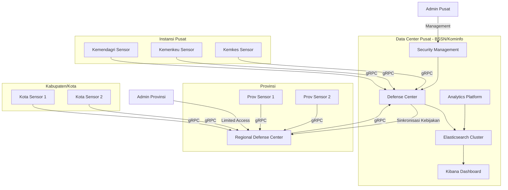
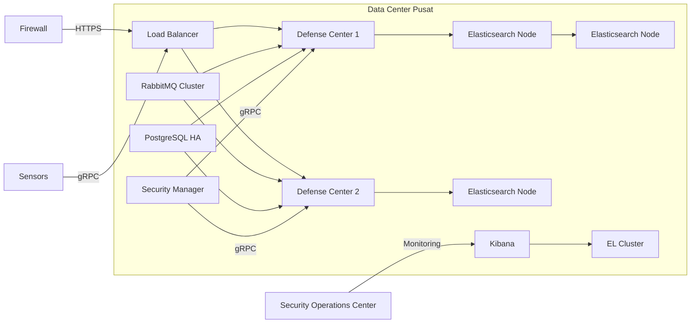
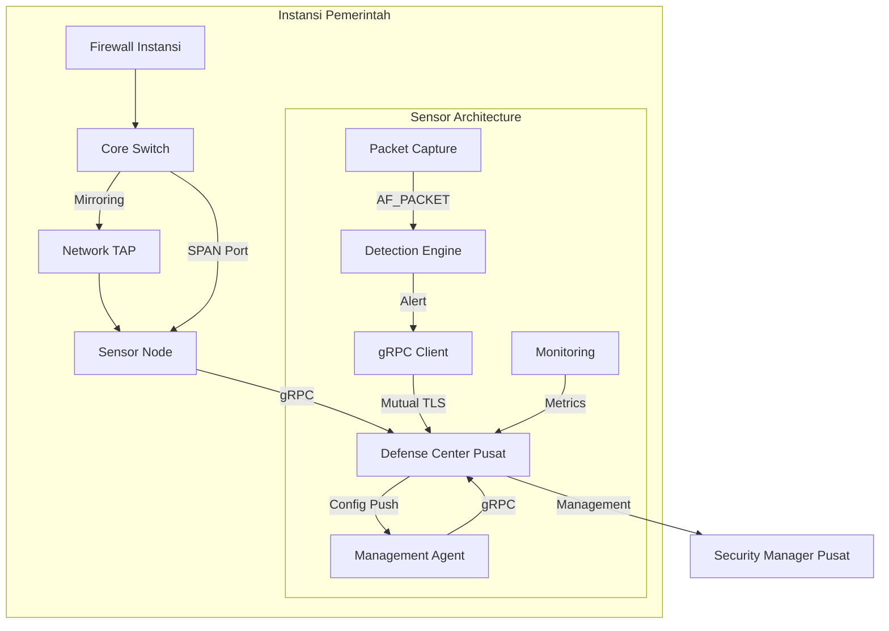
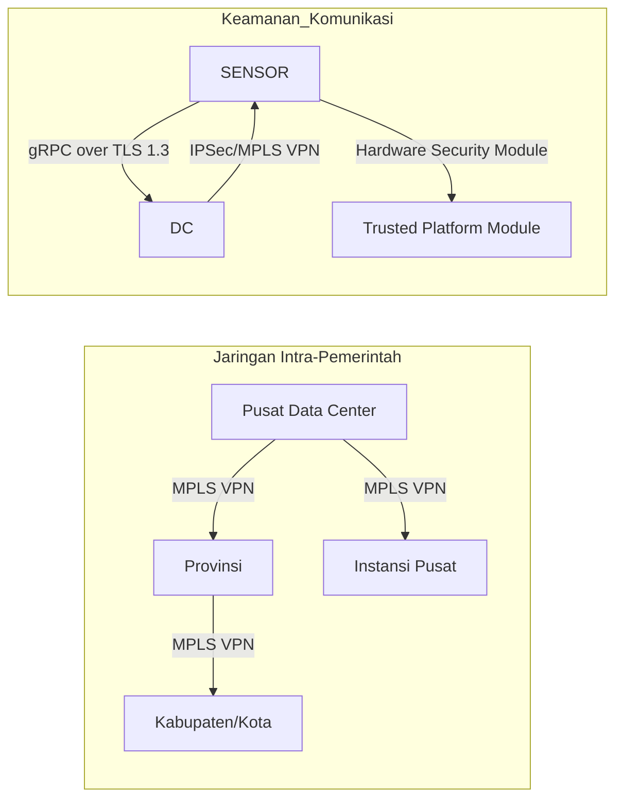
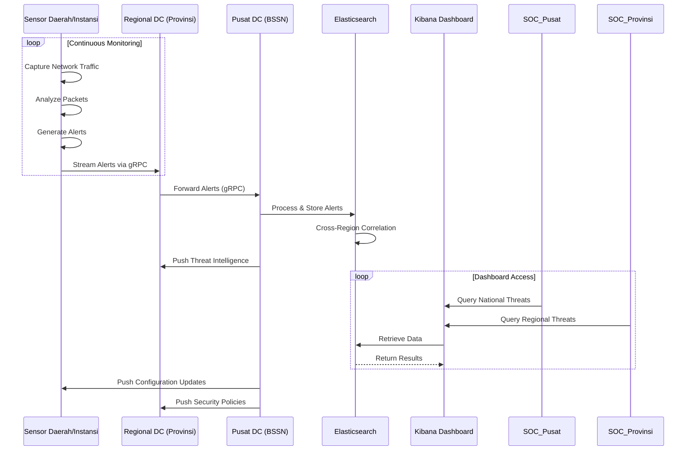
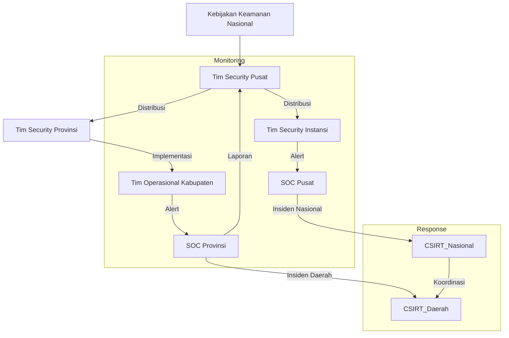
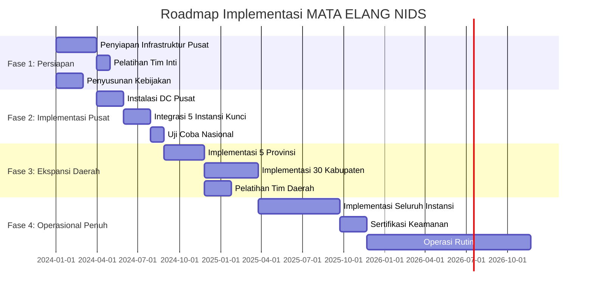

# Desain Penerapan MATA ELANG NIDS untuk Jaringan Intra-Pemerintah

## Arsitektur Terintegrasi Pusat-Daerah



## Diagram Detail Penerapan Per-Lokasi

### 1. Arsitektur Defense Center Pusat


### 2. Arsitektur Sensor di Instansi Pemerintah


## Desain Jaringan dan Keamanan



## Diagram Alur Data Terintegrasi



## Hierarki Manajemen dan Pengawasan

```mermaid
graph TD
    Pusat[BSSN/Kominfo Pusat]
    Provinsi[Pemprov]
    Kabupaten[Pemkab/Pemkot]
    Instansi[K/L Kementerian/Lembaga]
    
    Pusat -->|Kebijakan Nasional| Provinsi
    Pusat -->|Kebijakan Nasional| Instansi
    Provinsi -->|Koordinasi| Kabupaten
    
    sublayer Pusat_Layer
        Pusat -->|Supervisi| SOC_Nasional[SOC Nasional]
        SOC_Nasional -->|Monitoring| ALL[Semua Sensor]
    end
    
    sublayer Provinsi_Layer
        Provinsi -->|Operasional| SOC_Provinsi[SOC Provinsi]
        SOC_Provinsi -->|Monitoring| PROV_SENSOR[Sensor Provinsi]
        SOC_Provinsi -->|Monitoring| KAB_SENSOR[Sensor Kabupaten]
    end
    
    sublayer Instansi_Layer
        Instansi -->|Operasional| SOC_Instansi[SOC Instansi]
        SOC_Instansi -->|Monitoring| INST_SENSOR[Sensor Instansi]
    end
    
    SOC_Nasional -->|Laporan Konsolidasi| Pusat
    SOC_Provinsi -->|Laporan| Provinsi
    SOC_Instansi -->|Laporan| Instansi
```

## Spesifikasi Teknis Implementasi

### 1. Defense Center Pusat
- **Cluster Setup**: 3-node HA dengan load balancing
- **Storage**: 100TB+ Elasticsearch cluster dengan hot-warm architecture
- **Processing**: 32-core/128GB RAM per node
- **Keamanan**:
  - Hardware Security Module (HSM) untuk enkripsi data
  - Network segmentation dengan zona keamanan terpisah
  - Two-factor authentication untuk akses admin

### 2. Sensor Node
- **Hardware**: Server 1U dengan 10G NIC (Intel X710 atau setara)
- **Capture Method**: Dual-path (SPAN + Network TAP)
- **Sizing**:
  - Instansi Pusat: 20Gbps capacity
  - Provinsi: 10Gbps capacity
  - Kabupaten: 1Gbps capacity
- **Keamanan**:
  - Secure boot dengan TPM 2.0
  - Disk encryption at rest
  - BIOS-level protection

### 3. Komunikasi Jaringan
- **Transport**: gRPC over HTTP/2
- **Enkripsi**: TLS 1.3 dengan cipher suite modern
- **Authentication**: Mutual TLS dengan sertifikat PKI Nasional
- **QoS**: Prioritas jaringan DSCP EF (Expedited Forwarding)

## Model Operasional



## Keuntungan Penerapan Terpusat-Terdistribusi

1. **Efisiensi Biaya**:
   - Shared infrastructure di tingkat pusat
   - Skala ekonomi dalam lisensi dan pemeliharaan

2. **Keamanan Terpadu**:
   - Kebijakan keamanan konsisten di semua instansi
   - Deteksi ancaman lintas entitas pemerintah
   - Threat intelligence sharing terotomasi

3. **Kepatuhan Regulasi**:
   - Pemenuhan standar Perlindungan Data Pemerintah
   - Audit trail terpusat untuk kebutuhan forensik
   - Pelaporan keamanan terstandarisasi

4. **Operasional Efektif**:
   - Pelatihan terpusat untuk tim daerah
   - Update signature otomatis dari pusat
   - Pemantauan kesehatan infrastruktur terpusat

5. **Skalabilitas**:
   - Penambahan instansi/daerah tanpa redesign arsitektur
   - Kapasitas elastis di pusat untuk kebutuhan masa depan

## Strategi Implementasi Bertahap



Desain ini memberikan kerangka komprehensif untuk penerapan MATA ELANG NIDS di lingkungan pemerintah yang memenuhi kebutuhan:
- **Keamanan**: Proteksi berlapis dengan enkripsi end-to-end
- **Skalabilitas**: Arsitektur terdistribusi dari pusat hingga daerah
- **Kepatuhan**: Memenuhi standar keamanan informasi pemerintah
- **Efisiensi**: Manajemen terpusat dengan operasional terdistribusi
- **Resiliensi**: Desain high-availability di semua lapisan

Implementasi ini akan menciptakan sistem deteksi intrusi nasional yang terpadu namun tetap mempertimbangkan kebutuhan operasional spesifik di tiap tingkatan pemerintahan.
