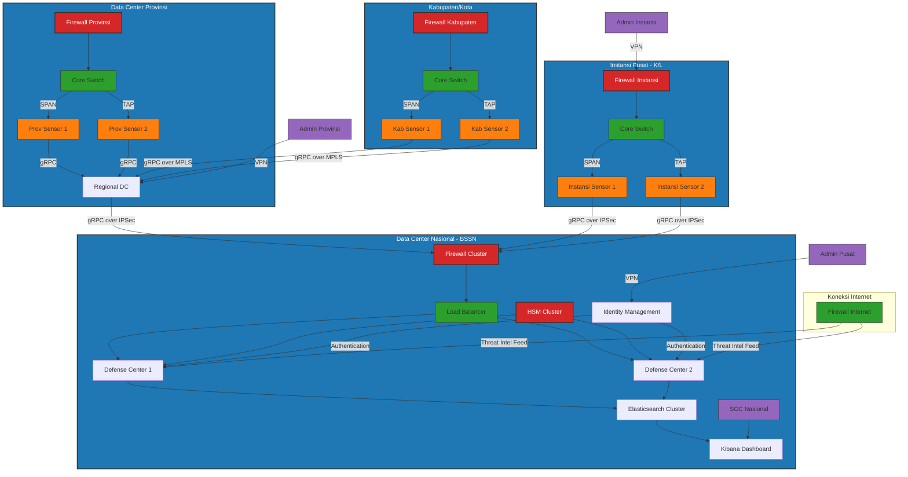
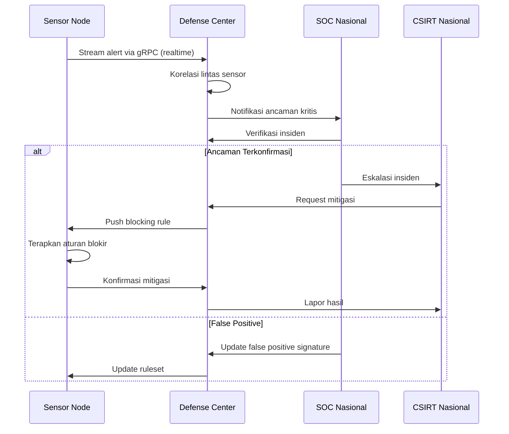
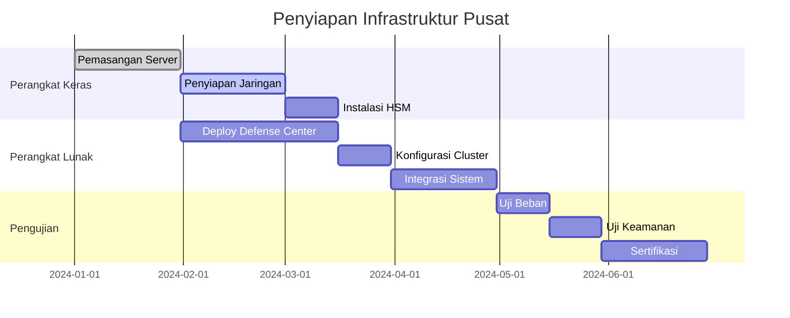

# Topologi Penerapan MATA ELANG NIDS pada Jaringan Intra-Pemerintah

## Diagram Topologi Komprehensif

## Keterangan Topologi

### 1. Lapisan Nasional (BSSN/Kominfo)
- **Defense Center Cluster**: Dua node HA dengan load balancing
- **Elasticsearch Cluster**: Penyimpanan dan analisis data terdistribusi
- **HSM Cluster**: Enkripsi data dan manajemen kriptografi
- **Firewall Cluster**: Perlindungan perimeter dan segmentasi jaringan
- **Identity Management**: Otentikasi terpusat untuk semua pengguna

### 2. Lapisan Provinsi
- **Regional Defense Center**: Node regional untuk agregasi data kabupaten
- **Sensor Provinsi**: Terpasang di core switch jaringan provinsi
- **Network TAP/SPAN**: Metode monitoring lalu lintas jaringan
- **Firewall Provinsi**: Perlindungan perimeter jaringan provinsi

### 3. Lapisan Kabupaten/Kota
- **Sensor Kabupaten**: Terpasang di jaringan inti kabupaten
- **Core Switch**: Perangkat jaringan utama dengan port SPAN
- **Firewall Kabupaten**: Perlindungan perimeter jaringan kabupaten
- **Koneksi MPLS**: Keamanan komunikasi ke pusat provinsi

### 4. Lapisan Instansi Pusat (K/L)
- **Sensor Instansi**: Terpasang di jaringan masing-masing kementerian/lembaga
- **Koneksi IPSec**: Tunnel aman ke Data Center Nasional
- **Management Terpisah**: Admin lokal dengan akses terkontrol

### 5. Komponen Keamanan
- **Mutual TLS**: Autentikasi dua arah antara sensor dan defense center
- **Network Segmentation**: Zona keamanan terpisah untuk komponen kritis
- **Threat Intelligence**: Update signature otomatis dari sumber terpercaya
- **HSM**: Perlindungan kunci kriptografi tingkat perangkat keras

## Diagram Topologi Fisik

```mermaid
graph LR
    subgraph Rack_Nasional[Rack Data Center Nasional]
        RU1[RU 1-3: Server Defense Center]
        RU4[RU 4-6: Elasticsearch Nodes]
        RU7[RU 7: Load Balancers]
        RU8[RU 8: Firewall Cluster]
        RU9[RU 9: HSM Appliances]
        RU10[RU 10: Network Storage]
    end
    
    subgraph Rack_Prov[Rack Data Center Provinsi]
        RUP1[RU 1: Regional DC Server]
        RUP2[RU 2: Firewall]
        RUP3[RU 3: Core Switch]
        RUP4[RU 4: Sensor Nodes]
    end
    
    subgraph Kab_Rack[Rack Kabupaten]
        RUK1[RU 1: Core Switch]
        RUK2[RU 2: Firewall]
        RUK3[RU 3: Sensor Node]
    end
    
    subgraph Instansi_Rack[Rack Instansi]
        RUI1[RU 1: Core Switch]
        RUI2[RU 2: Firewall]
        RUI3[RU 3: Sensor Node]
    end
    
    Rack_Nacional -->|DWDM Fiber| Rack_Prov
    Rack_Prov -->|Fiber MetroE| Kab_Rack
    Rack_Nasional -->|IPSec VPN| Instansi_Rack
    
    classDef rack fill:#8c564b,stroke:#333,stroke-width:1px,color:#fff;
    class Rack_Nasional,Rack_Prov,Kab_Rack,Instansi_Rack rack;
```

## Spesifikasi Konektivitas

### Jalur Komunikasi Utama
| Rute                  | Protokol      | Media         | Bandwidth | Latensi Maks |
|-----------------------|--------------|---------------|-----------|--------------|
| Nasional-Provinsi     | gRPC over IPSec | DWDM Fiber    | 10 Gbps   | <10 ms       |
| Provinsi-Kabupaten    | gRPC over MPLS  | Metro Ethernet| 1 Gbps    | <20 ms       |
| Nasional-Instansi     | gRPC over IPSec | Internet VPN  | 1 Gbps    | <50 ms       |
| Sensor-Defense Center | gRPC          | Jaringan Intra| 1-10 Gbps | <5 ms        |

### Konfigurasi Keamanan Jaringan
1. **Segmentasi Zona**:
   - Zona Publik: Interface internet
   - DMZ: Layanan eksternal
   - Zona Internal: Sistem operasional
   - Zona Manajemen: Akses administratif
   - Zona Sensor: Komunikasi khusus sensor

2. **Kontrol Akses**:
   - RBAC (Role-Based Access Control) terpusat
   - Network Access Control berbasis sertifikat
   - Mikrosegmentasi antar komponen

3. **Enkripsi Data**:
   - Data in-transit: TLS 1.3 dengan cipher suite AEAD
   - Data at-rest: AES-256 dengan kunci di HSM
   - Key rotation otomatis setiap 90 hari

## Diagram Alur Operasional

## Keuntungan Topologi Terpadu

1. **Pertahanan Berlapis**:
   - Deteksi di edge (sensor)
   - Analisis di regional (provinsi)
   - Korelasi di nasional (pusat)
   
2. **Resiliensi Jaringan**:
   - Multiple path komunikasi
   - Redundansi komponen kritis
   - Failover otomatis

3. **Manajemen Terpusat**:
   - Pembaruan kebijakan terpusat
   - Monitoring kesehatan seluruh sensor
   - Distribusi signature serangan

4. **Kepatuhan Regulasi**:
   - Pemenuhan SPBE (Sistem Pemerintahan Berbasis Elektronik)
   - Sesuai standar SNI ISO/IEC 27001
   - Audit trail terintegrasi

## Strategi Implementasi Topologi

### Fase 1: Penyiapan Infrastruktur Pusat

### Fase 2: Implementasi Bertahap di Daerah
1. **Pilot Project**: 1 provinsi + 3 kabupaten
2. **Ekspansi Regional**: 5 provinsi berikutnya
3. **Coverage Nasional**: Seluruh provinsi dan kabupaten
4. **Integrasi Instansi**: K/L strategis terlebih dahulu

Topologi ini dirancang untuk memenuhi kebutuhan khusus jaringan pemerintah dengan memperhatikan:
- **Kedaulatan Data**: Seluruh infrastruktur dalam negeri
- **Keamanan Berlapis**: Pertahanan depth-in-defense
- **Skalabilitas Hierarkis**: Dari pusat hingga daerah terpencil
- **Keterpaduan Sistem**: Integrasi dengan existing infrastructure
- **Kepatuhan Regulasi**: Memenuhi semua persyaratan keamanan pemerintah

Dengan implementasi topologi ini, MATA ELANG NIDS akan membentuk tulang punggung sistem deteksi intrusi nasional yang terpadu, aman, dan responsif terhadap ancaman siber terkini.
