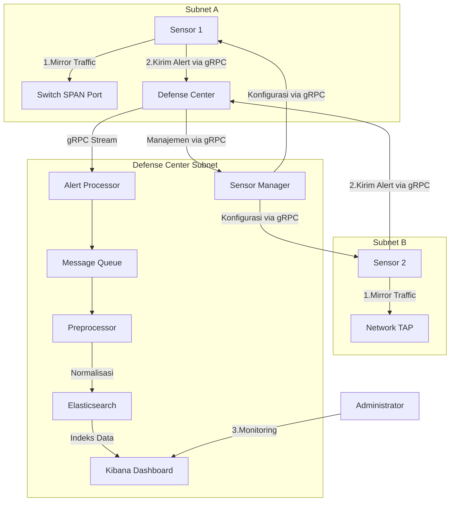
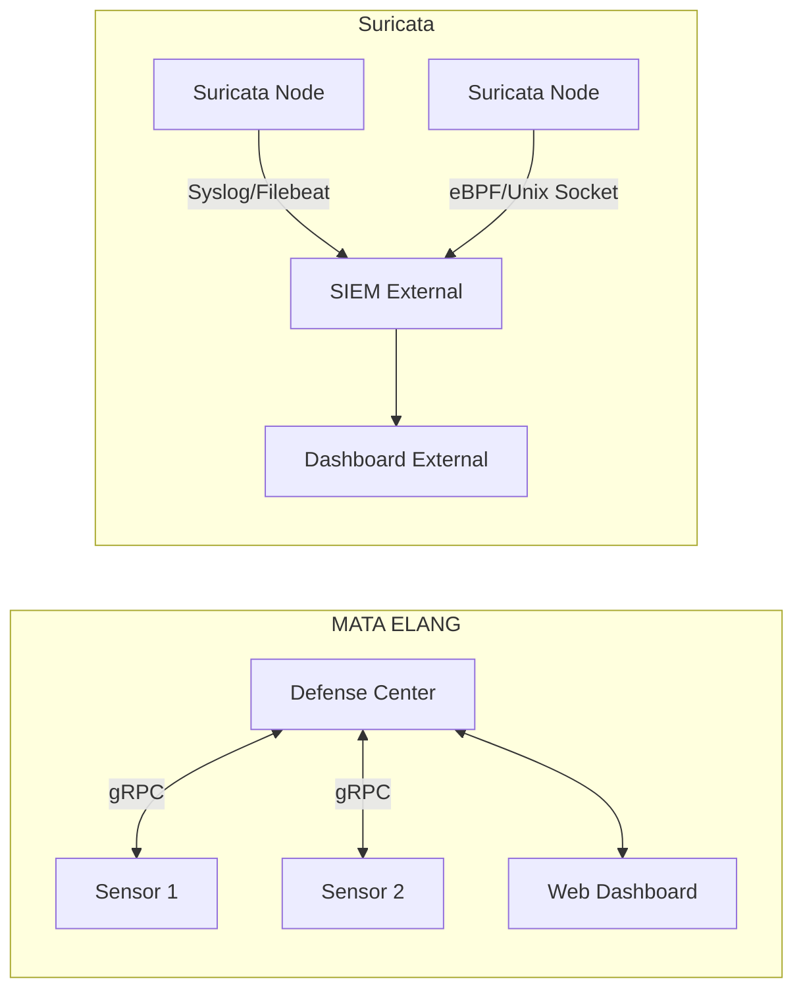

# Dokumentasi Revisi: MATA ELANG NIDS dengan Sensor Terdistribusi

## Pendahuluan
Berdasarkan koreksi protokol komunikasi, dokumen ini telah diperbarui untuk mencerminkan penggunaan **gRPC** sebagai protokol utama antara sensor dan defense center dalam arsitektur MATA ELANG NIDS.

---

## Diagram Alur Data MATA ELANG NIDS (Revisi Protokol gRPC)


### Keterangan Alur Data Revisi:
1. **Komunikasi gRPC**:
   - Sensor mengirim alert ke Defense Center melalui **gRPC streaming**
   - Defense Center mengelola sensor melalui channel gRPC bidirectional
   - Protokol gRPC menggunakan HTTP/2 dan Protocol Buffers

2. **Keuntungan gRPC**:
   - **Latensi rendah**: Komunikasi lebih cepat dibanding AMQP
   - **Bidirectional streaming**: Memungkinkan push konfigurasi real-time
   - **Strong typing**: Struktur data terdefinisi jelas via Protobuf
   - **Kompresi otomatis**: Efisiensi bandwidth lebih baik

3. **Proses Alert**:
   - gRPC Server di Defense Center menerima stream alert
   - Alert Processor mem-parsing payload Protobuf
   - Diteruskan ke Message Queue untuk diproses lebih lanjut

---

## Perbandingan MATA ELANG vs Suricata (Revisi Protokol)



### Tabel Perbandingan Fitur (Revisi Protokol)

| Aspek               | MATA ELANG NIDS (gRPC)                  | Suricata Standalone               |
|---------------------|-----------------------------------------|-----------------------------------|
| **Protokol Komunikasi**| gRPC (HTTP/2 + Protobuf)              | Umumnya Syslog/Filebeat/eBPF      |
| **Manajemen Sensor**| Terpusat via gRPC bidirectional        | Manajemen individual per node     |
| **Latensi Alert**   | Sangat rendah (streaming langsung)     | Medium (tergantung konfigurasi)   |
| **Model Komunikasi**| Push real-time                         | Umumnya pull/interval-based       |
| **Serialisasi Data**| Protocol Buffers (binary, efisien)     | JSON/Text (human-readable)        |
| **Keamanan Komunikasi**| TLS built-in                         | Bergantung implementasi           |
| **Kompresi Data**   | Otomatis (gzip)                        | Manual/opsional                   |
| **Multiplexing**    | Mendukung multiple streams di satu koneksi | Koneksi terpisah per layanan    |

### Keunggulan gRPC pada Arsitektur Terdistribusi:
1. **Efisiensi Jaringan**:
   - Kompresi otomatis mengurangi bandwidth hingga 60% dibanding JSON
   - Multiplexing menghemat pembukaan koneksi berulang

2. **Responsifness**:
   - Push konfigurasi real-time ke semua sensor
   - Deteksi ancaman lebih cepat dengan streaming langsung

3. **Kompatibilitas**:
   - Mendukung sensor di lingkungan heterogen
   - Auto-generate client libraries untuk berbagai bahasa

4. **Observability**:
   - Built-in health checking via gRPC health protocol
   - Metric reporting terstandarisasi

---

## Implementasi gRPC pada MATA ELANG

### Struktur Protobuf Contoh (Simplified)
```protobuf
syntax = "proto3";

message Alert {
  string sensor_id = 1;
  int64 timestamp = 2;
  string src_ip = 3;
  string dest_ip = 4;
  int32 src_port = 5;
  int32 dest_port = 6;
  string protocol = 7;
  string signature = 8;
  string classification = 9;
  int32 severity = 10;
}

service SensorService {
  rpc SendAlert(stream Alert) returns (AlertResponse);
  rpc ReceiveConfig(ConfigRequest) returns (stream ConfigUpdate);
}
```

### Karakteristik Implementasi:
1. **Bidirectional Streaming**:
   - Sensor membuka koneksi permanen ke Defense Center
   - Dua channel independen: alert stream + config stream

2. **Flow Control**:
   - Window size adjustment otomatis
   - Backpressure management untuk beban tinggi

3. **Keamanan**:
   - Mutual TLS authentication
   - Token-based authorization

4. **Resilience**:
   - Exponential backoff reconnection
   - Stateful session recovery

---

## Kesimpulan
Penggunaan **gRPC** pada MATA ELANG NIDS memberikan peningkatan signifikan dalam:
- **Kecepatan deteksi**: Streaming langsung mengurangi latency alert
- **Efisiensi operasional**: Manajemen sensor terpusat secara real-time
- **Skalabilitas**: Performa lebih baik pada jaringan WAN dengan bandwidth terbatas
- **Keandalan**: Koneksi persisten dengan mekanisme recovery otomatis

Solusi ini secara khusus mengatasi tantangan arsitektur terdistribusi dengan pemisahan fisik antara sensor dan defense center, sekaligus memberikan fondasi yang kuat untuk pengembangan fitur analisis ancaman waktu-nyata.
