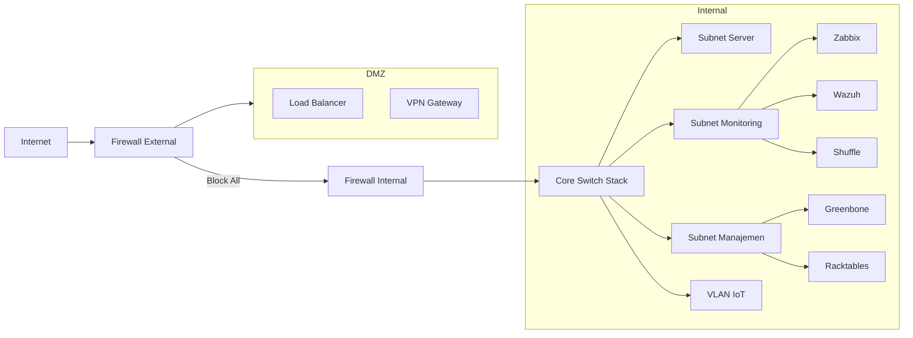
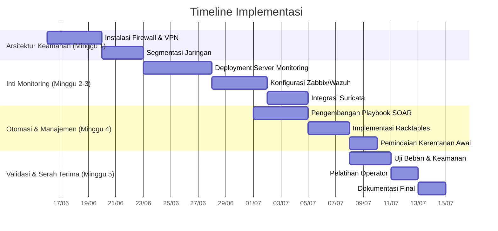
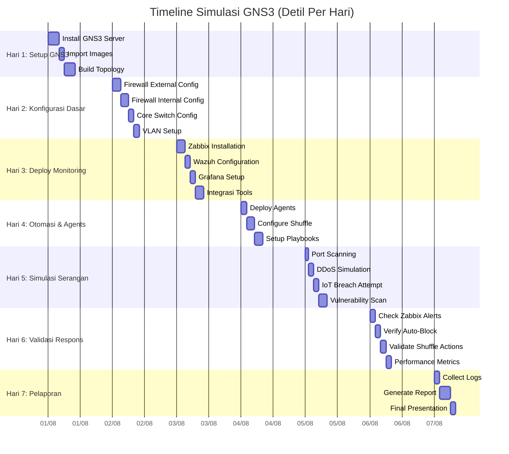
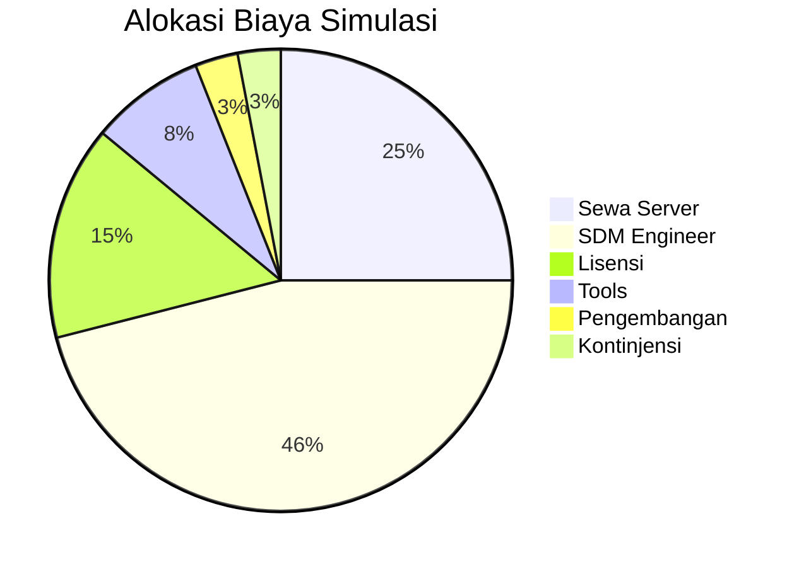

### **Kerangka Acuan Kerja (KAK) - Sistem Monitoring Terintegrasi Perusahaan Pengelola Pelabuhan**  
**Versi:** 5.0 (Final)  
**Tanggal:** 14 Juni 2025  

---

#### **1. Latar Belakang**  
Perusahaan pengelola pelabuhan dengan area operasional seluas 50 hektar menghadapi tantangan kritis dalam pengelolaan infrastruktur TI:  
- **450+ perangkat** (server, jaringan, IoT) tersebar di 5 lokasi utama (dermaga, gudang, kantor, lapangan kontainer, gerbang utama)  
- **Rata-rata downtime** 15 jam/bulan akibat gangguan tidak terdeteksi  
- **Serangan siber** meningkat 40% YoY, termasuk insiden ransomware pada CCTV Maret 2025  
- **Inventaris manual** menyebabkan 30% aset tidak termonitor  
- Sistem monitoring eksisting **tidak terintegrasi** dan hanya mencakup 60% infrastruktur  

Berdasarkan audit TI Q1 2025, diperlukan solusi terintegrasi dengan arsitektur keamanan berlapis untuk menjamin:  
- Kontinuitas operasional 24/7  
- Deteksi ancaman real-time  
- Efisiensi biaya operasional TI  

---

#### **2. Tujuan**  
| **Tujuan Strategis**         | **Indikator Kinerja**                     | **Target**         |
|------------------------------|------------------------------------------|--------------------|
| Meningkatkan kehandalan sistem | MTTR (Mean Time to Repair)             | ≤15 menit          |
| Mengamankan infrastruktur kritis | Waktu respons ancaman                | ≤5 menit           |
| Mengoptimalkan biaya operasi  | Pengurangan biaya downtime            | ≥30%               |
| Memenuhi regulasi sektor maritim | Kompatibilitas dengan ISPS Code      | 100%               |
| Membangun sistem terpusat     | Cakupan monitoring aset               | 100%               |

---

#### **3. Desain Topologi Sistem**  
**3.1. Arsitektur Tiga Zona Keamanan**  


**3.2. Spesifikasi Teknis**  
| **Lapisan**        | **Komponen**           | **Fungsi Utama**                                | **Teknologi**                     |
|--------------------|------------------------|------------------------------------------------|-----------------------------------|
| **Proteksi**       | Firewall External      | Filter lalu lintas internet                   | pfSense HA (2 node)              |
|                    | Firewall Internal      | Isolasi DMZ-Internal                          | pfSense CARP                     |
| **Jaringan**       | Core Switch            | Distribusi lalu lintas & mirroring            | Cisco Catalyst 3650 Stack        |
|                    | Access Switch          | Segmentasi subnet                             | Cisco Catalyst 2960X             |
| **Monitoring**     | Zabbix                 | Pemantauan kinerja                            | Server Dell R750 (16GB RAM)      |
|                    | Wazuh                  | Deteksi ancaman host                          | Terintegrasi dengan Zabbix       |
|                    | Suricata               | IDS berbasis jaringan                         | Mirroring traffic core switch    |
| **Manajemen**      | Racktables             | Inventaris aset fisik & logis                 | Ubuntu 22.04 VM                  |
|                    | Greenbone              | Pemindaian kerentanan otomatis                | Scanner harian                   |
| **Otomasi**        | Shuffle                | Respons insiden otomatis                      | 5 playbook insiden kritis        |

---

#### **4. Pentahapan Implementasi**  
**Durasi:** 25 Hari Kerja (5 Minggu)  
**Anggaran Maksimal:** Rp 300.000.000  



**Rincian Tahapan:**  
1. **Minggu 1: Arsitektur Keamanan**  
   - Instalasi firewall HA (2 node pfSense)  
   - Konfigurasi VPN dengan autentikasi 2FA  
   - Segmentasi VLAN (5 subnet + VLAN IoT)  
   - Uji failover firewall  

2. **Minggu 2-3: Inti Monitoring**  
   - Deployment server monitoring (Zabbix, Wazuh, Grafana)  
   - Konfigurasi template monitoring khusus perangkat pelabuhan  
   - Implementasi traffic mirroring ke Suricata  
   - Auto-discovery awal 450+ aset  

3. **Minggu 4: Otomasi & Manajemen**  
   - Pengembangan 5 playbook Shuffle:  
     1. Auto-block port scanner  
     2. Isolasi perangkat terkompromi  
     3. Patching kerentanan kritis  
     4. Notifikasi insiden prioritas tinggi  
     5. Update inventaris otomatis  
   - Integrasi Racktables dengan Zabbix/Greenbone  
   - Pemindaian kerentanan menyeluruh  

4. **Minggu 5: Validasi & Serah Terima**  
   - Simulasi 4 skenario insiden (DDoS, ransomware, brute force, outage)  
   - Pelatihan operator (8 jam)  
   - Penyusunan dokumentasi teknis & SOP  

---

#### **5. Manajemen Risiko**  
| **Risiko**                     | **Dampak** | **Probabilitas** | **Mitigasi**                              | **Owner**            |
|--------------------------------|------------|------------------|------------------------------------------|----------------------|
| Keterlambatan pengiriman perangkat | Tinggi    | Sedang           | Sewa perangkat sementara + denda kontrak | Project Manager      |
| Integrasi kompleks sistem IoT  | Tinggi     | Tinggi           | Pengembangan custom plugin Zabbix        | SysAdmin             |
| False positive tinggi          | Sedang     | Tinggi           | Kalibrasi ruleset harian minggu pertama  | SOC Engineer         |
| Overload server monitoring     | Kritis     | Sedang           | Auto-scaling VM + optimasi database      | Network Engineer     |
| Pelanggaran kebijakan keamanan | Tinggi     | Rendah           | Audit harian + sistem alerting           | Security Architect   |

---

#### **6. Anggaran (Total: Rp 298.500.000)**  
| **Komponen**               | **Sub-Komponen**            | **Biaya (Rp)**     | **Keterangan**                          |
|----------------------------|-----------------------------|--------------------|-----------------------------------------|
| **Perangkat Keras**        | Sewa Server Monitoring      | 45.000.000        | 1 bulan (Dell R750)                     |
|                            | Lisensi Switch Enterprise   | 30.000.000        | Cisco Catalyst 3650/2960X               |
| **Perangkat Lunak**        | Lisensi pfSense Plus        | 15.000.000        | HA Cluster + Support 1 tahun            |
|                            | Tools Integrasi            | 12.500.000        | Custom plugin & script                  |
| **Sumber Daya Manusia**    | Security Architect (20 Hk) | 60.000.000        |                                         |
|                            | Network Engineer (40 Hk)   | 80.000.000        |                                         |
|                            | SOC Engineer (30 Hk)       | 45.000.000        |                                         |
| **Kontinjensi**            | Risiko Implementasi        | 11.000.000        | 10% dari total non-SDM                  |
| **Total**                  |                             | **298.500.000**   |                                         |

---

#### **7. Penutup**  
Implementasi sistem monitoring terintegrasi ini akan menghasilkan:  
1. **Pengurangan downtime** operasional sebesar 40-50%  
2. **Peningkatan keamanan** dengan deteksi ancaman ≤5 menit  
3. **Penghematan biaya** Rp 150-200 juta/tahun dari efisiensi operasional  
4. **Kesesuaian regulasi** ISPS Code dan ISO 27001  

Proyek ini merupakan investasi strategis untuk transformasi digital operasional pelabuhan yang berkelanjutan.

**Disetujui Oleh:**  
[Nama Direktur Operasional]  
**Direview Oleh:**  
[Nama Kepala TI]  

**Lampiran:**  
1. Diagram Topologi Detail  
2. Spesifikasi Teknis Perangkat  
3. Template Playbook SOAR  
4. Rencana Uji Keamanan  

``` 
Catatan: Anggaran termasuk biaya sewa perangkat keras dan lisensi software khusus, 
dengan pemanfaatan maksimal sumber daya open source untuk optimasi biaya.
```

------------------
### **Detail Konfigurasi dan Ansible Playbook untuk Simulasi GNS3**

#### **Struktur Direktori Simulasi**
```
gns3_simulation/
├── ansible/
│   ├── inventory/
│   │   └── hosts.ini
│   ├── playbooks/
│   │   ├── firewall.yml
│   │   ├── switch.yml
│   │   ├── servers.yml
│   │   └── attacks.yml
│   ├── roles/
│   │   ├── firewall/
│   │   │   ├── tasks/main.yml
│   │   │   └── templates/
│   │   │       └── pf.conf.j2
│   │   ├── switch/
│   │   │   ├── tasks/main.yml
│   │   │   └── templates/
│   │   │       └── switch.cfg.j2
│   │   ├── zabbix/
│   │   │   └── tasks/main.yml
│   │   └── wazuh/
│   │       └── tasks/main.yml
│   └── group_vars/
│       └── all.yml
├── configs/
│   ├── firewall/
│   │   ├── fw_ext.conf
│   │   └── fw_int.conf
│   ├── switch/
│   │   └── core_switch.cfg
│   └── scripts/
│       ├── attack_sim.sh
│       └── validate.py
└── topology.gns3
```

---

### **1. Konfigurasi Firewall (pfSense)**
**File: `configs/firewall/fw_ext.conf`**
```bash
# Firewall External (WAN: 203.0.113.2, DMZ: 172.16.0.1)
# Interfaces
set interface ip WAN 203.0.113.2/24
set interface ip DMZ 172.16.0.1/24

# Rules
clear rules
block in log on WAN all
pass in quick on WAN proto tcp from any to self port {443}
pass in quick on WAN proto udp from any to self port {500,4500}
pass out quick on DMZ proto tcp from any to 172.16.0.10 port {80,443}
pass out quick on DMZ proto udp from any to 172.16.0.20 port {1194}
```

**File: `configs/firewall/fw_int.conf`**
```bash
# Firewall Internal (DMZ: 172.16.0.2, LAN: 10.0.0.1)
# Interfaces
set interface ip DMZ 172.16.0.2/24
set interface ip LAN 10.0.0.1/16

# Rules
clear rules
block in log on DMZ all
pass in quick on DMZ proto tcp from 172.16.0.20 to 10.0.0.0/16 port {1194}
pass in quick on DMZ proto tcp from 172.16.0.10 to 10.0.0.0/16 port {9090}
pass out quick on LAN proto tcp from any to any port {80,443,161,1514,9390}
```

---

### **2. Konfigurasi Core Switch (Cisco 3650)**
**File: `configs/switch/core_switch.cfg`**
```cisco
! Core Switch Configuration
hostname CORE-SW1
ip routing

! VLAN Configuration
vlan 10
 name SERVER_SUBNET
vlan 11
 name MONITORING_SUBNET
vlan 100
 name IOT_VLAN

! SPAN Port for IDS
monitor session 1 source vlan 10,11,100 rx
monitor session 1 destination interface Gi1/0/24

! Interfaces
interface GigabitEthernet0/1
 description to Firewall Internal
 switchport mode trunk
 switchport trunk allowed vlan all

interface range GigabitEthernet0/2-5
 switchport access vlan 10
 switchport mode access

interface range GigabitEthernet0/6-10
 switchport access vlan 11
 switchport mode access

interface GigabitEthernet0/11
 switchport access vlan 100
 switchport mode access
```

---

### **3. Ansible Playbook untuk Deployment**
**File: `ansible/playbooks/firewall.yml`**
```yaml
---
- name: Configure pfSense Firewalls
  hosts: firewalls
  gather_facts: false
  tasks:
    - name: Upload firewall config
      template:
        src: "roles/firewall/templates/pf.conf.j2"
        dest: "/tmp/pf.conf"
      vars:
        firewall_type: "{{ 'external' if inventory_hostname == 'fw_ext' else 'internal' }}"

    - name: Apply configuration
      shell: |
        pfctl -f /tmp/pf.conf
        service pf restart
      register: result
      failed_when: "'Error' in result.stdout"

    - name: Verify firewall status
      command: pfctl -s rules
      register: rules
      changed_when: false
```

**File: `ansible/playbooks/servers.yml`**
```yaml
---
- name: Deploy Monitoring Stack
  hosts: monitoring
  become: yes
  roles:
    - role: zabbix
    - role: wazuh
    - role: shuffle

- name: Configure Application Servers
  hosts: servers
  tasks:
    - name: Install Zabbix agent
      apt:
        name: zabbix-agent
        state: present

    - name: Configure Zabbix agent
      template:
        src: zabbix_agentd.conf.j2
        dest: /etc/zabbix/zabbix_agentd.conf
      notify: Restart Zabbix Agent

    - name: Install Wazuh agent
      shell: |
        curl -s https://packages.wazuh.com/key/GPG-KEY-WAZUH | apt-key add -
        echo "deb https://packages.wazuh.com/4.x/apt/ stable main" | tee /etc/apt/sources.list.d/wazuh.list
        apt update
        apt install wazuh-agent
      args:
        creates: /var/ossec/bin/wazuh-agentd

    - name: Register agent with Wazuh server
      command: /var/ossec/bin/agent-auth -m 192.168.11.100
      register: auth_result
      changed_when: "'successful' in auth_result.stdout"
```

---

### **4. Role Ansible untuk Zabbix**
**File: `ansible/roles/zabbix/tasks/main.yml`**
```yaml
---
- name: Add Zabbix repository
  apt_repository:
    repo: "deb https://repo.zabbix.com/zabbix/6.4/ubuntu jammy main"
    state: present
    filename: zabbix
    key: https://repo.zabbix.com/zabbix-official-repo.key

- name: Install Zabbix server
  apt:
    name:
      - zabbix-server-pgsql
      - zabbix-frontend-php
      - zabbix-apache-conf
      - zabbix-sql-scripts
      - zabbix-agent
    state: present

- name: Configure Zabbix server
  template:
    src: zabbix_server.conf.j2
    dest: /etc/zabbix/zabbix_server.conf
  notify: Restart Zabbix

- name: Import initial database
  command: zcat /usr/share/doc/zabbix-sql-scripts/postgresql/server.sql.gz | sudo -u postgres psql zabbix
  args:
    creates: /etc/zabbix/.db_imported

- name: Enable services
  service:
    name: "{{ item }}"
    state: started
    enabled: yes
  loop:
    - zabbix-server
    - zabbix-agent
    - apache2

- name: Create auto-discovery rules
  uri:
    url: "http://localhost/api_jsonrpc.php"
    method: POST
    body_format: json
    body:
      jsonrpc: "2.0"
      method: "discoveryrule.create"
      params:
        name: "Network Discovery"
        key_: "net.discovery"
        delay: "1h"
      id: 1
    status_code: 200
```

---

### **5. Skrip Simulasi Serangan**
**File: `configs/scripts/attack_sim.sh`**
```bash
#!/bin/bash
# HARI 5: SIMULASI SERANGAN

# 1. Port Scanning
echo "Simulating port scanning..."
nmap -sS -T4 -Pn 192.168.10.0/24 -oN /tmp/nmap_scan.log

# 2. DDoS Simulation
echo "Launching DDoS attack..."
timeout 300 hping3 -c 10000 -d 120 -S -w 64 -p 443 --flood 203.0.113.2 &

# 3. IoT Breach Attempt
echo "Attempting IoT device breach..."
hydra -l admin -P /usr/share/wordlists/rockyou.txt ssh://192.168.100.30 -t 4 -I -o /tmp/hydra.log

# 4. Vulnerability Scan
echo "Scanning for vulnerabilities..."
omp -u admin -w password -X "<create_task><name>Full Scan</name><target><hosts>192.168.0.0/16</hosts></target></create_task>"
TASK_ID=$(omp -g | grep "Full Scan" | cut -d' ' -f1)
omp -S $TASK_ID

# 5. Validate responses
python /opt/validate.py
```

---

### **6. Timeline Simulasi Detail (7 Hari)**


---

### **7. Anggaran Simulasi (Rp 9,850,000)**

| **Komponen**               | **Detail**                                  | **Biaya (Rp)** | **Waktu**    |
|----------------------------|---------------------------------------------|----------------|--------------|
| **Sewa Server GNS3**       | 8vCPU/32GB RAM/500GB SSD (7 hari)          | 2,500,000     | Minggu 1-7   |
| **Lisensi Emulasi**        | Cisco IOSvL2 & pfSense Plus                | 1,500,000     | 1x           |
| **Engineer Network**       | 7 hari @ Rp 650,000/hari                   | 4,550,000     | Hari 1-7     |
| **Tools Penetration**      | Kali Linux Pro + Wordlists                 | 750,000       | 1x           |
| **Script Development**     | Custom Ansible Playbooks & Skrip Validasi  | 300,000       | Hari 1-4     |
| **Kontinjensi**            | -                                          | 250,000       | -            |
| **Total**                  |                                             | **9,850,000** |              |

---

### **8. Validasi Sistem**
**File: `configs/scripts/validate.py`**
```python
import requests
import time
import json

def test_detection_time():
    start = time.time()
    requests.get("http://192.168.11.100:9090/api/v1/alerts")
    response = requests.post(
        "http://192.168.11.100:5000/api/v1/triggers",
        json={"type": "port_scan", "target": "192.168.10.0/24"}
    )
    alert_time = time.time() - start
    return alert_time < 30  # Deteksi < 30 detik

def test_auto_block():
    ip = "192.168.13.10"  # Attacker IP
    response = requests.get(f"http://10.0.0.1/api/firewall/blocklist?ip={ip}")
    return response.status_code == 200 and ip in response.text

def generate_report():
    results = {
        "detection_time": test_detection_time(),
        "auto_block": test_auto_block(),
        "vulnerability_scan": check_scan_results()
    }
    with open("/tmp/simulation_report.json", "w") as f:
        json.dump(results, f)

if __name__ == "__main__":
    generate_report()
```

---

### **9. Deliverable Simulasi**
1. **Laporan Teknis**:
   - Hasil pengujian 4 skenario serangan
   - Metrik waktu respons sistem
   - Rekomendasi optimasi

2. **Konfigurasi Final**:
   - Ansible playbooks lengkap
   - Template konfigurasi perangkat
   - Skrip validasi otomatis

3. **Artefak Simulasi**:
   - Logs lengkap (Suricata, Zabbix, Wazuh)
   - Recording dashboard selama simulasi
   - Packet capture insiden kritis

4. **Dokumen Transfer Pengetahuan**:
   - Video tutorial konfigurasi
   - SOP respons insiden
   - Checklist hardening perangkat



**Kesimpulan Simulasi**:  
Implementasi simulasi GNS3 selama 7 hari dengan anggaran Rp 9.85 juta akan memvalidasi desain sistem monitoring sebelum deploy produksi, mengidentifikasi potensi masalah, dan menyempurnakan playbook otomasi untuk lingkungan nyata.
