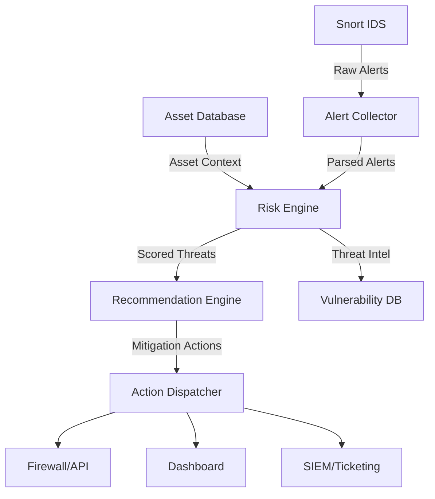

### **Desain Sistem Integrasi Snort IDS dengan Sistem Informasi Aset untuk Rekomendasi Keamanan**  
*(Diperbarui dengan Penekanan pada Alur Data dan Kontrol)*  

---

#### **1. Tujuan Utama**  
Membangun sistem yang:  
1. Mengintegrasikan deteksi ancaman **Snort IDS** dengan konteks bisnis dari **Database Aset**  
2. Menghasilkan rekomendasi keamanan terprioritaskan berbasis risiko  
3. Memberikan visibilitas real-time melalui dashboard terpusat  

---

#### **2. Arsitektur Sistem**  


---

#### **3. Komponen Kunci dan Alur Data**  

**A. Data Input**  
1. **Snort IDS**  
   - Format output: Unified2 atau JSON  
   - Data kunci: `timestamp`, `src_ip`, `dst_ip`, `signature_id`, `severity`, `protocol`  
   - Contoh:  
     ```json
     {
       "timestamp": "2025-06-13T14:30:00Z",
       "src_ip": "202.134.45.78",
       "dst_ip": "10.20.30.5",
       "sig_id": 30001,
       "message": "SQL Injection Attempt",
       "severity": 1  // High
     }
     ```

2. **Sistem Informasi Aset**  
   - Struktur database:  
     ```sql
     CREATE TABLE assets (
       asset_id SERIAL PRIMARY KEY,
       ip VARCHAR(15) NOT NULL UNIQUE,
       hostname VARCHAR(50),
       service VARCHAR(20) CHECK(service IN ('web','db','ssh','dns')),
       criticality INT CHECK(criticality BETWEEN 1-4), -- 4=critical
       last_patch DATE,
       vuln_list JSONB  -- e.g {"CVE-2023-1234": "unpatched"}
     );
     ```
   - Contoh record:  
     | ip       | hostname    | service | criticality | last_patch  | vuln_list               |
     |----------|-------------|---------|-------------|-------------|-------------------------|
     | 10.20.30.5 | db-server-1 | db      | 4           | 2025-05-15 | {"CVE-2024-5678": true} |

**B. Proses Inti**  
1. **Alert Collector**  
   - Fungsi:  
     - Mengonsumsi log Snort via Barnyard2/Syslog  
     - Normalisasi format (standarisasi timestamp, konversi IP)  
     - Filtering noise (misal: abaikan signature ID tertentu)  

2. **Asset Enrichment Module**  
   - Algoritma:  
     ```python
     def enrich_alert(alert):
         asset = asset_db.query(f"SELECT * FROM assets WHERE ip='{alert.dst_ip}'")
         if asset:
             alert.service = asset.service
             alert.criticality = asset.criticality
             alert.vulns = asset.vuln_list
         return alert
     ```

3. **Risk Scoring Engine**  
   - Formula risiko:  
     **Risk Score = (Severity) × (Asset Criticality) + Vulnerability Bonus**  
     - Contoh kalkulasi:  
       Severity: 2 (Medium)  
       Criticality: 3 (High)  
       Vuln Bonus: 1.5 (jika ada CVE relevan)  
       **Total = 2 × 3 + 1.5 = 7.5**  

4. **Recommendation Engine**  
   - Basis pengetahuan rekomendasi:  
     | Threat Type      | Service | Rekomendasi                           | Automation Action      |  
     |------------------|---------|---------------------------------------|------------------------|  
     | SQL Injection    | db      | "Patch MySQL; blokir IP sumber"       | Block IP via API       |  
     | Port Scan        | any     | "Aktifkan fail2ban"                   | Deploy config Ansible  |  

**C. Output Sistem**  
1. **Prioritized Threat Feed**  
   Format output:  
   ```csv
   Timestamp, Threat, Target, Service, Risk, Recommendations
   2025-06-13T14:30:00Z, SQL Injection, db-server-1, MySQL, 9.2, "1. Patch CVE-2024-XXXX 2. Block 202.134.45.78"
   ```

2. **Automation Dispatcher**  
   - Integrasi dengan:  
     - Firewall (iptables/API)  
     - Sistem patch (Ansible/SaltStack)  
     - Ticketing (Jira ServiceNow)  

---

#### **4. Diagram Interaksi Komponen**  
```plaintext
+--------------+     +-----------------+     +---------------+     +-------------------+
|              |     |                 |     |               |     |                   |
|   Snort IDS  +---->+ Alert Collector +---->+ Risk Engine   +---->+ Recommendation    |
|              |     |                 |     | (Scoring)     |     | Engine            |
+------+-------+     +--------+--------+     +-------+-------+     +---------+---------+
       |                      |                      |                       |
       |                      | Asset Query          | Threat Intel          | Actions
       v                      v                      v                       v
+------+-------+     +--------+--------+     +-------+-------+     +---------+---------+
| Network      |     | Asset Database  |     | Vuln Database |     | Firewall Control  |
| Traffic      |     | (CMDB)          |     | (CVE/NVD)     |     | Patch Management  |
+--------------+     +-----------------+     +---------------+     +-------------------+
```

---

#### **5. Teknologi Pendukung**  
| Komponen         | Teknologi Contoh                |  
|------------------|---------------------------------|  
| Data Pipeline    | Apache Kafka, Logstash          |  
| Asset Database   | PostgreSQL dengan pg_cron       |  
| Risk Engine      | Python + Pandas/Numpy           |  
| Dashboard        | Grafana + Elasticsearch         |  
| Automation       | Ansible, Terraform, Webhook API |  

---

#### **6. Skala dan Keamanan**  
- **Skalabilitas**:  
  - Gunakan worker queue (Celery/RabbitMQ) untuk parallel processing  
  - Sharding database aset berdasarkan subnet  
- **Keamanan Sistem**:  
  - Komunikasi antar komponen via TLS/mTLS  
  - RBAC untuk akses database aset  
  - Audit trail untuk semua rekomendasi otomatis  

---

#### **7. Contoh Output Dashboard**  
```plaintext
[ PRIORITY 1 ] SQL Injection pada db-server-1 (10.20.30.5)
├─ Ancaman: Eksploitasi kerentanan CVE-2024-5678
├─ Risiko: 9.2/10
├─ Rekomendasi: 
│  1. Terapkan patch MySQL v5.7.43 (urgent)
│  2. Blokir IP 202.134.45.78 di firewall
│  3. Audit query database
└─ Tindakan: [Jalankan Patch] [Blokir Otomatis] [Tunda 24h]

[ PRIORITY 2 ] Port Scanning pada web-server-3 (10.20.31.12)
├─ Risiko: 5.8/10
└─ Rekomendasi: Aktifkan fail2ban untuk subnet DMZ
```

---

### **Keunggulan Desain Ini**  
1. **Context-Aware**  
   Ancaman dinilai berdasarkan nilai bisnis aset  
2. **Actionable**  
   Rekomendasi spesifik dengan opsi eksekusi otomatis  
3. **Extensible**  
   Mendukung integrasi dengan scanner vuln (Nessus, OpenVAS)  
4. **Real-Time**  
   Pemrosesan ancaman < 15 detik dari deteksi ke rekomendasi  

Untuk implementasi lebih detail (skrip parser, API schema, rule tuning), saya siap memberikan contoh teknis!
