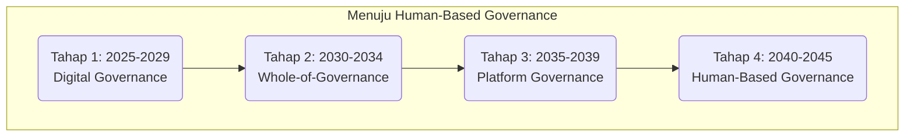
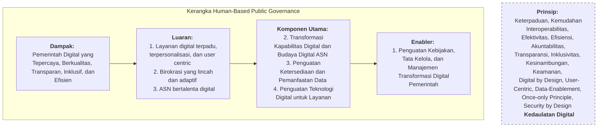
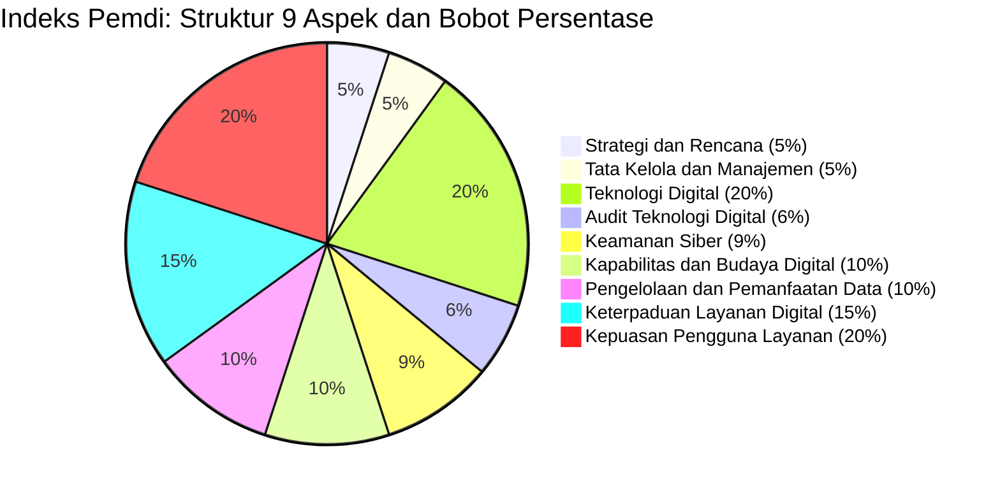
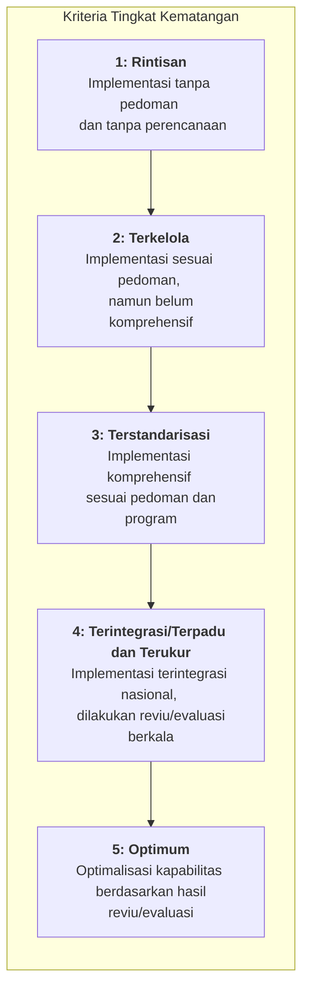
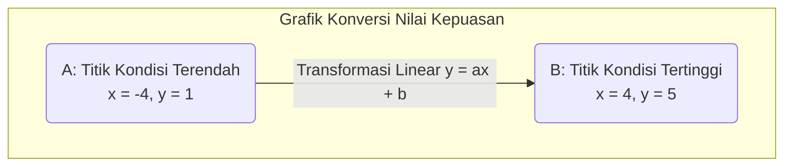

**TELAAH KOMPREHENSIF INDEKS PEMERINTAH DIGITAL (PEMDI): PARADIGMA BARU PENGUKURAN KINERJA TRANSFORMASI DIGITAL PEMERINTAH**

-----

### **BAGIAN 1: PENDAHULUAN**

Sebagai tindak lanjut atas diterbitkannya Surat Kementerian Pendayagunaan Aparatur Negara dan Reformasi Birokrasi (PANRB) Nomor B/66/PD.02/2025 tertanggal 21 April 2025, perihal "Pembinaan kepada Instansi Pemerintah pada Tahun 2025 dalam Rangka Penerapan Kebijakan Pemerintah Digital sebagai Penguatan Kebijakan SPBE"[cite: 5, 6, 11, 12, 13], perlu dilakukan analisis mendalam terhadap implikasi dan muatan kebijakan baru yang diperkenalkan.

Surat tersebut mengamanatkan pergeseran fundamental dari kerangka Sistem Pemerintahan Berbasis Elektronik (SPBE) menuju kerangka "Pemerintah Digital (Pemdi)"[cite: 23]. Pergeseran ini tidak hanya bersifat nomenklatur, melainkan merepresentasikan perubahan paradigma dalam strategi, pelaksanaan, dan yang paling signifikan, metodologi pengukuran kinerja transformasi digital di lingkungan instansi pemerintah pusat maupun daerah.

Fokus utama dari perubahan kebijakan ini adalah pengenalan instrumen evaluasi baru, yakni "Indeks Pemdi", yang akan menggantikan Indeks SPBE sebelumnya[cite: 23, 548]. Telaah ini disusun untuk membedah secara komprehensif konsep, struktur, arsitektur, dan metodologi Indeks Pemdi baru sebagaimana dijabarkan dalam Lampiran 2 surat tersebut[cite: 471], guna mempersiapkan pemahaman dan langkah-langkah implementasi yang diperlukan oleh seluruh pemangku kepentingan.

### **BAGIAN 2: LANDASAN KEBIJAKAN DAN URGENSI PERUBAHAN**

Perubahan dari SPBE ke Pemdi didasarkan pada mandat kebijakan di tingkat tertinggi, yang menegaskan urgensi percepatan transformasi digital sebagai salah satu strategi pengarusutamaan pembangunan nasional.

1.  **Amanat RPJP Nasional 2025-2045 (UU No. 59 Tahun 2024):** Dalam rangka mencapai Transformasi Indonesia, ditetapkan tiga pilar utama, yakni Transformasi Sosial, Transformasi Ekonomi, dan Transformasi Tata Kelola[cite: 19].
2.  **Amanat RPJM Nasional 2025-2029 (Perpres No. 12 Tahun 2025):** Pelaksanaan pembangunan nasional secara eksplisit mengamanatkan pemanfaatan transformasi digital sebagai strategi pengarusutamaan[cite: 18].

Indeks Pemdi dirancang sebagai instrumen untuk mengawal pilar **Transformasi Tata Kelola**, yang strategi pelaksanaannya adalah melalui Transformasi Digital Pemerintah (TDP)[cite: 20]. Target jangka panjang yang ditetapkan adalah pencapaian sasaran Indeks SPBE (Pemdi) sebesar 5,00 (skala 5) pada tahun 2045[cite: 20].

Pada periode 2025-2029, penerapan Pemdi difokuskan untuk pencapaian Asta Cita melalui lima aspek utama:

1.  Penguatan tata kelola Pemdi[cite: 21].
2.  Penguatan teknologi Pemdi[cite: 21].
3.  Pengembangan budaya dan kompetensi digital ASN[cite: 21].
4.  Transformasi digital layanan publik prioritas[cite: 21].
5.  Penguatan ketersediaan dan pemanfaatan data[cite: 21].

Peran Pemdi sebagai pengungkit pembangunan juga didetailkan, antara lain untuk mendukung penurunan kemiskinan melalui tata kelola data terpadu, penciptaan iklim usaha berbasis teknologi, modernisasi administrasi pemerintahan, hingga transformasi layanan publik berbasis siklus hidup (*life-cycle services*)[cite: 22].

### **BAGIAN 3: KERANGKA KERJA KONSEPTUAL TRANSFORMASI**

Lampiran 2 surat tersebut menjabarkan dua kerangka kerja konseptual yang menjadi fondasi penyusunan Indeks Pemdi.

#### **3.1. Grand Design Reformasi Birokrasi Nasional (GDRBN) 2025-2045**

Kerangka ini memposisikan **Terwujudnya Transformasi Digital Pemerintah** sebagai **Sasaran Pertama** dari lima sasaran Reformasi Birokrasi [cite: 495], dengan visi akhir "World Class Bureaucracy 2045"[cite: 484]. Hal ini menegaskan bahwa transformasi digital bukan lagi fungsi pendukung, melainkan prasyarat utama keberhasilan Reformasi Birokrasi.

GDRBN menetapkan tahapan transformasi yang terstruktur:

*Bagan 1: Tahapan Transformasi GDRBN 2025-2045 [cite: 497, 498, 499, 500, 501, 503, 504, 505, 506, 507, 508, 509, 511]*

#### **3.2. Kerangka Kerja Human-Based Public Governance**

Untuk mencapai Sasaran Pertama GDRBN, disusun kerangka kerja "Human-Based Public Governance". Kerangka ini mendefinisikan Transformasi Digital Pemerintah sebagai perubahan paradigma, budaya, proses bisnis, dan cara kerja birokrasi agar relevan dengan era digital, dengan orientasi utama pada peningkatan kualitas layanan[cite: 523, 524].

Kerangka ini menetapkan empat tingkatan pencapaian:

*Bagan 2: Kerangka Kerja Human-Based Public Governance [cite: 519, 520, 521, 522, 535, 536, 542]*

**Seluruh 35 Indikator dalam Indeks Pemdi baru dirancang secara spesifik untuk mengevaluasi implementasi 1 Enabler dan 3 Komponen Utama dalam kerangka kerja tersebut.**

### **BAGIAN 4: ANATOMI DAN INSTRUMEN PENGUKURAN INDEKS PEMERINTAH DIGITAL**

Indeks Pemdi baru merupakan pengembangan dari Indeks SPBE yang dirancang untuk mengevaluasi kinerja pemerintah digital[cite: 548]. Instrumen evaluasi ini terdiri dari 35 Indikator yang dikelompokkan ke dalam 9 Aspek[cite: 548].

Pergeseran prioritas terlihat jelas pada struktur pembobotan yang baru:

*Bagan 3: Pembobotan 9 Aspek Indeks Pemdi [cite: 553, 555, 558, 560, 562, 565, 567, 568, 570]*

Tiga aspek, yakni **Teknologi Digital (20%)**, **Keterpaduan Layanan Digital (15%)**, dan **Kepuasan Pengguna Layanan (20%)**, secara kolektif memiliki bobot 55% dari total penilaian. Hal ini mengindikasikan bahwa fokus evaluasi bergeser secara signifikan dari pemenuhan administratif ke implementasi teknis yang terpadu dan dampaknya yang dirasakan langsung oleh pengguna.

Berikut adalah telaah komprehensif atas 9 Aspek dan 35 Indikator tersebut.

#### **Aspek 1: Strategi dan Rencana (Bobot 5%)**

*Indikator 1-5. Instansi Pembina: Kementerian PANRB, Kementerian PPN/Bappenas, Kementerian Keuangan, Kementerian Dalam Negeri* [cite: 618, 624, 625]

Aspek ini mengevaluasi fondasi perencanaan strategis dan keselarasan program transformasi digital.

  * **Indikator 1: Tingkat Kematangan Strategi Transformasi Digital Pemerintah (Bobot 1%)**
      * **Telaah Indikator:** Mengukur eksistensi dan kualitas rencana terstruktur untuk pemanfaatan teknologi digital guna peningkatan kualitas layanan, efisiensi birokrasi, dan partisipasi masyarakat[cite: 618]. Penekanan diberikan pada aspek inovasi, kolaborasi, dan perubahan budaya[cite: 618].
  * **Indikator 2: Tingkat Kematangan Inovasi Proses Bisnis Tematik (Bobot 1%)**
      * **Telaah Indikator:** Merepresentasikan salah satu komponen krusial. Indikator ini menilai kemampuan instansi dalam melakukan rekayasa proses bisnis yang bersifat *lintas sektor* (tematik)[cite: 618]. Tujuannya adalah menghasilkan keterpaduan layanan yang berorientasi pada kebutuhan pengguna, melalui penyederhanaan, otomasi, dan digitalisasi proses[cite: 618].
  * **Indikator 3: Tingkat Kematangan Arsitektur Pemerintah Digital (Bobot 1%)**
      * **Telaah Indikator:** Mengukur ketersediaan dan kematangan kerangka dasar (cetak biru) yang mendeskripsikan integrasi Proses Bisnis, Data dan Informasi, Infrastruktur Digital, Aplikasi Digital, dan Keamanan Siber[cite: 625].
  * **Indikator 4: Tingkat Kematangan Peta Rencana Pemerintah Digital (Bobot 1%)**
      * **Telaah Indikator:** Menilai dokumen perencanaan taktis turunan dari Arsitektur Pemdi, yang memuat program kerja dan aktivitas terarah dengan linimasa pelaksanaan hingga tahun 2029[cite: 625].
  * **Indikator 5: Tingkat Kematangan Keterpaduan Rencana dan Anggaran Pemerintah Digital (Bobot 1%)**
      * **Telaah Indikator:** Memastikan adanya keselarasan dan integrasi antara program transformasi digital (yang termuat dalam Arsitektur dan Peta Rencana) dengan dokumen perencanaan dan penganggaran tahunan instansi[cite: 625].

-----

#### **Aspek 2: Tata Kelola dan Manajemen (Bobot 5%)**

*Indikator 6-9. Instansi Pembina: Kementerian PANRB* [cite: 631, 637]

Aspek ini mengevaluasi efektivitas struktur organisasi, mekanisme kolaborasi, manajemen risiko, dan manajemen layanan.

  * **Indikator 6: Tingkat Kematangan Skalabilitas Koordinasi Internal Instansi (Bobot 1%)**
      * **Telaah Indikator:** Menilai efektivitas wadah koordinasi internal yang harus melibatkan seluruh unsur, mulai dari Pimpinan, Pengampu Proses Bisnis, Penyelenggara Layanan, Pengelola Digital, hingga Pengawas Internal[cite: 631].
  * **Indikator 7: Tingkat Kematangan Kolaborasi Penerapan Pemerintah Digital (Bobot 1%)**
      * **Telaah Indikator:** Mengukur implementasi kolaborasi *eksternal* (model *penta-helix*) dengan akademisi, pelaku usaha, masyarakat, dan media untuk peningkatan kualitas penyelenggaraan Pemdi[cite: 631].
  * **Indikator 8: Tingkat Kematangan Penerapan Manajemen Risiko dan Keberlangsungan (Bobot 1%)**
      * **Telaah Indikator:** Menilai penerapan pendekatan sistematis terhadap Risiko Pemerintah Digital, yang terintegrasi dengan Manajemen Risiko Pembangunan Nasional (MRPN)[cite: 637]. Secara spesifik, indikator ini menuntut adanya *Business Continuity Plan (BCP)* dan *Disaster Recovery Plan (DRP)* untuk Layanan Digital[cite: 637].
  * **Indikator 9: Tingkat Kematangan Penerapan Manajemen Layanan (Bobot 2%)**
      * **Telaah Indikator:** Mengukur serangkaian proses pelayanan operasional kepada pengguna, yang mencakup Manajemen Aset TIK, Manajemen Pengetahuan, dan Manajemen Perubahan guna menjamin kualitas Layanan Digital[cite: 637].

-----

#### **Aspek 3: Teknologi Digital (Bobot 20%)**

*Indikator 10-13. Instansi Pembina: Kementerian Komunikasi dan Digital (Komdigi)* [cite: 643, 649]

Sebagai aspek dengan bobot tertinggi, ini menandakan fokus pada adopsi fondasi teknis nasional.

  * **Indikator 10: Tingkat Kematangan Pembangunan/Pengembangan Aplikasi (Bobot 5%)**
      * **Telaah Indikator:** Menilai kepatuhan proses pengembangan aplikasi terhadap siklus pengembangan (*Software Development Life Cycle/SDLC*) dan kerangka Arsitektur Pemdi[cite: 643]. Prinsip keterpaduan, interoperabilitas, dan keamanan menjadi kunci penilaian[cite: 643].
  * **Indikator 11: Tingkat Kematangan Pemanfaatan Ekosistem Pusat Data Nasional (Bobot 5%)**
      * **Telaah Indikator:** Menandakan pergeseran kebijakan strategis. Indikator ini menilai kemampuan instansi dalam menyelenggarakan layanan digital dengan *mengutamakan* Teknologi Awan (*Cloud Technology*) melalui pemanfaatan ekosistem Pusat Data Nasional (PDN)[cite: 643]. Tujuannya adalah konsolidasi dan efisiensi infrastruktur.
  * **Indikator 12: Tingkat Kematangan Layanan Jaringan Intra Pemerintah (Bobot 5%)**
      * **Telaah Indikator:** Mengukur pemanfaatan Jaringan Intra Instansi Pemerintah (JIP) sebagai infrastruktur jaringan yang aman untuk mendukung interoperabilitas data dan integrasi sistem antar instansi[cite: 643].
  * **Indikator 13: Tingkat Kematangan Pemanfaatan Teknologi Baru (Bobot 5%)**
      * **Telaah Indikator:** Menilai kapasitas instansi dalam mengadopsi teknologi baru (*emerging technologies*) seperti *Artificial Intelligence (AI), Internet of Things (IoT), Digital Reality (DR)*, dan lainnya, untuk peningkatan efektivitas dan kualitas layanan[cite: 649].

-----

#### **Aspek 4: Audit Teknologi Digital (Bobot 6%)**

*Indikator 14-16. Instansi Pembina: Kementerian Komdigi & BSSN* [cite: 649, 655]

Aspek ini berfungsi sebagai mekanisme pengawasan dan penjaminan kualitas atas implementasi Aspek 3.

  * **Indikator 14: Tingkat Kematangan Pelaksanaan Audit Aplikasi Digital (Bobot 2%)**
      * **Telaah Indikator:** Menilai kemampuan instansi dalam melaksanakan audit aplikasi digital secara berkala, mencakup pemeriksaan tata kelola, manajemen, fungsionalitas, dan kinerja aplikasi[cite: 649].
  * **Indikator 15: Tingkat Kematangan Pelaksanaan Audit Infrastruktur Digital (Bobot 2%)**
      * **Telaah Indikator:** Menilai kemampuan instansi dalam melaksanakan audit infrastruktur digital (termasuk layanan PDN dan JIP) untuk memeriksa tata kelola, manajemen, fungsionalitas, dan kinerjanya[cite: 649, 655].
  * **Indikator 16: Tingkat Kematangan Pelaksanaan Audit Keamanan Aplikasi dan Infrastruktur Digital (Bobot 2%)**
      * **Telaah Indikator:** Mengukur pelaksanaan audit keamanan siber secara spesifik pada aplikasi dan infrastruktur, sesuai dengan standar dan tata cara yang ditetapkan oleh BSSN[cite: 655].

-----

#### **Aspek 5: Keamanan Siber (Bobot 9%)**

*Indikator 17-19. Instansi Pembina: BSSN* [cite: 655, 661]

Peningkatan keamanan siber menjadi aspek mandiri dengan bobot signifikan, menegaskan *trust* sebagai fondasi Pemdi.

  * **Indikator 17: Tingkat Kematangan Keamanan Siber Pemerintah Digital (Bobot 4%)**
      * **Telaah Indikator:** Menilai postur keamanan siber instansi secara komprehensif, mencakup implementasi tata kelola, manajemen keamanan, dan kontrol teknis keamanan siber[cite: 655].
  * **Indikator 18: Tingkat Kematangan Penerapan Kriptografi Nasional untuk Keamanan Data (Bobot 2%)**
      * **Telaah Indikator:** Indikator teknis yang menilai kapabilitas instansi dalam memproteksi kerahasiaan data melalui penerapan fungsi kriptografi standar nasional (BSSN) pada seluruh siklus hidup data (*at-rest, in-use, in-transit*)[cite: 655, 661].
  * **Indikator 19: Tingkat Kematangan Kapabilitas Penanganan Insiden Siber (Bobot 3%)**
      * **Telaah Indikator:** Mengukur kesiapan dan kapabilitas instansi dalam menangani insiden siber secara terstruktur dan terstandar, termasuk pemanfaatan Tim Tanggap Insiden Siber (CSIRT) dan integrasinya dengan CSIRT Nasional[cite: 661].

-----

#### **Aspek 6: Kapabilitas dan Budaya Digital (Bobot 10%)**

*Indikator 20-22. Instansi Pembina: Kementerian PANRB* [cite: 661, 667]

Aspek baru ini secara langsung mengukur "Luaran" berupa **ASN Bertalenta Digital**, berfokus pada elemen sumber daya manusia.

  * **Indikator 20: Tingkat Kematangan Penerapan Kapabilitas Sumber Daya Manusia Digital (Bobot 3%)**
      * **Telaah Indikator:** Menilai kompetensi ASN (baik sebagai pengguna maupun pengelola) yang tidak hanya mencakup keterampilan teknis, tetapi juga *literasi digital* dan kemampuan beradaptasi terhadap perubahan teknologi[cite: 661].
  * **Indikator 21: Tingkat Kematangan Kapabilitas Kepemimpinan Digital (Bobot 4%)**
      * **Telaah Indikator:** Indikator krusial yang menilai tingkat keterlibatan Pimpinan (Kepemimpinan Digital) dalam menginisiasi, mengarahkan, dan mengelola pencapaian tujuan transformasi digital[cite: 661, 667]. Transformasi tidak dapat didelegasikan hanya ke level teknis.
  * **Indikator 22: Tingkat Kematangan Penerapan Budaya Digital (Bobot 3%)**
      * **Telaah Indikator:** Mengukur perubahan *mindset* dan perilaku birokrasi. Apakah pemanfaatan teknologi telah mendorong terciptanya budaya kerja yang beretika, dinamis, inovatif, dan kompetitif[cite: 667].

-----

#### **Aspek 7: Pengelolaan dan Pemanfaatan Data dan Informasi (Bobot 10%)**

*Indikator 23-26. Instansi Pembina: Kementerian PPN/Bappenas, BIG, BPS, Kementerian Komdigi* [cite: 667, 673, 679]

Aspek baru ini merupakan instrumen untuk mengukur implementasi "Satu Data Indonesia" dan kepatuhan terhadap regulasi Pelindungan Data Pribadi (PDP).

  * **Indikator 23: Tingkat Kematangan Penerapan Manajemen Data (Bobot 2%)**
      * **Telaah Indikator:** Menilai tata kelola data di instansi, mencakup Arsitektur Data, Data Induk, Data Referensi, dan Kualitas Data, untuk menjamin data yang akurat, mutakhir, dan terintegrasi[cite: 667]. Pemanfaatan Forum Satu Data Indonesia menjadi kunci[cite: 667].
  * **Indikator 24: Tingkat Kematangan Operasional Pemanfaatan Data dan Informasi (Bobot 3%)**
      * **Telaah Indikator:** Menilai implementasi prinsip berbagi pakai data *lintas sektor*[cite: 673]. Indikator ini diselaraskan dengan hasil evaluasi lain, yakni Evaluasi Penyelenggaraan Statistik Sektoral (Indeks Pembangunan Statistik/IPS) dan Jaringan Informasi Geospasial Nasional (Indeks Bhumandala)[cite: 673].
  * **Indikator 25: Tingkat Kematangan Teknologi Digital Pemanfaatan Data (Bobot 2%)**
      * **Telaah Indikator:** Menilai pemanfaatan teknologi *data analytic* (seperti *Big Data, BI, AI, ML, Data Mining*) untuk mendukung perencanaan strategis dan pengambilan keputusan berbasis data[cite: 673].
  * **Indikator 26: Tingkat Kematangan Pelindungan Data Pribadi (Bobot 3%)**
      * **Telaah Indikator:** Merupakan respons terhadap UU PDP. Indikator ini menilai kapabilitas hukum dan teknis instansi dalam mengatur, memroses, mengendalikan, dan mengawasi Data Pribadi sesuai peraturan perundangan[cite: 679].

-----

#### **Aspek 8: Keterpaduan Layanan Digital Pemerintah (Bobot 15%)**

*Indikator 27-32. Instansi Pembina: Kementerian PANRB & Kementerian Komdigi* [cite: 679, 685, 691]

Aspek ini adalah muara teknis, mengukur "Luaran" berupa **Layanan digital terpadu, terpersonalisasi, dan user-centric**. Aspek ini secara langsung mengevaluasi adopsi pilar Sistem Penghubung Layanan (SPLP) dan Identitas Digital Nasional (IDN).

  * **Indikator 27: Tingkat Kematangan Pemanfaatan Sistem Penghubung Layanan Pemerintah (Bobot 2%)**
      * **Telaah Indikator:** Menilai adopsi *middleware* nasional (SPLP) untuk interoperabilitas data dan integrasi sistem[cite: 679]. Tujuannya adalah meninggalkan integrasi *point-to-point* (P2P) yang tidak efisien.
  * **Indikator 28: Tingkat Kematangan Keterpaduan Layanan Administrasi Pemerintahan (Bobot 3%)**
      * **Telaah Indikator:** Menilai keterpaduan layanan internal (*back-office*) pemerintah melalui Inovasi Proses Bisnis Tematik berbasis Arsitektur Pemdi[cite: 685].
  * **Indikator 29: Tingkat Kematangan Pemanfaatan Portal Nasional Administrasi Pemerintahan (Bobot 2%)**
      * **Telaah Indikator:** Menilai upaya konsolidasi seluruh layanan administrasi pemerintahan (layanan ASN) ke dalam satu Portal Nasional Administrasi Pemerintahan[cite: 685].
  * **Indikator 30: Tingkat Kematangan Keterpaduan Pelayanan Publik Digital (Bobot 3%)**
      * **Telaah Indikator:** Menilai keterpaduan layanan *front-office* (layanan publik) yang berfokus pada kebutuhan masyarakat di setiap tahap kehidupan (layanan siklus hidup)[cite: 685].
  * **Indikator 31: Tingkat Kematangan Pemanfaatan Portal Nasional Pelayanan Publik (Bobot 2%)**
      * **Telaah Indikator:** Menilai upaya konsolidasi seluruh layanan kepada masyarakat ke dalam satu Portal Nasional Pelayanan Publik, sebagai implementasi "satu portal" layanan publik[cite: 691].
  * **Indikator 32: Tingkat Kematangan Pemanfaatan Identitas Digital Nasional (Bobot 3%)**
      * **Telaah Indikator:** Menilai adopsi Identitas Digital Nasional (IDN) sebagai mekanisme autentikasi tunggal (*Single Sign-On*) untuk mengakses layanan administrasi maupun layanan publik digital[cite: 691].

-----

#### **Aspek 9: Kepuasan Pengguna Layanan Digital Pemerintah (Bobot 20%)**

*Indikator 33-35. Instansi Pembina: Kementerian PANRB* [cite: 691, 697]

Aspek dengan bobot **tertinggi** ini merepresentasikan pergeseran paradigma paling fundamental: keberhasilan diukur dari **dampak yang dirasakan pengguna**, bukan ketersediaan sistem.

  * **Indikator 33: Tingkat Kepuasan Pengguna Layanan Digital Pemerintah (Bobot 10%)**
      * **Telaah Indikator:** Bobot 10% untuk satu indikator ini adalah sinyal terkuat dalam Indeks Pemdi. Penilaian secara spesifik mengukur kepuasan pengguna terhadap layanan digital utama[cite: 691]. Metodologi pengukurannya akan dibahas di Bagian 5.
  * **Indikator 34: Tingkat Pemenuhan Kualitas Layanan Digital (Bobot 5%)**
      * **Telaah Indikator:** Menilai pemenuhan standar kualitas layanan (*Service Level Agreement/SLA*) yang telah disepakati, seperti kecepatan, ketersediaan (*uptime*), dan waktu respon layanan[cite: 697].
  * **Indikator 35: Tingkat Pemanfaatan Layanan Digital (Bobot 5%)**
      * **Telaah Indikator:** Mengukur tingkat adopsi (*adoption rate*) layanan. Menilai kuantitas pemanfaatan layanan digital utama apakah sudah optimal atau belum[cite: 697].

-----

### **BAGIAN 5: METODOLOGI PENGUKURAN DAN PENILAIAN**

Perubahan tidak hanya terjadi pada indikator, tetapi juga pada metodologi penilaian.

#### **5.1. Pengukuran Aspek 1 s.d. 8 (Tingkat Kematangan)**

Pengukuran untuk 32 indikator pertama (Aspek 1-8) menggunakan skala 5 Tingkat Kematangan[cite: 703]:

*Bagan 4: 5 Tingkat Kematangan Indeks Pemdi [cite: 704]*

#### **5.2. Pengukuran Aspek 9 (Tingkat Kepuasan)**

Metodologi untuk Aspek 9 (khususnya Indikator 33) mengalami perubahan signifikan[cite: 705]. Pengukuran "Nilai Kepuasan Pengguna" tidak lagi bersifat subjektif, melainkan kuantitatif berdasarkan perbandingan antara "Persepsi Keuntungan dan Manfaat" (k) dengan "Persepsi Biaya dan Risiko" (b)[cite: 713].

**Rumus:**
Nilai Kepuasan Pengguna ($x$) = $n_k - n_b$ [cite: 714]
Dimana:

  * $n_k$ = nilai rata-rata persepsi keuntungan dan manfaat [cite: 716]
  * $n_b$ = nilai rata-rata persepsi biaya dan risiko [cite: 716]

Skala penilaian "Net sum Persepsi" (k-b) ini menghasilkan rentang nilai -4 (kondisi terburuk) hingga +4 (kondisi terbaik)[cite: 721, 722].

Nilai $x$ (rentang -4 s.d. 4) ini kemudian ditranslasikan ke "Tingkat Kematangan Kepuasan Layanan Digital" (y) (rentang 1 s.d. 5), menggunakan teori transformasi linear ($y = ax + b$)[cite: 740, 745].

*Bagan 5: Konsep Grafik Transformasi Linear [cite: 729, 737, 739, 733]*

Hasil konversi tersebut menghasilkan predikat untuk Indikator 33 sebagai berikut[cite: 746]:

  * Nilai \< -2,4 = 1 (Sangat Buruk)
  * \-2,4 s.d. \< -0,8 = 2 (Buruk)
  * \-0,8 s.d. \< 1 = 3 (Cukup)
  * 1 s.d. \< 2,4 = 4 (Baik)
  * 2,4 s.d. 4,0 = 5 (Sangat Baik)

#### **5.3. Perhitungan Indeks Final**

Nilai akhir Indeks Pemdi (skala 1-5) akan diberikan predikat sebagai berikut[cite: 753]:

  * $1 \text{ s.d. } <1,8$ = Kurang
  * $1,8 \text{ s.d. } <2,6$ = Cukup
  * $2,6 \text{ s.d. } <3,5$ = Baik
  * $3,5 \text{ s.d. } <4,2$ = Sangat Baik
  * $4,2 \text{ s.d. } 5$ = Memuaskan

-----

### **BAGIAN 6: LINIMASA IMPLEMENTASI DAN PEMBINAAN**

Surat Kementerian PANRB menetapkan linimasa implementasi yang jelas dan terukur:

1.  **Tahun 2025 (Tahun Transisi):** Evaluasi di tahun 2025 **masih menggunakan indikator lama** (Indeks SPBE). Target capaian nasional yang ditetapkan adalah **3,00**[cite: 29].
2.  **Tahun 2026 (Implementasi Penuh):** Penerapan dan evaluasi dengan **indikator baru** (Indeks Pemdi dengan 35 indikator) akan dimulai secara penuh pada tahun 2026[cite: 29].
3.  **Siklus Evaluasi:** Evaluasi nasional akan diselenggarakan per **2 (dua) tahun**[cite: 29].
4.  **Target 2028:** Evaluasi berikutnya akan dilaksanakan pada tahun 2028, dengan target capaian nasional ditetapkan sebesar **2,00** (menggunakan indikator baru)[cite: 30].

Penetapan target 2,00 (Predikat "Cukup") pada 2028 mengindikasikan tingkat kesulitan dan kompleksitas yang jauh lebih tinggi pada Indeks Pemdi baru dibandingkan Indeks SPBE lama.

Untuk mengakselerasi kesiapan, Kementerian PANRB telah mengidentifikasi **target lokus pembinaan** (Instansi Pusat dan Pemerintah Daerah) sebagaimana termuat dalam Lampiran 3[cite: 31, 32]. Instansi-instansi tersebut akan menjadi prioritas dalam Pemantauan SPBE untuk memastikan kemajuan yang signifikan[cite: 32]. .

### **BAGIAN 7: PENUTUP**

Indeks Pemerintah Digital (Pemdi) 2025 menandai pergeseran paradigma fundamental dalam akuntabilitas penyelenggaraan pemerintahan digital di Indonesia. Instrumen evaluasi baru ini secara tegas menggeser fokus dari sekadar "ketersediaan" (*availability*) sistem informasi, menuju "dampak" (*impact*) yang terukur, yakni keterpaduan layanan dan kepuasan pengguna.

Dengan struktur pembobotan dengan  fokus yang sangat berbeda dengan pembeobotan pada evaluasi SPBE —memberikan porsi 55% pada aspek Teknologi Digital, Keterpaduan Layanan, dan Kepuasan Pengguna—Indeks Pemdi secara efektif berfungsi sebagai instrumen strategis untuk mendorong adopsi pilar-pilar utama transformasi: Pusat Data Nasional (PDN), Jaringan Intra Pemerintah (JIP), Sistem Penghubung Layanan (SPLP), dan Identitas Digital Nasional (IDN).

Diperkenalkannya aspek baru seperti Kapabilitas dan Budaya Digital serta Pengelolaan dan Pemanfaatan Data, menegaskan bahwa transformasi ini adalah upaya holistik yang bertumpu pada kesiapan sumber daya manusia (ASN), kekuatan kepemimpinan digital, dan kemampuan mengelola data sebagai aset strategis.

Seluruh Instansi Pemerintah Pusat dan Daerah wajib mencermati perubahan instrumen ini dan segera menyusun langkah-langkah adaptasi strategis, teknis, dan organisasional untuk menghadapi evaluasi tahun 2026.

-----

### **LAMPIRAN 1: TABEL PEMETAAN INDEKS PEMDI KE INDEKS SPBE (PERMENPANRB 59/2020)**

Tabel berikut menyajikan pemetaan 35 Indikator Indeks Pemdi baru terhadap 47 Indikator Indeks SPBE lama, beserta penjelasan mengenai perbedaan konseptual dan fokus evaluasi.

| **Aspek & Indikator Indeks PEMDI (Baru)** | **Padanan Indikator Indeks SPBE (Lama)** | **Penjelasan Perbedaan Utama** |
| :--- | :--- | :--- |
| **Aspek 1: Strategi dan Rencana** | | **Fokus bergeser dari dokumen perencanaan ke strategi transformasi yang terintegrasi.** |
| 1. Tingkat Kematangan Strategi Transformasi Digital Pemerintah | Ind. 9: Peta Rencana SPBE | **Perluasan Konsep:** Dari sekadar dokumen "Peta Rencana SPBE" menjadi "Strategi Transformasi" yang mencakup perubahan budaya dan proses bisnis, tidak hanya teknologi. |
| 2. Tingkat Kematangan Inovasi Proses Bisnis Tematik | Ind. 32-40: Layanan Administrasi & Publik | **Pergeseran Fokus:** Dari mengukur *ketersediaan* layanan per aplikasi (e-office, e-planning) menjadi mengukur *inovasi proses bisnis* yang bersifat "Tematik" (lintas sektor) dan berorientasi pengguna. |
| 3. Tingkat Kematangan Arsitektur Pemerintah Digital | Ind. 7: Arsitektur SPBE | **Penajaman:** Konsep serupa, namun Arsitektur Pemdi secara eksplisit menuntut integrasi 5 domain (Proses Bisnis, Data, Aplikasi, Infrastruktur, Keamanan Siber) menjadi satu kesatuan. |
| 4. Tingkat Kematangan Peta Rencana Pemerintah Digital | Ind. 8: Peta Rencana SPBE | **Penajaman:** Sama dengan sebelumnya, merupakan turunan dari Arsitektur Pemdi yang baru dan lebih komprehensif. |
| 5. Tingkat Kematangan Keterpaduan Rencana dan Anggaran | Ind. 10: Rencana dan Anggaran SPBE | **Penguatan:** Dari sekadar *adanya* anggaran SPBE menjadi *keterpaduan* antara perencanaan digital dengan dokumen perencanaan dan penganggaran nasional (Renstra, Renja). |
| **Aspek 2: Tata Kelola dan Manajemen** | | **Fokus pada kolaborasi, keberlangsungan, dan manajemen layanan yang lebih matang.** |
| 6. Tingkat Kematangan Skalabilitas Koordinasi Internal | Ind. 16: Tim Koordinasi SPBE | **Pengembangan:** Dari *terbentuknya* Tim Koordinasi menjadi *skalabilitas dan efektivitas* tim tersebut dalam mengendalikan program Pemdi yang dinamis. |
| 7. Tingkat Kematangan Kolaborasi Penerapan Pemerintah Digital | Sebagian Ind. 16 | **Indikator Baru:** Secara eksplisit menuntut *kolaborasi eksternal* (penta-helix) dengan akademisi, industri, dan masyarakat. Sebelumnya tidak diukur secara spesifik. |
| 8. Tingkat Kematangan Penerapan Manajemen Risiko dan Keberlangsungan | Ind. 20: Manajemen Risiko | **Pengembangan:** Menambahkan secara eksplisit aspek "Keberlangsungan", termasuk kewajiban memiliki BCP dan DRP untuk layanan digital. |
| 9. Tingkat Kematangan Penerapan Manajemen Layanan | Ind. 24: Manajemen Layanan | **Penajaman:** Konsep serupa, namun didetailkan untuk mencakup Manajemen Aset TIK, Manajemen Pengetahuan, dan Manajemen Perubahan. |
| **Aspek 3: Teknologi Digital** | | **Fokus pada adopsi infrastruktur nasional dan teknologi baru.** |
| 10. Tingkat Kematangan Pembangunan/Pengembangan Aplikasi | Ind. 13: Aplikasi | **Penajaman:** Dari *ketersediaan* aplikasi menjadi *kualitas proses* pengembangannya (SDLC) yang sesuai Arsitektur dan prinsip keamanan. |
| 11. Tingkat Kematangan Pemanfaatan Ekosistem Pusat Data Nasional | Ind. 11: Pusat Data | **Perubahan Strategis:** Dari *memiliki* pusat data menjadi *memanfaatkan* Ekosistem Pusat Data Nasional (PDN) dan Teknologi Awan. |
| 12. Tingkat Kematangan Layanan Jaringan Intra Pemerintah | Ind. 12: Jaringan Intra | **Sama:** Konsep sebagian besar sama, yaitu pemanfaatan Jaringan Intra Instansi Pemerintah. |
| 13. Tingkat Kematangan Pemanfaatan Teknologi Baru | - | **Indikator Baru:** Secara eksplisit mengukur pemanfaatan *emerging technology* (AI, IoT, dll.) yang sebelumnya tidak ada. |
| **Aspek 4: Audit Teknologi Digital** | | **Pemisahan dan pendetailan dari aspek Audit TIK lama.** |
| 14. Tingkat Kematangan Pelaksanaan Audit Aplikasi Digital | Ind. 27: Audit Aplikasi | **Pemisahan:** Audit Aplikasi kini menjadi indikator mandiri untuk penilaian yang lebih fokus. |
| 15. Tingkat Kematangan Pelaksanaan Audit Infrastruktur Digital | Ind. 26: Audit Infrastruktur | **Pemisahan:** Sama seperti di atas, audit infrastruktur kini menjadi indikator mandiri. |
| 16. Tingkat Kematangan Pelaksanaan Audit Keamanan Aplikasi & Infrastruktur | Ind. 28: Audit Keamanan SPBE | **Penajaman:** Audit keamanan kini secara spesifik diarahkan pada aplikasi dan infrastruktur, dengan BSSN sebagai instansi pembina. |
| **Aspek 5: Keamanan Siber** | | **Aspek yang diperkuat secara signifikan menjadi pilar mandiri.** |
| 17. Tingkat Kematangan Keamanan Siber | Ind. 21: Manajemen Keamanan Informasi | **Pengembangan Signifikan:** Dari sekadar penerapan standar (ISO 27001) menjadi postur keamanan siber komprehensif (tata kelola, manajemen, kontrol teknis) sesuai standar BSSN. |
| 18. Tingkat Kematangan Penerapan Kriptografi Nasional | - | **Indikator Baru:** Sangat teknis dan baru, mewajibkan penerapan kriptografi nasional (dari BSSN) untuk keamanan data. |
| 19. Tingkat Kematangan Kapabilitas Penanganan Insiden | Sebagian Ind. 21 | **Penajaman:** Kapabilitas penanganan insiden, termasuk integrasi dengan CSIRT Nasional, kini diukur secara eksplisit. |
| **Aspek 6: Kapabilitas dan Budaya Digital** | | **Aspek Baru yang fundamental, berfokus pada elemen manusia.** |
| 20. Tingkat Kematangan Penerapan Kapabilitas SDM Digital | Ind. 25: Manajemen SDM | **Pengembangan:** Dari "Kompetensi SDM" menjadi "Kapabilitas SDM Digital", yang mencakup *literasi digital* dan adaptabilitas, bukan hanya skill teknis. |
| 21. Tingkat Kematangan Kapabilitas Kepemimpinan Digital | - | **Indikator Baru:** Sangat krusial. Mengukur keterlibatan dan komitmen Pimpinan (*digital leadership*) dalam mendorong transformasi. |
| 22. Tingkat Kematangan Penerapan Budaya Digital | - | **Indikator Baru:** Mengukur perubahan *mindset* dan perilaku birokrasi menjadi lebih inovatif dan kompetitif melalui pemanfaatan teknologi. |
| **Aspek 7: Pengelolaan dan Pemanfaatan Data** | | **Aspek Baru yang mengintegrasikan Satu Data Indonesia dan UU PDP.** |
| 23. Tingkat Kematangan Penerapan Manajemen Data | Ind. 22: Manajemen Data | **Pengembangan:** Jauh lebih detail, mencakup Arsitektur Data, Data Induk/Referensi, Kualitas Data, dan pemanfaatan "Forum Satu Data Indonesia". |
| 24. Tingkat Kematangan Operasional Pemanfaatan Data | Ind. 30: Layanan Berbagi Data | **Fokus Baru:** Dari *ketersediaan* layanan berbagi data menjadi *pemanfaatan operasional* data lintas sektor, dan terintegrasi dengan Indeks Pembangunan Statistik & Indeks Bhumandala. |
| 25. Tingkat Kematangan Teknologi Digital Pemanfaatan Data | - | **Indikator Baru:** Mengukur penggunaan teknologi untuk analisis data (Big Data, AI, ML, BI) untuk pengambilan keputusan. |
| 26. Tingkat Kematangan Pelindungan Data Pribadi | - | **Indikator Baru:** Merespons langsung UU PDP, mengukur kapabilitas instansi dalam mengelola dan melindungi Data Pribadi. |
| **Aspek 8: Keterpaduan Layanan Digital** | | **Pergeseran total dari ketersediaan layanan menjadi keterpaduan layanan.** |
| 27. Tingkat Kematangan Pemanfaatan Sistem Penghubung Layanan | Ind. 29: Interoperabilitas | **Penajaman:** Dari interoperabilitas secara umum menjadi kewajiban *pemanfaatan* Sistem Penghubung Layanan Pemerintah (SPLP) nasional. |
| 28. Tingkat Kematangan Keterpaduan Layanan Administrasi Pemerintahan | Ind. 32-35: Layanan Perencanaan, Keuangan, dll. | **Fokus Baru:** Dari *ketersediaan* beberapa layanan internal menjadi *keterpaduan* seluruh layanan administrasi. |
| 29. Tingkat Kematangan Pemanfaatan Portal Nasional Administrasi | - | **Indikator Baru:** Mewajibkan integrasi layanan administrasi ke dalam satu Portal Nasional. |
| 30. Tingkat Kematangan Keterpaduan Pelayanan Publik Digital | Ind. 36-40: Layanan Publik | **Fokus Baru:** Dari *ketersediaan* layanan publik menjadi *keterpaduannya* berdasarkan siklus hidup (*life events*). |
| 31. Tingkat Kematangan Pemanfaatan Portal Nasional Pelayanan Publik | - | **Indikator Baru:** Mewajibkan integrasi layanan publik ke dalam satu Portal Nasional. |
| 32. Tingkat Kematangan Pemanfaatan Identitas Digital Nasional | - | **Indikator Baru:** Sangat penting, mewajibkan pemanfaatan Identitas Digital Nasional (IDN) sebagai autentikasi tunggal. |
| **Aspek 9: Kepuasan Pengguna Layanan** | | **Fokus pada dampak yang dirasakan, bukan output semata.** |
| 33. Tingkat Kepuasan Pengguna | Ind. 43, 45-47: Pengaduan & Opini | **Fokus Baru:** Dari *adanya* kanal pengaduan/survei menjadi pengukuran *hasil kepuasan* secara langsung dengan bobot 10% dan metodologi baru (manfaat vs biaya/risiko). |
| 34. Tingkat Pemenuhan Kualitas Layanan | Ind. 42: Tingkat Ketersediaan | **Penajaman:** Dari sekadar *ketersediaan* (uptime) menjadi kualitas layanan secara umum (*SLA*), termasuk kecepatan dan waktu respon. |
| 35. Tingkat Pemanfaatan Layanan Digital | Ind. 44: Tingkat Pemanfaatan | **Sama:** Konsep serupa, yaitu mengukur kuantitas penggunaan atau adopsi layanan oleh pengguna. |
