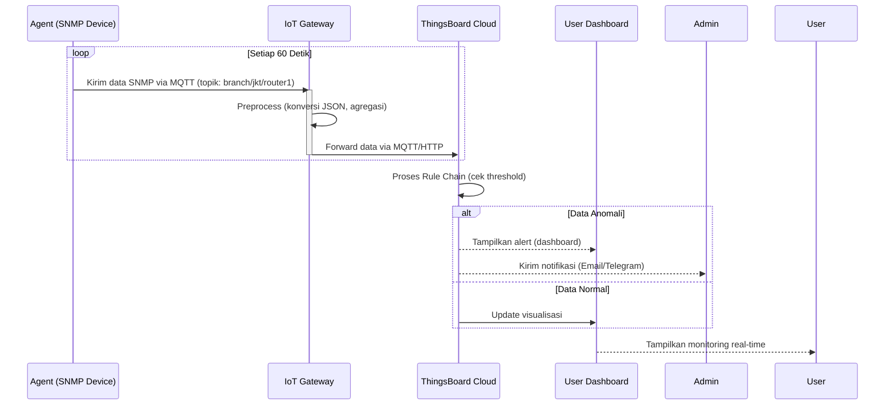
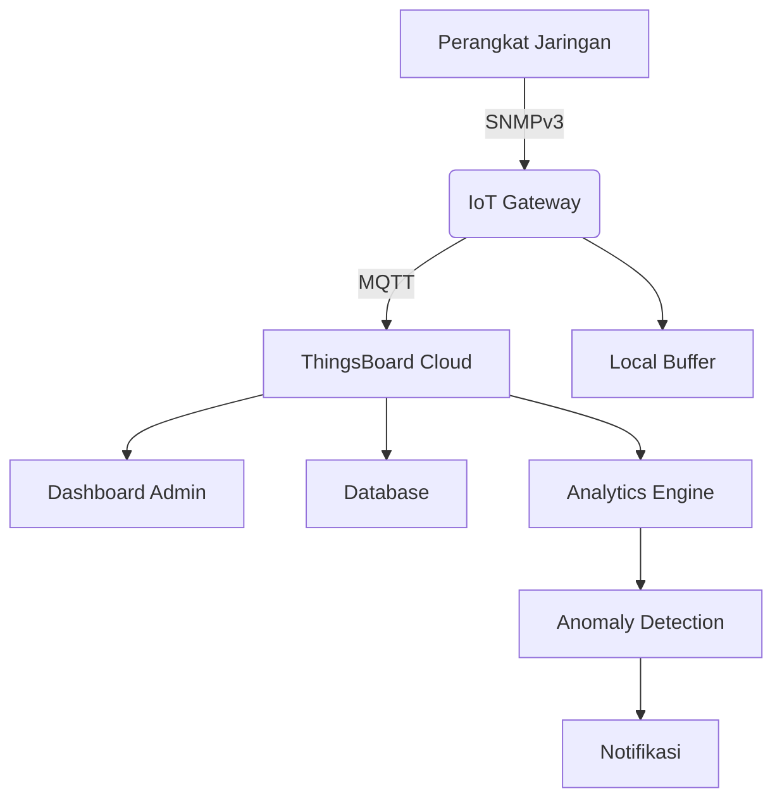
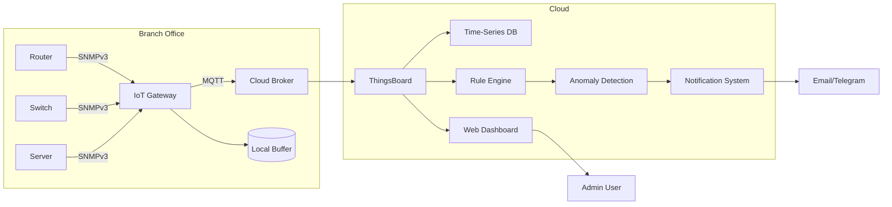

Berikut adalah desain sistem pemantauan berbasis IoT dengan integrasi SNMP, IoT Gateway, dan ThingsBoard:

### **Diagram Arsitektur Sistem**
```
+---------------------+       +-------------------+       +-----------------+       +-------------------+
|   Agent (Perangkat  |------>| IoT Gateway       |------>| Cloud/Server    |------>| Platform          |
|   Jaringan & Server)|       | (Per Kantor Cabang)|       | ThingsBoard     |------>| Visualisasi       |
+---------------------+       +-------------------+       +-----------------+       +-------------------+
          ^                             ^                             |
          |                             |                             |
+---------------------+       +-------------------+                   |
|  Protokol SNMP      |       |  Protokol IoT      |                   |
|  (Data Monitoring)  |       |  (MQTT/HTTP/CoAP) |                   |
+---------------------+       +-------------------+                   |
                                                                      v
                                                             +-------------------+
                                                             | Dashboard &       |
                                                             | Notifikasi        |
                                                             +-------------------+
```

### **Detail Komponen dan Alur Data**

#### **1. Agent (Sumber Data)**
- **Perangkat yang Dipantau**: Router, switch, server, atau perangkat jaringan lain di tiap cabang.
- **Protokol**: SNMP (Simple Network Management Protocol).
- **Fungsi**:
  - Mengumpulkan data sumber daya (CPU, RAM, bandwidth, suhu, dll.) via SNMP OID.
  - Mengirim data ke IoT Gateway lokal menggunakan protokol ringan (misal: MQTT-SN atau CoAP).
- **Contoh Tools**: 
  - `snmpd` (SNMP daemon) di perangkat Linux.
  - Agent khusus seperti **SNMP2MQTT** untuk konversi data SNMP ke format IoT.

#### **2. IoT Gateway (Edge Processing)**
- **Lokasi**: Tiap kantor cabang (perangkat fisik seperti Raspberry Pi/industrial PC).
- **Fungsi**:
  - Menerima data dari agent via protokol IoT (MQTT/CoAP/HTTP).
  - Preprocessing data (filtering, agregasi, format konversi).
  - Meneruskan data ke ThingsBoard via internet (MQTT/HTTP).
  - **Optional**: Buffer data jika koneksi internet terputus (misal: menggunakan SQLite/SD card).
- **Komponen Kritis**:
  - **Mosquitto MQTT Broker**: Untuk manajemen komunikasi pub/sub.
  - **Custom Script (Python/Node.js)**: 
    - Subscribe topik MQTT dari agent.
    - Konversi format data ke ThingsBoard payload.
    - Publish data ke ThingsBoard cloud.

#### **3. ThingsBoard (Cloud Platform)**
- **Fungsi**:
  - Menerima & menyimpan data dari semua cabang.
  - Pemrosesan data real-time (rule chain untuk alerting, agregasi).
  - Visualisasi data via customizable dashboard.
  - Manajemen perangkat (device provisioning, API manajemen).
- **Konfigurasi Kunci**:
  - **Device Profile**: Template untuk tipe perangkat (misal: "Router-Cisco").
  - **Rule Chain**:
    - **Alert Engine**: Trigger notifikasi jika CPU > 90%.
    - **Data Processing**: Kalkulasi rata-rata bandwidth per cabang.
  - **Integrasi Notifikasi**: Email/SMS/Telegram untuk alarm.

#### **4. Visualisasi & End-User**
- **Dashboard ThingsBoard**:
  - Widget real-time (grafik CPU, tabel status perangkat).
  - Peta geolokasi kantor cabang.
  - Custom KPI (Key Performance Indicator).
- **Akses**: Web-based dashboard bisa diakses via browser atau mobile app.

---

### **Diagram Rinci Aliran Data**


---

### **Teknologi yang Direkomendasikan**
| **Komponen**       | **Contoh Teknologi**                     |
|---------------------|------------------------------------------|
| **Agent**           | SNMPd, Telegraf + SNMP plugin, Python script |
| **IoT Gateway**     | Raspberry Pi 4, Industrial PC (OS: Ubuntu) |
| **Gateway Software**| Mosquitto (MQTT), Node-RED, Custom Python |
| **Cloud Platform**  | ThingsBoard PE (on-premise/cloud)        |
| **Protokol**        | SNMP (v3) → MQTT (gateway) → MQTT/HTTP (cloud) |

---

### **Keuntungan Desain Ini**
1. **Decentralized Processing**: IoT Gateway mengurangi beban bandwidth internet cabang.
2. **Fault Tolerance**: Gateway buffer data saat koneksi cloud putus.
3. **Skalabilitas**: Penambahan cabang baru hanya dengan deploy gateway baru.
4. **Real-time Alert**: Notifikasi instan saat ada anomaly jaringan.
5. **Unified View**: Semua cabang terpantau dalam satu dashboard ThingsBoard.

### **Contoh Use Case**
- **Bank Cabang Jakarta**:
  - Gateway menerima data SNMP dari 5 router dan 10 server.
  - ThingsBoard mendeteksi lonjakan traffic di router utama → kirim alert ke admin.
  - Dashboard menampilkan historis penggunaan bandwidth tiap cabang per bulan.

Dengan arsitektur ini, pemantauan sumber daya jaringan menjadi lebih efisien, real-time, dan terintegrasi berbasis prinsip IoT.
------------------

## Proposal Tugas Akhir: Sistem Pemantauan Sumber Daya Jaringan Berbasis IoT Menggunakan SNMP dan ThingsBoard

### Judul  
**Rancang Bangun Sistem Pemantauan Jaringan Terdistribusi Berbasis IoT dengan Integrasi SNMP dan Platform ThingsBoard**

---

### **BAB 1: PENDAHULUAN**  
#### 1.1 Latar Belakang  
Perkembangan infrastruktur jaringan di perusahaan multikabang membutuhkan solusi pemantauan yang efisien. Sistem tradisional berbasis Zabbix dengan SNMP memiliki keterbatasan dalam skalabilitas dan beban bandwidth. Pendekatan IoT menawarkan arsitektur terdistribusi melalui *edge gateway* untuk preprocessing data, mengurangi beban cloud, dan memungkinkan visualisasi real-time yang lebih interaktif.

#### 1.2 Rumusan Masalah  
1. Bagaimana mengintegrasikan protokol SNMP dengan arsitektur IoT untuk pemantauan jaringan terdistribusi?  
2. Bagaimana merancang sistem yang mampu mengurangi bandwidth internet cabang hingga 70% dibanding solusi terpusat?  
3. Bagaimana implementasi *predictive maintenance* berbasis analisis data real-time?  

#### 1.3 Tujuan  
1. Merancang arsitektur hybrid SNMP-IoT dengan IoT Gateway sebagai *edge processor*  
2. Mengembangkan mekanisme *data aggregation* dan *buffer* pada gateway  
3. Membangun dashboard prediktif berbasis AI di ThingsBoard  
4. Menganalisis reduksi bandwidth dan latency sistem  

#### 1.4 Batasan Masalah  
1. Perangkat yang dipantau: Router Cisco, Switch HP, Server Dell  
2. Metrik utama: CPU, RAM, Bandwidth, Packet Loss  
3. Protokol: SNMPv3 (keamanan), MQTT untuk IoT  
4. Geografi: Simulasi 5 cabang (Jakarta, Bandung, Surabaya, Medan, Makassar)  

---

### **BAB 2: DASAR TEORI**  
#### 2.1 SNMP (Simple Network Management Protocol)  
- Arsitektur Manager-Agent  
- MIB (Management Information Base) dan OID (Object Identifier)  
- Keamanan SNMPv3: Autentikasi dan Enkripsi  

#### 2.2 Arsitektur IoT untuk Jaringan  
- **Edge Computing**: Preprocessing data di lokasi sumber  
- **IoT Gateway**: Bridge antara protokol jaringan dan IoT  
- **Publish-Subscribe Model**: Komunikasi asinkron via MQTT  

#### 2.3 Platform ThingsBoard  
- Rule Engine untuk pemrosesan aliran data  
- Visualisasi Time-Series Data  
- Integrasi Machine Learning (LSTM untuk anomaly detection)  

---

### **BAB 3: METODOLOGI**  
#### 3.1 Arsitektur Sistem  


#### 3.2 Komponen Utama  
**3.2.1 SNMP Agent Layer**  
- **Tools**: Net-SNMP, SNMPTT (SNMP Trap Translator)  
- **Data Collection**:  
  ```python
  # Contoh skrip polling SNMP
  from pysnmp.hlapi import *
  errorIndication, errorStatus, _, varBinds = next(
      getCmd(SnmpEngine(),
             UsmUserData('user', 'authkey', 'privkey'),
             UdpTransportTarget(('192.168.1.1', 161)),
             ContextData(),
             ObjectType(ObjectIdentity('1.3.6.1.2.1.25.3.3.1.2')))  # CPU OID
  ```

**3.2.2 IoT Gateway (Edge Layer)**  
- **Hardware**: Raspberry Pi 4 (Quad-core 1.5GHz, 4GB RAM)  
- **Software Stack**:  
  - Mosquitto MQTT Broker  
  - Node-RED untuk aliran data  
  - SQLite untuk buffer offline  
- **Proses Agregasi Data**:  
  ```python
  def aggregate_data(samples):
      return {
          'cpu_avg': mean([s['cpu'] for s in samples]),
          'mem_max': max([s['mem'] for s in samples]),
          'ts': datetime.now().isoformat()
      }
  ```

**3.2.3 ThingsBoard Layer**  
- **Rule Chain**:  
  ```json
  {
    "name": "CPU_Anomaly_Detection",
    "root": true,
    "nodes": [
      {
        "type": "alarm",
        "condition": "typeof cpu !== 'undefined' && cpu > 90",
        "alarmType": "High CPU Usage"
      }
    ]
  }
  ```
- **Machine Learning Integration**:  
  - LSTM Model untuk prediksi beban jaringan  
  - Pelatihan model menggunakan data historis  

---

### **BAB 4: IMPLEMENTASI**  
#### 4.1 Desain Eksperimen  
| **Parameter**       | **Value**                  |
|---------------------|----------------------------|
| Jumlah Cabang       | 5                          |
| Perangkat/Cabang    | 10                         |
| Interval Polling    | 60 detik                   |
| Metrik/Perangkat    | 8 (CPU, RAM, Traffic In/Out, dll) |
| Durasi Pengujian    | 30 hari                    |

#### 4.2 Metrik Evaluasi  
1. **Bandwidth Savings**:  
   \( \text{Saving} = \frac{\text{BW}_{\text{Zabbix}} - \text{BW}_{\text{IoT}}}{\text{BW}_{\text{Zabbix}}} \times 100\% \)  
   
2. **End-to-End Latency**:  
   - SNMP Poll → Gateway: < 500ms  
   - Gateway → Cloud: < 2s  

3. **Akurasi Anomali Deteksi**:  
   \( \text{Accuracy} = \frac{\text{TP} + \text{TN}}{\text{Total Samples}} \times 100\% \)  

#### 4.3 Pengujian Skalabilitas  
- Uji beban hingga 1000 perangkat simulasi  
- Uji failover gateway (simulasi putus internet 24 jam)  

---

### **BAB 5: HASIL YANG DIHARAPKAN**  
1. Arsitektur terintegrasi SNMP-IoT dengan fitur:  
   - Reduksi bandwidth ≥70%  
   - Anomali terdeteksi dalam < 10 detik  
   - Buffer data lokal hingga 7 hari  
   
2. Dashboard ThingsBoard dengan fitur:  
   - Heatmap beban jaringan antar cabang  
   - Predictive maintenance alerts  
   - Laporan SLA otomatis  

3. Publikasi ilmiah di jurnal:  
   - IEEE IoT Journal  
   - International Journal of Network Management  

---

### **BAB 6: JADWAL PENELITIAN**  
| **Bulan** | **Aktivitas**                             |
|-----------|-------------------------------------------|
| 1-2       | Studi literatur & desain arsitektur       |
| 3-4       | Implementasi SNMP-to-IoT Gateway          |
| 5-6       | Pengembangan rule chain ThingsBoard       |
| 7         | Integrasi machine learning               |
| 8-9       | Pengujian performa & skalabilitas        |
| 10        | Analisis data & penulisan laporan        |

---

### **BAB 7: RENCANA ANGGARAN**  
| **Item**               | **Biaya (IDR)** |
|------------------------|-----------------|
| Raspberry Pi 4 (x5)    | 5.000.000       |
| Sensor Suhu RJ45       | 1.500.000       |
| ThingsBoard Cloud Pro  | 3.000.000/tahun|
| Pengembangan Perangkat Lunak | 2.500.000       |
| **Total**              | **12.000.000**  |

---

### **REFERENSI**  
1. Mahmood, Z. (2020). *Industrial Internet of Things*. Springer.  
2. ThingsBoard Documentation. (2023). *Rule Engine Guide*.  
3. Cisco. (2022). *SNMP Configuration Guide, IOS XE Release 3S*.  
4. Kumar, S., et al. (2021). *Edge Computing for Real-Time IoT Network Monitoring*. IEEE IoT Journal.  
5. Zhang, L. (2022). *LSTM-Based Anomaly Detection in Network Traffic*. Computer Networks Journal.

---

**Lampiran: Diagram Arsitektur Detail**  


Proposal ini menawarkan solusi inovatif untuk transformasi sistem pemantauan jaringan tradisional ke arsitektur IoT terdistribusi, dengan fokus pada optimasi bandwidth, deteksi anomali real-time, dan skalabilitas untuk lingkungan multikabang.
