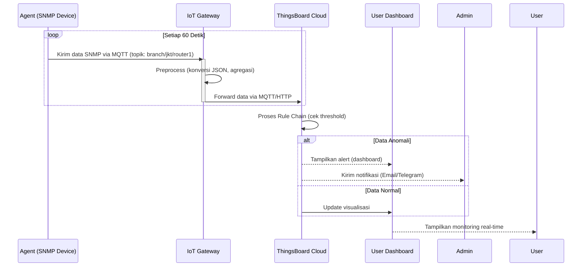

Berikut adalah desain sistem pemantauan berbasis IoT dengan integrasi SNMP, IoT Gateway, dan ThingsBoard:

### **Diagram Arsitektur Sistem**
```
+---------------------+       +-------------------+       +-----------------+       +-------------------+
|   Agent (Perangkat  |------>| IoT Gateway       |------>| Cloud/Server    |------>| Platform          |
|   Jaringan & Server)|       | (Per Kantor Cabang)|       | ThingsBoard     |------>| Visualisasi       |
+---------------------+       +-------------------+       +-----------------+       +-------------------+
          ^                             ^                             |
          |                             |                             |
+---------------------+       +-------------------+                   |
|  Protokol SNMP      |       |  Protokol IoT      |                   |
|  (Data Monitoring)  |       |  (MQTT/HTTP/CoAP) |                   |
+---------------------+       +-------------------+                   |
                                                                      v
                                                             +-------------------+
                                                             | Dashboard &       |
                                                             | Notifikasi        |
                                                             +-------------------+
```

### **Detail Komponen dan Alur Data**

#### **1. Agent (Sumber Data)**
- **Perangkat yang Dipantau**: Router, switch, server, atau perangkat jaringan lain di tiap cabang.
- **Protokol**: SNMP (Simple Network Management Protocol).
- **Fungsi**:
  - Mengumpulkan data sumber daya (CPU, RAM, bandwidth, suhu, dll.) via SNMP OID.
  - Mengirim data ke IoT Gateway lokal menggunakan protokol ringan (misal: MQTT-SN atau CoAP).
- **Contoh Tools**: 
  - `snmpd` (SNMP daemon) di perangkat Linux.
  - Agent khusus seperti **SNMP2MQTT** untuk konversi data SNMP ke format IoT.

#### **2. IoT Gateway (Edge Processing)**
- **Lokasi**: Tiap kantor cabang (perangkat fisik seperti Raspberry Pi/industrial PC).
- **Fungsi**:
  - Menerima data dari agent via protokol IoT (MQTT/CoAP/HTTP).
  - Preprocessing data (filtering, agregasi, format konversi).
  - Meneruskan data ke ThingsBoard via internet (MQTT/HTTP).
  - **Optional**: Buffer data jika koneksi internet terputus (misal: menggunakan SQLite/SD card).
- **Komponen Kritis**:
  - **Mosquitto MQTT Broker**: Untuk manajemen komunikasi pub/sub.
  - **Custom Script (Python/Node.js)**: 
    - Subscribe topik MQTT dari agent.
    - Konversi format data ke ThingsBoard payload.
    - Publish data ke ThingsBoard cloud.

#### **3. ThingsBoard (Cloud Platform)**
- **Fungsi**:
  - Menerima & menyimpan data dari semua cabang.
  - Pemrosesan data real-time (rule chain untuk alerting, agregasi).
  - Visualisasi data via customizable dashboard.
  - Manajemen perangkat (device provisioning, API manajemen).
- **Konfigurasi Kunci**:
  - **Device Profile**: Template untuk tipe perangkat (misal: "Router-Cisco").
  - **Rule Chain**:
    - **Alert Engine**: Trigger notifikasi jika CPU > 90%.
    - **Data Processing**: Kalkulasi rata-rata bandwidth per cabang.
  - **Integrasi Notifikasi**: Email/SMS/Telegram untuk alarm.

#### **4. Visualisasi & End-User**
- **Dashboard ThingsBoard**:
  - Widget real-time (grafik CPU, tabel status perangkat).
  - Peta geolokasi kantor cabang.
  - Custom KPI (Key Performance Indicator).
- **Akses**: Web-based dashboard bisa diakses via browser atau mobile app.

---

### **Diagram Rinci Aliran Data**


---

### **Teknologi yang Direkomendasikan**
| **Komponen**       | **Contoh Teknologi**                     |
|---------------------|------------------------------------------|
| **Agent**           | SNMPd, Telegraf + SNMP plugin, Python script |
| **IoT Gateway**     | Raspberry Pi 4, Industrial PC (OS: Ubuntu) |
| **Gateway Software**| Mosquitto (MQTT), Node-RED, Custom Python |
| **Cloud Platform**  | ThingsBoard PE (on-premise/cloud)        |
| **Protokol**        | SNMP (v3) → MQTT (gateway) → MQTT/HTTP (cloud) |

---

### **Keuntungan Desain Ini**
1. **Decentralized Processing**: IoT Gateway mengurangi beban bandwidth internet cabang.
2. **Fault Tolerance**: Gateway buffer data saat koneksi cloud putus.
3. **Skalabilitas**: Penambahan cabang baru hanya dengan deploy gateway baru.
4. **Real-time Alert**: Notifikasi instan saat ada anomaly jaringan.
5. **Unified View**: Semua cabang terpantau dalam satu dashboard ThingsBoard.

### **Contoh Use Case**
- **Bank Cabang Jakarta**:
  - Gateway menerima data SNMP dari 5 router dan 10 server.
  - ThingsBoard mendeteksi lonjakan traffic di router utama → kirim alert ke admin.
  - Dashboard menampilkan historis penggunaan bandwidth tiap cabang per bulan.

Dengan arsitektur ini, pemantauan sumber daya jaringan menjadi lebih efisien, real-time, dan terintegrasi berbasis prinsip IoT.
