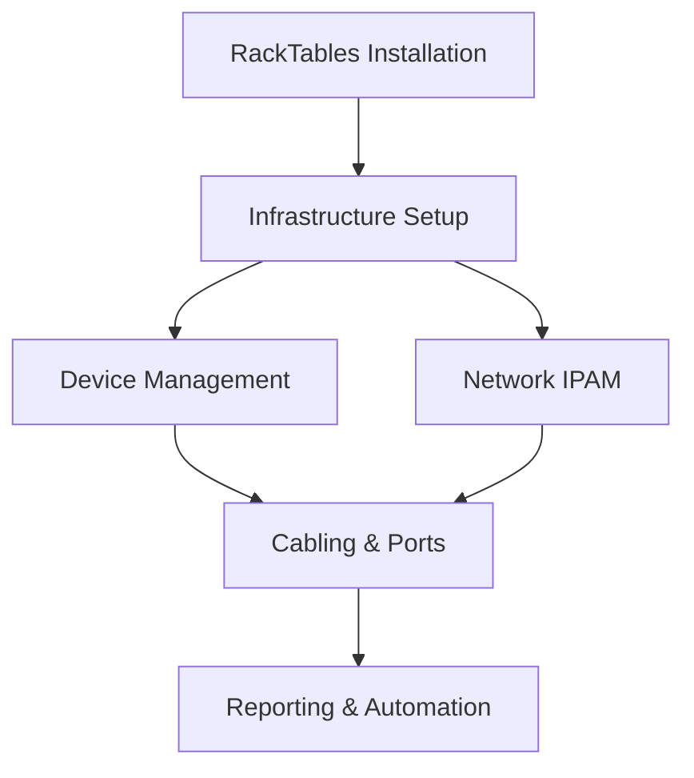
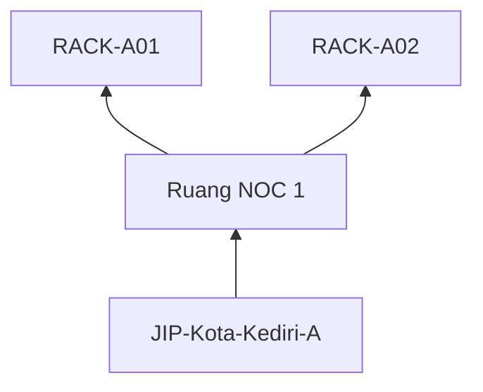

# **Manual Lengkap RackTables untuk Data Center Management**  
*(Versi 1.0 - Untuk Profesional Data Center)*  



## **1. Pendahuluan**  
**Apa itu RackTables?**  
Open-source DCIM (Data Center Infrastructure Management) untuk:  
- 📊 Manajemen aset fisik & logis  
- 🔌 Dokumentasi kabel & jaringan  
- 📍 IP Address Management (IPAM)  
- 🏷️ Pelacakan aset berbasis tag  

**Use Case Utama**:  
- Visualisasi tata letak rak & perangkat  
- Manajemen subnet dan alokasi IP  
- Dokumentasi koneksi end-to-end  
- Audit kapasitas ruang/rak  

---

## **2. Instalasi & Konfigurasi Awal**  
### **Persyaratan Sistem**  
- OS: Ubuntu 20.04+/Debian 11+  
- Web Server: Apache 2.4+  
- Database: MariaDB 10.3+  
- PHP: 7.4+ dengan ekstensi `gd`, `mysqli`, `json`  

### **Proses Instalasi**  
```bash
# Download terbaru
wget https://racktables.org/files/stable/racktables-0.22.1.tar.gz
tar -xzvf racktables-*.tar.gz
sudo mv racktables /var/www/html/

# Buat database
sudo mysql -e "CREATE DATABASE racktables_db;"
sudo mysql -e "CREATE USER 'rackuser'@'localhost' IDENTIFIED BY 'P@ssw0rd!';"
sudo mysql -e "GRANT ALL ON racktables_db.* TO 'rackuser'@'localhost';"

# Konfigurasi file secret
sudo nano /var/www/html/racktables/inc/secret.php
```
```php
<?php
$db_username = 'rackuser';
$db_password = 'P@ssw0rd!';
$db_name = 'racktables_db';
```

### **Setup Awal via Web**  
1. Akses `http://your-server/racktables/install.php`  
2. Ikuti wizard:  
   - Verifikasi sistem  
   - Konfigurasi admin user  
   - Inisialisasi database  
3. Hapus file `install.php` setelah selesai  

---

## **3. Struktur Hierarki Data Center**  
### **Membangun Layout Fisik**  
1. **Tambah Lokasi**:  
   - `Menu: Locations → Add Location`  
   - Contoh:  
     - Name: `Dinas Komunikasi, Informatika dan Statistik Kota Kediri`  
     - Type: `Jaringan Intra Pemerintah Kota Kediri`  
     - Parent: `None`  

2. **Tambah Rak**:  
   - `Menu: Racks → Add Rack`  
   - Isi:  
     | Field | Contoh |  
     |-------|--------|  
     | Name | RACK-A01 |  
     | Location | Ruang Server 1 |  
     | Height | 42U |  
     | Model | Standard 19" |  



---

## **4. Manajemen Perangkat**  
### **Menambahkan Device Baru**  
1. `Objects → Add Object`  
2. Pilih jenis:  
   - Server, Switch, Router, PDU, Storage, dll  
3. Form wajib:  
   - **Name**: `WEB-PRIMARY-01`  
   - **Asset Tag**: `IDC-JKT-2024-001`  
   - **Model**: Pilih dari database atau tambah baru  

### **Penempatan di Rak**  
- Drag & drop di view `RackSpace`  
- Atur:  
  - **Position**: Unit awal (misal: U12)  
  - **Orientation**: Front/Back  
  - **Port Alignment**: Left/Right (untuk switch)  

  
*Contoh tata letak perangkat di rack*

---

## **5. Manajemen Jaringan (IPAM)**  
### **Definisikan Subnet**  
1. `IPv4 Networks → Add Network`  
   - Network: `192.168.20.0/24`  
   - Gateway: `192.168.20.1`  
   - VLAN: `20`  
   - Name: `DMZ-Servers`  

### **Alokasi IP ke Perangkat**  
1. Buka objek perangkat  
2. Tab `IPs → Add IP`  
3. Pilih dari subnet yang tersedia  

### **DNS Integration**  
- Otomatiskan PTR records:  
  `Configuration → Settings → Auto PTR records = YES`  

---

## **6. Manajemen Kabel & Port**  
### **Koneksi Perangkat**  
1. Buka objek sumber (mis. Switch)  
2. Tab `Ports → Add Port`:  
   - Name: `Gig1/0/24`  
   - Type: `1000BASE-T`  
3. Klik **Connect** → Pilih perangkat tujuan & port (mis. `WEB-PRIMARY-01: eth0`)  

### **Labeling Kabel**  
- Gunakan atribut kustom:  
  - `Cable ID`: `FIBER-A-012`  
  - `Length`: `3m`  
  - `Color`: `Yellow`  

### **Visualisasi Topologi**  
- Gunakan `Cabling` view:  
  ```mermaid
  graph LR
      SW[Switch-Core] -- Port 24 --> WEB[WEB-PRIMARY-01]
      SW -- Port 18 --> DB[DB-MASTER-01]
  ```

---

## **7. Pelaporan & Otomasi**  
### **Generate Report**  
1. `Reports → Create Report`  
2. Contoh query:  
   - **Semua server di RACK-A01**:  
     ```sql
     SELECT ObjectName, AssetTag 
     FROM Object 
     WHERE Rack = 'RACK-A01' AND Type = 'Server'
     ```  
   - **IP terpakai di VLAN 20**:  
     ```sql
     SELECT IP, ObjectName 
     FROM IPv4Allocation 
     WHERE VLAN = 20
     ```

### **API & Skrip Otomasi**  
Gunakan CLI tool `racktables-script`:  
```bash
# Tambah server baru via CLI
echo 'add_object "BACKUP-SRV-01" server' | racktables-script -u admin

# Alokasi IP
echo 'add_ipv4 192.168.30.45 "BACKUP-SRV-01"' | racktables-script -u admin
```

---

## **8. Best Practices**  
### **Tagging Strategy**  
| Tag | Deskripsi | Contoh Objek |  
|-----|-----------|-------------|  
| `#prod` | Produksi | Server utama |  
| `#backup` | Backup target | Storage, tape library |  
| `#decom` | Decommissioned | Perangkat non-aktif |  

### **Atribut Kustom Wajib**  
1. `Maintenance Window`: Setiap perangkat  
2. `Support Vendor`: Untuk kontrak dukungan  
3. `Power Consumption`: Prediksi beban daya  

### **Backup Rutin**  
```bash
# Backup database
mysqldump -u rackuser -p racktables_db > racktables_backup_$(date +%F).sql

# Backup konfigurasi
tar -czvf racktables_config_$(date +%F).tar.gz /var/www/html/racktables/inc/
```

---

## **9. Troubleshooting**  
**Masalah Umum & Solusi**:  
| Gejala | Penyelesaian |  
|--------|--------------|  
| Port tidak muncul | Pastikan port type sudah didefinisikan di `Configuration → Port Types` |  
| IP conflict | Aktifkan `IP conflict checking` di Settings |  
| Performance lambat | Optimasi indeks database & caching PHP |  

**Log Penting**:  
- `/var/log/apache2/error.log`  
- Database slow query log  

---

## **10. Lampiran: Cheat Sheet**  
### **Shortcut Keyboard**  
- `Ctrl + D`: Tambah perangkat cepat  
- `Ctrl + K`: Buka manajemen kabel  
- `Ctrl + Q`: Pencarian global  

### **File Konfigurasi Kritis**  
| Path | Fungsi |  
|------|--------|  
| `/inc/secret.php` | Kredensial database |  
| `/inc/options.php` | Pengaturan sistem |  
| `/wwwroot/plugins/` | Folder plugin kustom |  

### **Link Penting**  
- [Dokumentasi Resmi](https://wiki.racktables.org/)  
- [Template RackCode](https://github.com/RackTables/racktables-contribs)  
- [Komunitas Forum](https://groups.google.com/g/racktables-users)  

© 2024 Cyber Security Research Group  Politeknik Elektronika Negeri Surabaya - RackTables v0.22+
