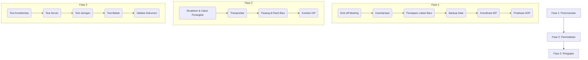
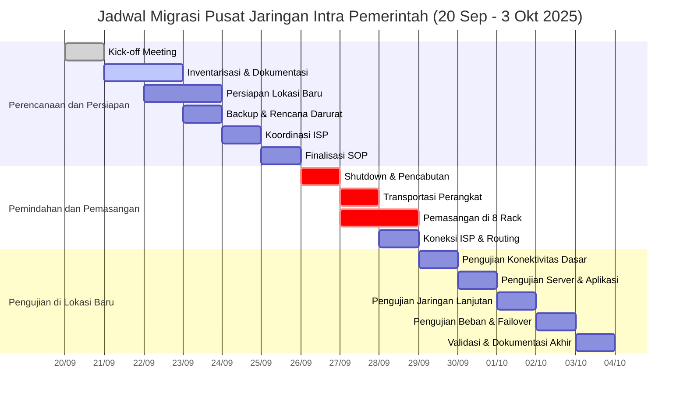

### **KERANGKA ACUAN KERJA (KAK) MIGRASI PUSAT KENDALI JIP**  
**Judul Proyek:** Migrasi Pusat Kendali JIP dari Lokasi Lama ke Lokasi Baru  
**Tanggal:** 20 September - 3 Oktober 2025  
**Pemimpin Proyek:** [Nama Project Manager]  
**Tim Terlibat:** Administrator Jaringan, Kepala IT, Teknisi Jaringan, Teknisi Telekomunikasi, ISP  

---

## **I. Latar Belakang**  
**Ruang Lingkup Proyek Migrasi Pusat Data (Penjelasan Lengkap 500 Kata)**

Proyek migrasi pusat data ini merupakan inisiatif strategis untuk memindahkan seluruh infrastruktur TI dari lokasi lama ke fasilitas baru yang lebih modern dan skalabel. Ruang lingkup pekerjaan dirancang secara komprehensif untuk memastikan perpindahan yang lancar dengan dampak minimal terhadap operasional bisnis. Proyek ini mencakup empat aspek utama: migrasi jaringan, pemindahan fisik perangkat, persiapan infrastruktur lokasi baru, serta pengujian dan validasi menyeluruh.

Pada aspek migrasi jaringan, proyek ini akan memindahkan seluruh konfigurasi jaringan secara utuh tanpa mengubah arsitektur yang ada. Ini termasuk transfer semua pengaturan IP address, VLAN, tabel routing, dan aturan firewall ke lingkungan baru. Khusus untuk konektivitas eksternal, tim akan berkoordinasi erat dengan penyedia layanan internet (ISP) untuk memastikan migrasi koneksi WAN berjalan lancar, termasuk transfer IP Public dan konfigurasi BGP routing jika diperlukan. Seluruh perubahan pada jaringan akan didokumentasikan secara rinci untuk memudahkan pelacakan dan pemecahan masalah. Aspek kritis dalam migrasi jaringan adalah mempertahankan semua kebijakan keamanan dan Quality of Service (QoS) yang telah diimplementasikan sebelumnya.

Untuk komponen fisik, proyek ini akan memindahkan dua rack server lengkap dengan seluruh perangkat di dalamnya ke lokasi baru yang telah dipersiapkan dengan delapan rack. Proses pemindahan mencakup server fisik dan virtual beserta sistem penyimpanan terkait (NAS/SAN), perangkat jaringan aktif (switch, router, firewall, load balancer), serta seluruh infrastruktur pendukung seperti sistem cable management (kabel fiber optik, UTP, dan power). Setiap perangkat akan diberi label jelas sebelum dipindahkan untuk memastikan pemasangan yang akurat di lokasi baru. Tata letak di fasilitas baru dirancang dengan pendekatan modular untuk memungkinkan ekspansi di masa depan, sekaligus mengoptimalkan aliran udara dan efisiensi energi.

Persiapan infrastruktur di lokasi baru merupakan fase kritis yang meliputi beberapa verifikasi penting. Tim akan memastikan ketersediaan daya listrik yang memadai melalui pemeriksaan kapasitas UPS, PDU, dan kebutuhan ampere seluruh perangkat. Sistem pendingin ruangan akan diuji untuk memastikan dapat mempertahankan suhu optimal 18-22°C dengan sirkulasi udara yang baik. Instalasi fisik meliputi pemasangan rack baru, sistem grounding, dan cable tray yang memenuhi standar TIA-942 untuk data center. Selain itu, dilakukan juga pengecekan terhadap sistem keamanan fisik seperti akses kontrol, pemadam kebakaran, dan monitoring lingkungan.

Fase pengujian dan validasi dirancang secara menyeluruh untuk memverifikasi keberhasilan migrasi. Tim akan melakukan serangkaian uji coba dimulai dari tes konektivitas dasar (ping, traceroute), verifikasi fungsi VLAN dan DNS, hingga pengujian aplikasi bisnis kritis. Dilakukan juga uji beban (load testing) untuk memastikan kinerja jaringan memenuhi standar, serta uji failover untuk memverifikasi redundansi sistem. Seluruh hasil pengujian akan didokumentasikan dalam laporan lengkap yang mencakup metrik kinerja seperti throughput, latency, dan packet loss.

Proyek ini secara spesifik tidak mencakup pengembangan aplikasi baru atau upgrade perangkat keras yang tidak terkait langsung dengan proses migrasi. Setelah migrasi selesai, fasilitas data center lama akan dinonaktifkan secara resmi. Tim proyek menetapkan toleransi downtime maksimal 48 jam selama periode kritis 26-28 September 2025, dengan rencana cadangan yang jelas untuk meminimalkan gangguan operasional. Komunikasi intensif dengan semua stakeholder, termasuk manajemen bisnis dan unit pengguna, akan dilakukan secara berkala untuk memastikan transparansi dan kesiapan semua pihak menghadapi perubahan ini.

Migrasi ini dilakukan untuk memindahkan **2 rack server beserta perangkat jaringan** ke lokasi baru dengan **8 rack**, termasuk migrasi koneksi internet, konfigurasi jaringan, dan infrastruktur pendukung. Proyek ini bertujuan untuk:  
- Meningkatkan kapasitas dan skalabilitas pusat data.  
- Meminimalkan downtime operasional.  
- Memastikan keamanan data dan kontinuitas bisnis.  

---

## **II. Ruang Lingkup Pekerjaan**  
### **A. Yang Termasuk dalam Proyek**  
1. **Migrasi Jaringan:**  
   - Pemindahan konfigurasi IP, VLAN, routing, dan firewall.  
   - Koordinasi dengan ISP untuk migrasi koneksi internet.  
2. **Migrasi Fisik:**  
   - Pemindahan 2 rack server, switch, router, dan perangkat pendukung.  
   - Pemasangan ulang di 8 rack baru dengan tata letak optimal.  
3. **Kabel Management:**  
   - Penataan ulang kabel jaringan dan power untuk memenuhi standar best practice.  
4. **Pengujian & Validasi:**  
   - Uji konektivitas, performa jaringan, dan fungsionalitas aplikasi.  

---
## **III. Tahapan Pekerjaan** 

Berikut adalah alur kerja migrasi terstruktur dalam **3 fase utama**, dilengkapi jadwal harian dan diagram Mermaid.

---

### **Fase 1: Perencanaan dan Persiapan**  
*(20-25 September 2025)*  
**Tujuan:** Memastikan semua aspek teknis, logistik, dan koordinasi siap sebelum pemindahan.  

| Hari | Tanggal       | Aktivitas                                                                                               | Tim Terlibat                          |
|------|---------------|---------------------------------------------------------------------------------------------------------|---------------------------------------|
| 1    | 20 Sep (Sabtu)| **Kick-off Meeting** - Menetapkan tujuan, timeline, dan tanggung jawab pihak terkait.                 | PM, Kepala IT, Admin Jaringan, ISP    |
| 2    | 21 Sep (Minggu)| **Inventarisasi & Dokumentasi** - Mencatat konfigurasi perangkat (server, jaringan), topologi jaringan, dan label kabel. | Admin Jaringan, Teknisi              |
| 3    | 22 Sep (Senin)| **Persiapan Lokasi Baru** - Verifikasi daya listrik, cooling, rack layout (8 rack), dan koneksi ISP. | Teknisi Telekomunikasi, ISP          |
| 4    | 23 Sep (Selasa)| **Backup & Rencana Darurat** - Backup penuh data dan konfigurasi. - Siapkan rencana rollback.      | Admin Jaringan, Teknisi              |
| 5    | 24 Sep (Rabu) | **Koordinasi dengan ISP** - Konfirmasi maintenance window untuk migrasi koneksi internet.            | PM, ISP                              |
| 6    | 25 Sep (Kamis)| **Finalisasi SOP** - SOP pemindahan fisik, pengujian, dan komunikasi darurat.                        | Semua Tim                            |

---

### **Fase 2: Pemindahan dan Pemasangan**  
*(26-28 September 2025)*  
**Tujuan:** Memindahkan perangkat secara fisik dan memasangnya di lokasi baru dengan minimal downtime.  

| Hari | Tanggal       | Aktivitas                                                                                               | Tim Terlibat                          |
|------|---------------|---------------------------------------------------------------------------------------------------------|---------------------------------------|
| 7    | 26 Sep (Jumat)| **Shutdown & Pencabutan** *(18:00-23:59)* - Matikan server/perangkat. - Label & cabut kabel/perpindahan dari 2 rack. | Admin Jaringan, Teknisi              |
| 8    | 27 Sep (Sabtu)| **Transportasi** *(08:00-12:00)* - Pindahkan perangkat ke lokasi baru dengan pengamanan khusus.      | Teknisi, Logistik                    |
|      |               | **Pemasangan di 8 Rack** *(13:00-20:00)* - Instal perangkat di rack baru sesuai layout. - Pasang kabel (power & jaringan). | Teknisi Jaringan, Telekomunikasi     |
| 9    | 28 Sep (Minggu)| **Koneksi ISP & Routing Awal** *(08:00-15:00)* - Aktifkan koneksi internet dasar dan routing statis. | ISP, Admin Jaringan                  |

---

### **Fase 3: Pengujian di Lokasi Baru**  
*(29 September - 3 Oktober 2025)*  
**Tujuan:** Memvalidasi fungsi seluruh sistem sebelum operasional penuh.  

| Hari | Tanggal       | Aktivitas                                                                                               | Tim Terlibat                          |
|------|---------------|---------------------------------------------------------------------------------------------------------|---------------------------------------|
| 10   | 29 Sep (Senin)| **Pengujian Konektivitas Dasar** - Ping, VLAN, dan fisik (LED port). - Verifikasi DHCP dan DNS.   | Admin Jaringan, Teknisi              |
| 11   | 30 Sep (Selasa)| **Pengujian Server & Aplikasi** - Boot server, cek OS, dan aplikasi kritis. - Uji akses storage.   | Admin Jaringan, Teknisi              |
| 12   | 1 Okt (Rabu)  | **Pengujian Jaringan Lanjutan** - Uji routing, firewall, bandwidth, dan QoS.                         | Admin Jaringan, ISP                  |
| 13   | 2 Okt (Kamis) | **Pengujian Beban & Failover** - Simulasi beban tinggi. - Uji redundansi jaringan/server.          | Admin Jaringan, Teknisi              |
| 14   | 3 Okt (Jumat) | **Validasi & Dokumentasi Akhir** - Tandatangan berita acara. - Update dokumentasi topologi baru.  | Kepala IT, PM, Semua Tim             |

---

## **IV. Jadwal Pekerjaan** 
### **Diagram Alur Migrasi dan Jadwal (Mermaid)**  

---

## **V. Sumber Daya yang Dibutuhkan**  
### **A. Perangkat & Tools**  
- **Fisik:** Lifter server, toolbox, label printer, kabel tester.  
- **Software:** Backup tools (Veeam, rsync), network monitoring (PRTG, Wireshark).  

### **B. Tim & Peran**  
| Pihak                | Tanggung Jawab                             |  
|----------------------|--------------------------------------------|  
| **Project Manager**  | Koordinasi, pengawasan timeline, komunikasi. |  
| **Admin Jaringan**   | Konfigurasi, backup, pengujian jaringan.   |  
| **Teknisi**          | Pemindahan fisik, kabel management.        |  
| **ISP**              | Migrasi koneksi internet & BGP.            |  

---

## **VI. Manajemen Risiko**  
| Risiko                          | Mitigasi                                    |  
|---------------------------------|---------------------------------------------|  
| **Downtime lebih lama**         | Jadwalkan migrasi di luar jam kerja.        |  
| **Kerusakan perangkat**         | Gunakan transportasi berpendingin & asuransi. |  
| **Konfigurasi jaringan gagal**  | Simpan backup konfigurasi & siapkan rollback. |  

---

## **VII. Kriteria Keberhasilan**  
1. **Minim Downtime:** Maksimal 48 jam (26-28 Sep 2025).  
2. **Zero Data Loss:** Backup diverifikasi sebelum migrasi.  
3. **Jaringan Stabil:** Latency ≤ 5ms, packet loss 0%.  
4. **Dokumentasi Lengkap:** Diagram jaringan baru, IP list, dan laporan migrasi.  

---

 

--- 

**Lampiran:**  
1. **Diagram Topologi Jaringan Baru**  
2. **Daftar Inventory Perangkat**  
3. **SOP Rollback**  

 

