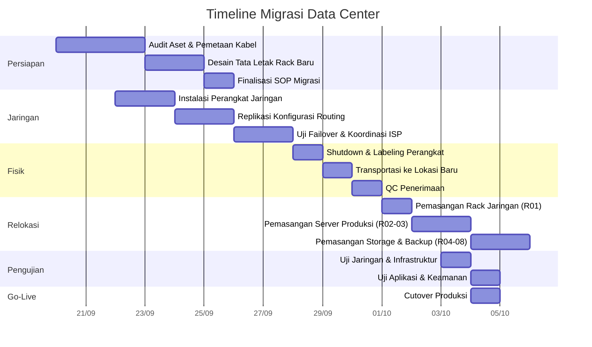

## **Rencana Migrasi Pusat Data: 20 September - 4 Oktober 2025**  



### **Tahap 1: Persiapan (20-25 September 2025)**  
#### Jadwal Detail  
| Aktivitas | Durasi | Tanggal | Penanggung Jawab |  
|-----------|--------|---------|------------------|  
| Audit Server & Jaringan | 2 hari | 20-21 Sep | Kepala IT |  
| Pemetaan Kabel Port-to-Port | 1 hari | 22 Sep | Admin Jaringan |  
| Desain 8 Rack Baru | 2 hari | 23-24 Sep | Project Manager |  
| Finalisasi Dokumen Migrasi | 1 hari | 25 Sep | Semua Tim |  

#### Checklist:  
- [ ] Matriks inventaris perangkat lengkap  
- [ ] Diagram topologi jaringan  
- [ ] Analisis kebutuhan daya & pendinginan  

---

### **Tahap 2: Migrasi Jaringan (22-28 September 2025)**  
#### Jadwal Detail  
| Aktivitas | Tanggal | Tim Terlibat | Output |  
|-----------|---------|--------------|--------|  
| Pemasangan Switch/Router | 22-23 Sep | Teknisi | Rack R01 siap |  
| Clone VLAN & Routing Tables | 24-25 Sep | Admin Jaringan | Konfigurasi aktif |  
| Uji BGP dengan ISP | 26 Sep | ISP, Admin Jaringan | Laporan throughput |  
| Validasi QoS & Failover | 27-28 Sep | Admin Jaringan | Sertifikat uji |  

#### Konfigurasi Kritis:  
```bash
! Backup Konfigurasi Router
router ospf 200
 network 192.168.0.0 0.0.255.255 area 0
 passive-interface default
 auto-cost reference-bandwidth 10000
```

---

### **Tahap 3: Pemindahan Fisik (28-30 September 2025)**  
#### Protokol Operasional  
| Waktu | Aktivitas | Protokol | Alat |  
|-------|-----------|----------|------|  
| **28 Sep (18:00-22:00)** | Shutdown | Aplikasi → VM → Storage → Fisik | Script otomasi |  
| **29 Sep (08:00-12:00)** | Labeling | 🔵 Fiber 🟢 UTP 🔴 Power | Label printer |  
| **29 Sep (13:00-17:00)** | Transport | Suhu 18-22°C, Guncangan <0.5G | Data logger |  
| **30 Sep (09:00-12:00)** | QC | Inspeksi fisik + test ESD | Multimeter |  

---

### **Tahap 4: Relokasi (1-3 Oktober 2025)**  
#### Tata Letak & Jadwal  
| Rack | Fungsi | Tanggal | Penanggung Jawab |  
|------|--------|---------|------------------|  
| R01 (Jaringan Inti) | Router, Core Switch | 1 Okt | Admin Jaringan |  
| R02-R03 (Produksi) | Server Web/App/DB | 1-2 Okt | Kepala IT |  
| R04 (Storage) | SAN/NAS | 2 Okt | Teknisi Storage |  
| R05-R08 (Backup) | Backup Server | 3 Okt | Teknisi Backup |  

---

### **Tahap 5: Pengujian (3-4 Oktober 2025)**  
#### Matriks Pengujian  
| Jenis Uji | Tanggal | Metrik Sukses | Alat |  
|-----------|---------|---------------|------|  
| Konektivitas Jaringan | 3 Okt | Packet loss <1% | PingPlotter |  
| Failover Aplikasi | 3 Okt | RTO <15 menit | LoadRunner |  
| Thermal Scan | 4 Okt | Suhu <25°C | FLIR E8 |  
| Uji Beban Daya | 4 Okt | Redundansi 99.9% | Power Analyzer |  

---

### **Tahap 6: Go-Live (4 Oktober 2025)**  
#### Rencana Cutover  
```mermaid
gantt
    title Timeline Cutover - 4 Oktober 2025
    dateFormat  YYYY-MM-DD HH:mm
    axisFormat %H:%M
    
    section Alih Daya
    Maintenance Mode ON : 2025-10-04 20:00, 15m
    Update DNS : after, 30m
    BGP Propagation : after, 1h
    Validasi Akhir : after, 2h
    
    section Kontinjensi
    Rollback Plan : 2025-10-04 23:00, 1h
```

---

### **Matriks Tanggung Jawab (RACI)**  
| Aktivitas | PM | Kepala IT | Admin Jaringan | Teknisi |  
|-----------|----|-----------|----------------|---------|  
| Desain Rack | R | A | C | I |  
| Konfigurasi Jaringan | C | A | R | - |  
| Pemindahan Fisik | A | R | I | R |  
| Uji Aplikasi | R | A | C | C |  
| Go-Live | A | R | R | I |  

**Keterangan**:  
- **R** = Responsible, **A** = Accountable  
- **C** = Consulted, **I** = Informed  

---

### **Lampiran Toolkit**  
#### Peralatan Wajib  
```markdown
- [ ] Vibration data logger (EL-USB-3)  
- [ ] Thermal camera FLIR E8  
- [ ] Cable tester Fluke LinkIQ  
- [ ] Backup config offline (2x USB encrypted)  
```

#### Kontak Darurat  
| Situasi | Kontak | Nomor |  
|---------|--------|-------|  
| Gangguan Jaringan | NOC 24/7 | 021-123456 |  
| Kerusakan Perangkat | Vendor Logistik | 0812-XXXX |  
| Masalah ISP | Technical Account Manager | 0813-YYYY |  

> **Catatan Penting**:  
> - Batas waktu rollback: **4 Oktober 2025 pukul 23:00**  
> - Monitoring intensif: **48 jam pasca cutover**  
> - Post-mortem meeting: **6 Oktober 2025**  

---

**Versi Dokumen**: 4.0  
**Tanggal Publikasi**: 15 September 2025  
© 2025 Tim Migrasi 

[Download Versi PDF](#) | [Template Word](#)  
*Dokumen berlaku untuk migrasi 20 Sept - 4 Okt 2025*  
