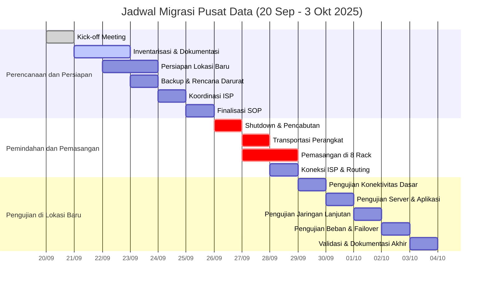

### **Rencana Migrasi Pusat Data: 14 Hari (20 September - 3 Oktober 2025)**  
Berikut adalah alur kerja migrasi terstruktur dalam **3 fase utama**, dilengkapi jadwal harian dan diagram Mermaid.

---

### **Fase 1: Perencanaan dan Persiapan**  
*(20-25 September 2025)*  
**Tujuan:** Memastikan semua aspek teknis, logistik, dan koordinasi siap sebelum pemindahan.  

| Hari | Tanggal       | Aktivitas                                                                                               | Tim Terlibat                          |
|------|---------------|---------------------------------------------------------------------------------------------------------|---------------------------------------|
| 1    | 20 Sep (Sabtu)| **Kick-off Meeting** - Menetapkan tujuan, timeline, dan tanggung jawab pihak terkait.                 | PM, Kepala IT, Admin Jaringan, ISP    |
| 2    | 21 Sep (Minggu)| **Inventarisasi & Dokumentasi** - Mencatat konfigurasi perangkat (server, jaringan), topologi jaringan, dan label kabel. | Admin Jaringan, Teknisi              |
| 3    | 22 Sep (Senin)| **Persiapan Lokasi Baru** - Verifikasi daya listrik, cooling, rack layout (8 rack), dan koneksi ISP. | Teknisi Telekomunikasi, ISP          |
| 4    | 23 Sep (Selasa)| **Backup & Rencana Darurat** - Backup penuh data dan konfigurasi. - Siapkan rencana rollback.      | Admin Jaringan, Teknisi              |
| 5    | 24 Sep (Rabu) | **Koordinasi dengan ISP** - Konfirmasi maintenance window untuk migrasi koneksi internet.            | PM, ISP                              |
| 6    | 25 Sep (Kamis)| **Finalisasi SOP** - SOP pemindahan fisik, pengujian, dan komunikasi darurat.                        | Semua Tim                            |

---

### **Fase 2: Pemindahan dan Pemasangan**  
*(26-28 September 2025)*  
**Tujuan:** Memindahkan perangkat secara fisik dan memasangnya di lokasi baru dengan minimal downtime.  

| Hari | Tanggal       | Aktivitas                                                                                               | Tim Terlibat                          |
|------|---------------|---------------------------------------------------------------------------------------------------------|---------------------------------------|
| 7    | 26 Sep (Jumat)| **Shutdown & Pencabutan** *(18:00-23:59)* - Matikan server/perangkat. - Label & cabut kabel/perpindahan dari 2 rack. | Admin Jaringan, Teknisi              |
| 8    | 27 Sep (Sabtu)| **Transportasi** *(08:00-12:00)* - Pindahkan perangkat ke lokasi baru dengan pengamanan khusus.      | Teknisi, Logistik                    |
|      |               | **Pemasangan di 8 Rack** *(13:00-20:00)* - Instal perangkat di rack baru sesuai layout. - Pasang kabel (power & jaringan). | Teknisi Jaringan, Telekomunikasi     |
| 9    | 28 Sep (Minggu)| **Koneksi ISP & Routing Awal** *(08:00-15:00)* - Aktifkan koneksi internet dasar dan routing statis. | ISP, Admin Jaringan                  |

---

### **Fase 3: Pengujian di Lokasi Baru**  
*(29 September - 3 Oktober 2025)*  
**Tujuan:** Memvalidasi fungsi seluruh sistem sebelum operasional penuh.  

| Hari | Tanggal       | Aktivitas                                                                                               | Tim Terlibat                          |
|------|---------------|---------------------------------------------------------------------------------------------------------|---------------------------------------|
| 10   | 29 Sep (Senin)| **Pengujian Konektivitas Dasar** - Ping, VLAN, dan fisik (LED port). - Verifikasi DHCP dan DNS.   | Admin Jaringan, Teknisi              |
| 11   | 30 Sep (Selasa)| **Pengujian Server & Aplikasi** - Boot server, cek OS, dan aplikasi kritis. - Uji akses storage.   | Admin Jaringan, Teknisi              |
| 12   | 1 Okt (Rabu)  | **Pengujian Jaringan Lanjutan** - Uji routing, firewall, bandwidth, dan QoS.                         | Admin Jaringan, ISP                  |
| 13   | 2 Okt (Kamis) | **Pengujian Beban & Failover** - Simulasi beban tinggi. - Uji redundansi jaringan/server.          | Admin Jaringan, Teknisi              |
| 14   | 3 Okt (Jumat) | **Validasi & Dokumentasi Akhir** - Tandatangan berita acara. - Update dokumentasi topologi baru.  | Kepala IT, PM, Semua Tim             |

---

### **Diagram Alur Migrasi (Mermaid)**  

---

### **Catatan Penting:**  
1. **Komunikasi:**  
   - Gunakan grup komunikasi real-time (misal: Slack/WhatsApp) untuk laporkan progres/hambatan.  
   - ISP harus tersedia selama fase pemindahan (26-28 Sep) untuk dukungan teknis.  

2. **Manajemen Risiko:**  
   - **Rollback Plan:** Jika pengujian gagal, kembali ke lokasi lama menggunakan backup (max 6 jam).  
   - **Downtime:** Pemadaman hanya terjadi pada 26 Sep (malam) hingga 29 Sep (pagi).  

3. **Kriteria Sukses:**  
   - Semua server/aplikasi berjalan normal di lokasi baru.  
   - Latency jaringan ≤ 5 ms, packet loss 0%.  
   - TTD (Turn Around Document) disetujui Kepala IT.  

