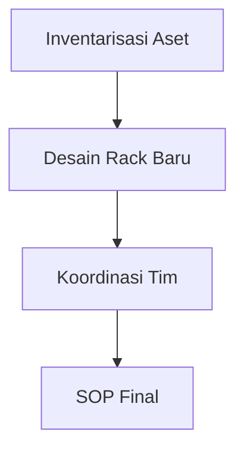
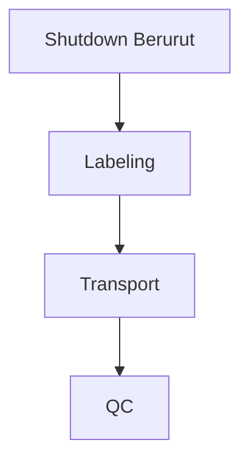
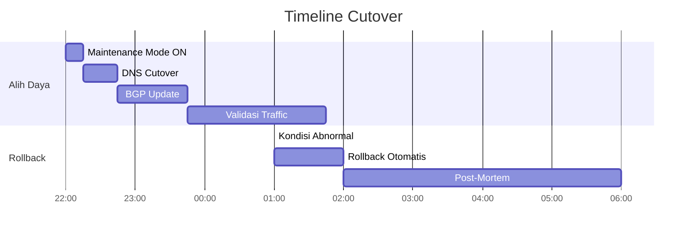

## **Rencana Migrasi Pusat Data Lengkap**  
**Periode Pelaksanaan: 8 September - 17 Oktober 2025**  


---

### **Tahap 1: Persiapan & Perencanaan (8-19 September 2025)**  
#### **Diagram Alur**  


#### **Jadwal Detail**  
| Aktivitas | Durasi | Tanggal | Penanggung Jawab | Status |  
|-----------|--------|---------|------------------|--------|  
| Audit Lengkap Aset | 4 hari | 8-11 Sep | Kepala IT | ◻️ |  
| Pemetaan Kabel & Port | 3 hari | 12-15 Sep | Admin Jaringan | ◻️ |  
| Desain Tata Letak 8 Rack | 2 hari | 16-17 Sep | Project Manager | ◻️ |  
| Finalisasi Dokumen Migrasi | 2 hari | 18-19 Sep | Semua Tim | ◻️ |  

#### **Deliverables**:  
- Matrik inventaris perangkat (server, switch, PDU)  
- Diagram kabel port-to-port  
- Desain rack baru dengan kapasitas daya dan pendinginan  

---

### **Tahap 2: Migrasi Jaringan & Routing (20-30 September 2025)**  
#### **Diagram Alur**  


#### **Jadwal Detail**  
| Aktivitas | Durasi | Tanggal | Tim Terlibat | Checklist |  
|-----------|--------|---------|--------------|-----------|  
| Pemasangan Switch/Router | 3 hari | 20-22 Sep | Teknisi | [ ] |  
| Clone VLAN & Routing Tables | 2 hari | 23-24 Sep | Admin Jaringan | [ ] |  
| Koordinasi BGP dengan ISP | 2 hari | 25-26 Sep | ISP, Admin Jaringan | [ ] |  
| Uji Failover & QoS | 3 hari | 27-29 Sep | Admin Jaringan | [ ] |  
| Dokumentasi Akhir | 1 hari | 30 Sep | Admin Jaringan | [ ] |  

#### **Contoh Konfigurasi Kritis**:  
```bash
# Backup OSPF Configuration
router ospf 100
 network 10.10.0.0 0.0.255.255 area 0
 auto-cost reference-bandwidth 10000
```

---

### **Tahap 3: Pemindahan Fisik 2 Rack (1-4 Oktober 2025)**  
#### **Diagram Alur**  


#### **Protokol Pemindahan**  
| Tahap | Protokol | Alat | Durasi | Tanggal |  
|-------|----------|------|--------|---------|  
| Shutdown | Aplikasi → VM → Storage → Fisik | Script otomasi | 4 jam | 1 Okt (20:00-00:00) |  
| Labeling | Sistem warna: 🔵Fiber 🟢UTP 🔴Power | Label printer | 3 jam | 2 Okt (08:00-11:00) |  
| Pengemasan | Anti-static bag + foam + palet | Data logger suhu | 2 jam | 2 Okt (11:00-13:00) |  
| Transport | Truck berpendingin (18-22°C) | Vibration monitor | 6 jam | 2 Okt (14:00-20:00) |  
| QC Penerimaan | Inspeksi fisik + test ESD | Thermal camera | 2 jam | 3 Okt (10:00-12:00) |  

---

### **Tahap 4: Relokasi ke 8 Rack Baru (5-11 Oktober 2025)**  
#### **Tata Letak Rack**  
| Rack | Fungsi | Perangkat | Penanggung Jawab |  
|------|--------|-----------|------------------|  
| R01 | Jaringan Inti | Router, Core Switch | Admin Jaringan |  
| R02-03 | Server Produksi | Web/App/DB | Kepala IT |  
| R04 | Storage | SAN/NAS | Teknisi Storage |  
| R05 | Keamanan | Firewall/IPS | Admin Jaringan |  
| R06-08 | Backup | Backup Server | Teknisi Backup |  

#### **Jadwal Pemasangan**:  
- **5-6 Okt**: Rack R01 (Jaringan Inti)  
- **7-8 Okt**: Rack R02-R03 (Server Produksi)  
- **9 Okt**: Rack R04 (Storage)  
- **10-11 Okt**: Rack R05-R08 (Keamanan & Backup)  

---

### **Tahap 5: Pengujian & Validasi (12-14 Oktober 2025)**  
#### **Matriks Pengujian**  
| Jenis Uji | Metode | Target | Tanggal |  
|-----------|--------|--------|---------|  
| Jaringan | Ping test, Traceroute | Packet loss <1% | 12 Okt |  
| Aplikasi | Load testing, Failover | RTO <15 menit | 13 Okt |  
| Keamanan | Penetration test | 0 critical findings | 14 Okt |  
| Daya/Pendingin | Thermal scan | Suhu <25°C | 14 Okt |  

---

### **Tahap 6: Cutover & Go-Live (15-17 Oktober 2025)**  
#### **Rencana Cutover**  


#### **Checklist Go-Live**:  
- [ ] Notifikasi maintenance ke user  
- [ ] Backup konfigurasi terakhir  
- [ ] Monitoring real-time 48 jam  
- [ ] Dokumentasi perubahan  

---

### **Matriks Tanggung Jawab (RACI)**  
| Aktivitas | PM | Kepala IT | Admin Jaringan | Teknisi | ISP |  
|-----------|----|-----------|----------------|---------|-----|  
| Desain Rack | R | A | C | I | - |  
| Migrasi Jaringan | C | A | R | - | C |  
| Pemindahan Fisik | A | R | I | R | - |  
| Uji Aplikasi | R | A | C | C | - |  
| Go-Live | A | R | R | I | R |  

**Keterangan**:  
- **R** = Responsible, **A** = Accountable  
- **C** = Consulted, **I** = Informed  

---

### **Lampiran Toolkit**  
#### **Dokumen Wajib**:  
- [Checklist Pemindahan Fisik](#)  
- [Template Labeling Kabel](#)  
- [SOP Darurat](#)  

#### **Peralatan Kritis**:  
```markdown
- [ ] Vibration data logger (EL-USB-3)  
- [ ] Thermal camera FLIR E8  
- [ ] Cable tester Fluke LinkIQ  
- [ ] Backup config offline (USB encrypted)  
```

> **Catatan Penting**:  
> - Downtime diizinkan: **Maks 4 jam** (15 Okt 22:00 - 16 Okt 02:00)  
> - Kontak darurat: **NOC 24/7 (021-123456)**  
> - Rollback deadline: **16 Okt 03:00**  

---

**Versi Dokumen**: 3.0  
**Tanggal Publikasi**: 1 September 2025  
© 2025 Tim Migrasi 

