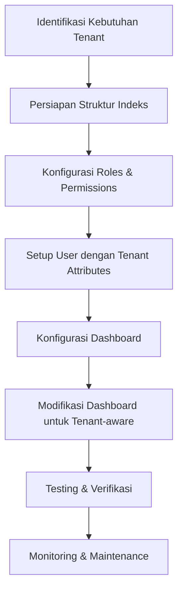
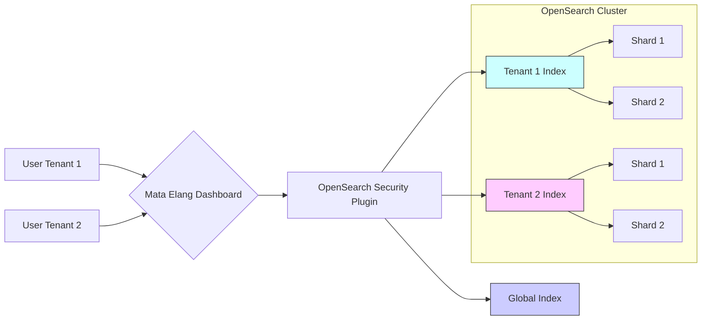

# Multi-Tenancy Setup for Mata Elang NIDS - Network Administrator Guide

## Overview
Sebagai Network Administrator di Mata Elang NIDS, saya akan mengimplementasikan multi-tenancy menggunakan fitur keamanan OpenSearch dengan referensi dokumentasi resmi:
- [User Management OpenSearch](https://mataelang.net/docs/2.0.0/User-Management-OpenSearch)
- [OpenSearch Dashboard Manual](https://mataelang.net/docs/2.0.0/OpenSearch-Dashboard-Manual-Page)



## Step-by-Step Implementation

### 1. Persiapan Struktur Indeks
Buat index pattern khusus untuk setiap tenant berdasarkan dokumentasi OpenSearch:

```bash
# Buat index untuk tenant 1
curl -XPUT "https://opensearch-node:9200/tenant1-mataelang-logs" -k \
-u admin:admin \
-H 'Content-Type: application/json' \
-d '{
  "settings": {
    "number_of_shards": 3,
    "number_of_replicas": 1,
    "opendistro.index_state_management.policy_id": "mataelang_retention_policy"
  }
}'

# Buat index untuk tenant 2
curl -XPUT "https://opensearch-node:9200/tenant2-mataelang-logs" -k \
-u admin:admin \
-H 'Content-Type: application/json' \
-d '{
  "settings": {
    "number_of_shards": 3,
    "number_of_replicas": 1,
    "opendistro.index_state_management.policy_id": "mataelang_retention_policy"
  }
}'
```

### 2. Konfigurasi Roles & Permissions
Buat role khusus untuk setiap tenant sesuai panduan User Management:

```bash
# Role untuk tenant 1
curl -XPOST "https://opensearch-node:9200/_plugins/_security/api/roles/tenant1_role" -k \
-u admin:admin \
-H 'Content-Type: application/json' \
-d '{
  "cluster_permissions": [
    "cluster_monitor",
    "cluster_composite_ops"
  ],
  "index_permissions": [{
    "index_patterns": [
      "tenant1-mataelang-*",
      ".opendistro-alerting-alert*",
      ".opendistro-alerting-config"
    ],
    "allowed_actions": [
      "read",
      "search",
      "indices:admin/get",
      "indices:data/read/scroll"
    ]
  }],
  "tenant_permissions": [{
    "tenant_patterns": ["tenant1"],
    "allowed_actions": ["kibana_all_write"]
  }]
}'
```

### 3. Setup User dengan Tenant Attributes
Buat user dengan atribut tenant spesifik:

```bash
curl -XPOST "https://opensearch-node:9200/_plugins/_security/api/internalusers/tenant1_admin" -k \
-u admin:admin \
-H 'Content-Type: application/json' \
-d '{
  "password": "StrongP@ssw0rd123",
  "backend_roles": ["tenant1_role"],
  "attributes": {
    "tenant": "tenant1"
  }
}'
```

### 4. Konfigurasi Dashboard (opensearch_dashboards.yml)
Modifikasi konfigurasi dashboard berdasarkan dokumentasi:

```yaml
# Aktifkan multi-tenancy
opensearch_security.multitenancy.enabled: true
opensearch_security.multitenancy.tenants.enable_private: true
opensearch_security.multitenancy.tenants.enable_global: true

# Mapping tenant ke index pattern
opensearch_security.tenant.index_patterns:
  - tenant1: "tenant1-mataelang-*"
  - tenant2: "tenant2-mataelang-*"

# Aktifkan fitur keamanan
opensearch_security.cookie.secure: true
opensearch_security.session.keepalive: true
opensearch_security.auth.type: "openid"
```

### 5. Modifikasi Dashboard untuk Tenant-aware
Implementasikan logika tenant-aware pada dashboard Mata Elang:

```javascript
// File: src/plugins/dashboards/backend/services/opensearch.js
async function getTenantIndex(request, indexName) {
  const user = request.user;
  const tenant = user.attributes.tenant;
  
  if (!tenant) {
    throw new Error('Tenant attribute not found in user profile');
  }
  
  return `${tenant}-${indexName}`;
}

// Modifikasi fungsi query
async function queryLogs(request, query) {
  const tenantIndex = await getTenantIndex(request, 'mataelang-logs');
  
  return await client.search({
    index: tenantIndex,
    body: query
  });
}
```

### 6. Testing & Verifikasi
Verifikasi isolasi tenant menggunakan akun berbeda:

```bash
# Test akses sebagai tenant1_admin
curl -k -u tenant1_admin:StrongP@ssw0rd123 \
"https://opensearch-node:9200/tenant1-mataelang-logs/_search"

# Test akses ke data tenant lain (harusnya ditolak)
curl -k -u tenant1_admin:StrongP@ssw0rd123 \
"https://opensearch-node:9200/tenant2-mataelang-logs/_search"
```

## Diagram Arsitektur Multi-Tenancy



## Maintenance & Monitoring
1. **Rotasi Password**:
   ```bash
   # Update password tenant secara berkala
   curl -XPUT "https://opensearch-node:9200/_plugins/_security/api/internalusers/tenant1_admin" -k \
   -u admin:admin \
   -H 'Content-Type: application/json' \
   -d '{"password": "NewP@ssw0rd456"}'
   ```

2. **Audit Log**:
   - Aktifkan audit log di `config.yml`:
     ```yaml
     plugins.security.audit.type: internal_opensearch
     plugins.security.enable_audit_log: true
     ```

3. **Monitoring Performa**:
   - Gunakan OpenSearch Performance Analyzer
   - Monitor resource usage per tenant

4. **Backup Konfigurasi**:
   ```bash
   # Backup roles
   curl -k -u admin:admin "https://opensearch-node:9200/_plugins/_security/api/roles" > roles_backup.json
   
   # Backup users
   curl -k -u admin:admin "https://opensearch-node:9200/_plugins/_security/api/internalusers" > users_backup.json
   ```

## Troubleshooting
1. **User Tidak Bisa Akses Data**:
   - Verifikasi attribute tenant di user profile
   - Periksa index pattern di role permissions
   - Pastikan index sudah dibuat dengan pola yang benar

2. **Dashboard Tidak Menampilkan Data**:
   - Periksa error log dashboard
   - Verifikasi koneksi ke OpenSearch
   - Pastikan konfigurasi tenant-aware di kode sudah benar

3. **Permission Issues**:
   ```bash
   # Periksa effective permissions
   curl -k -u tenant1_admin:password \
   "https://opensearch-node:9200/_plugins/_security/api/user/tenant1_admin?effective"
   ```

## Referensi
1. [Mata Elang User Management Documentation](https://mataelang.net/docs/2.0.0/User-Management-OpenSearch)
2. [Mata Elang Dashboard Manual](https://mataelang.net/docs/2.0.0/OpenSearch-Dashboard-Manual-Page)
3. [OpenSearch Security Documentation](https://opensearch.org/docs/latest/security-plugin/index/)

---------------------------

# Multi-Tenancy Setup for Mata Elang NIDS - Network Administrator Guide

## Overview
Sebagai Network Administrator di Mata Elang NIDS, saya akan mengimplementasikan multi-tenancy menggunakan fitur keamanan OpenSearch dengan referensi dokumentasi resmi:
- [User Management OpenSearch](https://mataelang.net/docs/2.0.0/User-Management-OpenSearch)
- [OpenSearch Dashboard Manual](https://mataelang.net/docs/2.0.0/OpenSearch-Dashboard-Manual-Page)


## Step-by-Step Implementation

### 1. Persiapan Struktur Indeks
Buat index pattern khusus untuk setiap tenant berdasarkan dokumentasi OpenSearch:

```bash
# Buat index untuk tenant 1
curl -XPUT "https://opensearch-node:9200/tenant1-mataelang-logs" -k \
-u admin:admin \
-H 'Content-Type: application/json' \
-d '{
  "settings": {
    "number_of_shards": 3,
    "number_of_replicas": 1,
    "opendistro.index_state_management.policy_id": "mataelang_retention_policy"
  }
}'

# Buat index untuk tenant 2
curl -XPUT "https://opensearch-node:9200/tenant2-mataelang-logs" -k \
-u admin:admin \
-H 'Content-Type: application/json' \
-d '{
  "settings": {
    "number_of_shards": 3,
    "number_of_replicas": 1,
    "opendistro.index_state_management.policy_id": "mataelang_retention_policy"
  }
}'
```

### 2. Konfigurasi Roles & Permissions
Buat role khusus untuk setiap tenant sesuai panduan User Management:

```bash
# Role untuk tenant 1
curl -XPOST "https://opensearch-node:9200/_plugins/_security/api/roles/tenant1_role" -k \
-u admin:admin \
-H 'Content-Type: application/json' \
-d '{
  "cluster_permissions": [
    "cluster_monitor",
    "cluster_composite_ops"
  ],
  "index_permissions": [{
    "index_patterns": [
      "tenant1-mataelang-*",
      ".opendistro-alerting-alert*",
      ".opendistro-alerting-config"
    ],
    "allowed_actions": [
      "read",
      "search",
      "indices:admin/get",
      "indices:data/read/scroll"
    ]
  }],
  "tenant_permissions": [{
    "tenant_patterns": ["tenant1"],
    "allowed_actions": ["kibana_all_write"]
  }]
}'
```

### 3. Setup User dengan Tenant Attributes
Buat user dengan atribut tenant spesifik:

```bash
curl -XPOST "https://opensearch-node:9200/_plugins/_security/api/internalusers/tenant1_admin" -k \
-u admin:admin \
-H 'Content-Type: application/json' \
-d '{
  "password": "StrongP@ssw0rd123",
  "backend_roles": ["tenant1_role"],
  "attributes": {
    "tenant": "tenant1"
  }
}'
```

### 4. Konfigurasi Dashboard (opensearch_dashboards.yml)
Modifikasi konfigurasi dashboard berdasarkan dokumentasi:

```yaml
# Aktifkan multi-tenancy
opensearch_security.multitenancy.enabled: true
opensearch_security.multitenancy.tenants.enable_private: true
opensearch_security.multitenancy.tenants.enable_global: true

# Mapping tenant ke index pattern
opensearch_security.tenant.index_patterns:
  - tenant1: "tenant1-mataelang-*"
  - tenant2: "tenant2-mataelang-*"

# Aktifkan fitur keamanan
opensearch_security.cookie.secure: true
opensearch_security.session.keepalive: true
opensearch_security.auth.type: "openid"
```

### 5. Modifikasi Dashboard untuk Tenant-aware
Implementasikan logika tenant-aware pada dashboard Mata Elang:

```javascript
// File: src/plugins/dashboards/backend/services/opensearch.js
async function getTenantIndex(request, indexName) {
  const user = request.user;
  const tenant = user.attributes.tenant;
  
  if (!tenant) {
    throw new Error('Tenant attribute not found in user profile');
  }
  
  return `${tenant}-${indexName}`;
}

// Modifikasi fungsi query
async function queryLogs(request, query) {
  const tenantIndex = await getTenantIndex(request, 'mataelang-logs');
  
  return await client.search({
    index: tenantIndex,
    body: query
  });
}
```

### 6. Testing & Verifikasi
Verifikasi isolasi tenant menggunakan akun berbeda:

```bash
# Test akses sebagai tenant1_admin
curl -k -u tenant1_admin:StrongP@ssw0rd123 \
"https://opensearch-node:9200/tenant1-mataelang-logs/_search"

# Test akses ke data tenant lain (harusnya ditolak)
curl -k -u tenant1_admin:StrongP@ssw0rd123 \
"https://opensearch-node:9200/tenant2-mataelang-logs/_search"
```

## Diagram Arsitektur Multi-Tenancy


## Maintenance & Monitoring
1. **Rotasi Password**:
   ```bash
   # Update password tenant secara berkala
   curl -XPUT "https://opensearch-node:9200/_plugins/_security/api/internalusers/tenant1_admin" -k \
   -u admin:admin \
   -H 'Content-Type: application/json' \
   -d '{"password": "NewP@ssw0rd456"}'
   ```

2. **Audit Log**:
   - Aktifkan audit log di `config.yml`:
     ```yaml
     plugins.security.audit.type: internal_opensearch
     plugins.security.enable_audit_log: true
     ```

3. **Monitoring Performa**:
   - Gunakan OpenSearch Performance Analyzer
   - Monitor resource usage per tenant

4. **Backup Konfigurasi**:
   ```bash
   # Backup roles
   curl -k -u admin:admin "https://opensearch-node:9200/_plugins/_security/api/roles" > roles_backup.json
   
   # Backup users
   curl -k -u admin:admin "https://opensearch-node:9200/_plugins/_security/api/internalusers" > users_backup.json
   ```

## Troubleshooting
1. **User Tidak Bisa Akses Data**:
   - Verifikasi attribute tenant di user profile
   - Periksa index pattern di role permissions
   - Pastikan index sudah dibuat dengan pola yang benar

2. **Dashboard Tidak Menampilkan Data**:
   - Periksa error log dashboard
   - Verifikasi koneksi ke OpenSearch
   - Pastikan konfigurasi tenant-aware di kode sudah benar

3. **Permission Issues**:
   ```bash
   # Periksa effective permissions
   curl -k -u tenant1_admin:password \
   "https://opensearch-node:9200/_plugins/_security/api/user/tenant1_admin?effective"
   ```

## Referensi
1. [Mata Elang User Management Documentation](https://mataelang.net/docs/2.0.0/User-Management-OpenSearch)
2. [Mata Elang Dashboard Manual](https://mataelang.net/docs/2.0.0/OpenSearch-Dashboard-Manual-Page)
3. [OpenSearch Security Documentation](https://opensearch.org/docs/latest/security-plugin/index/)
