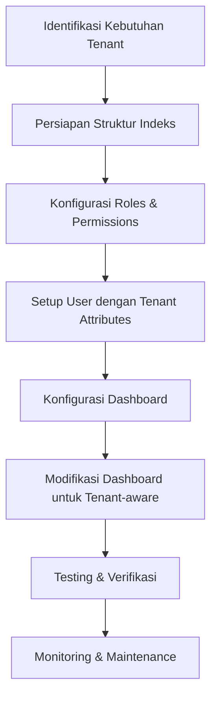
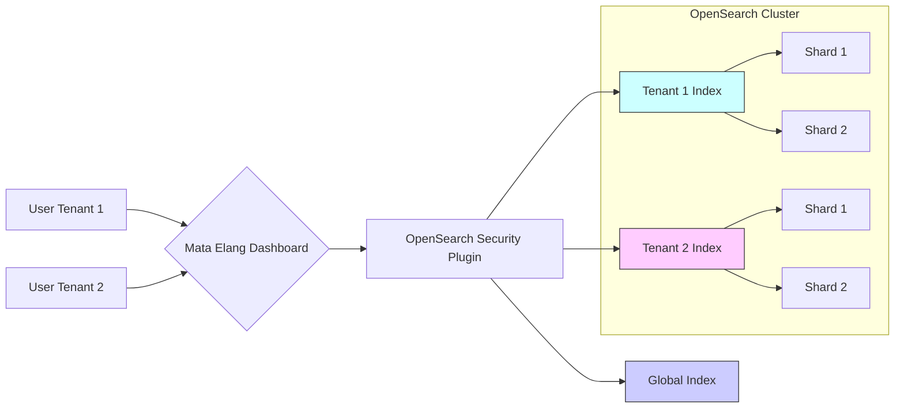
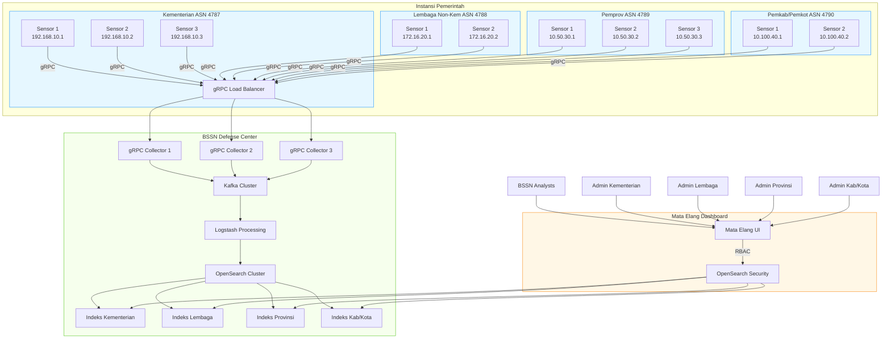
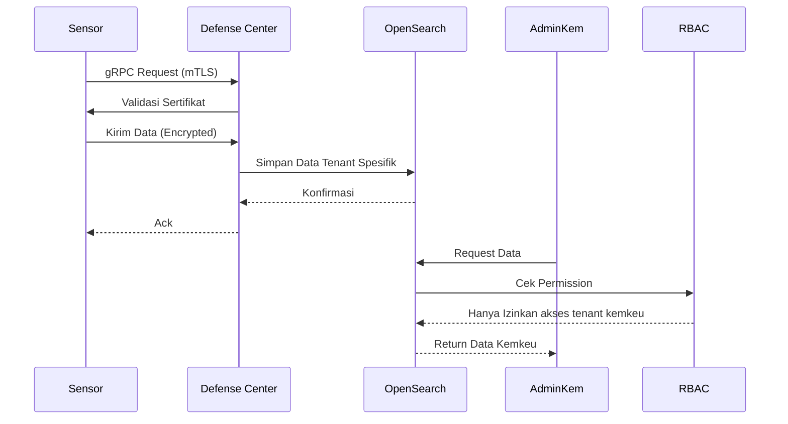

# Multi-Tenancy Setup for Mata Elang NIDS - Network Administrator Guide

## Overview
Sebagai Network Administrator di Mata Elang NIDS, saya akan mengimplementasikan multi-tenancy menggunakan fitur keamanan OpenSearch dengan referensi dokumentasi resmi:
- [User Management OpenSearch](https://mataelang.net/docs/2.0.0/User-Management-OpenSearch)
- [OpenSearch Dashboard Manual](https://mataelang.net/docs/2.0.0/OpenSearch-Dashboard-Manual-Page)



## Step-by-Step Implementation

### 1. Persiapan Struktur Indeks
Buat index pattern khusus untuk setiap tenant berdasarkan dokumentasi OpenSearch:

```bash
# Buat index untuk tenant 1
curl -XPUT "https://opensearch-node:9200/tenant1-mataelang-logs" -k \
-u admin:admin \
-H 'Content-Type: application/json' \
-d '{
  "settings": {
    "number_of_shards": 3,
    "number_of_replicas": 1,
    "opendistro.index_state_management.policy_id": "mataelang_retention_policy"
  }
}'

# Buat index untuk tenant 2
curl -XPUT "https://opensearch-node:9200/tenant2-mataelang-logs" -k \
-u admin:admin \
-H 'Content-Type: application/json' \
-d '{
  "settings": {
    "number_of_shards": 3,
    "number_of_replicas": 1,
    "opendistro.index_state_management.policy_id": "mataelang_retention_policy"
  }
}'
```

### 2. Konfigurasi Roles & Permissions
Buat role khusus untuk setiap tenant sesuai panduan User Management:

```bash
# Role untuk tenant 1
curl -XPOST "https://opensearch-node:9200/_plugins/_security/api/roles/tenant1_role" -k \
-u admin:admin \
-H 'Content-Type: application/json' \
-d '{
  "cluster_permissions": [
    "cluster_monitor",
    "cluster_composite_ops"
  ],
  "index_permissions": [{
    "index_patterns": [
      "tenant1-mataelang-*",
      ".opendistro-alerting-alert*",
      ".opendistro-alerting-config"
    ],
    "allowed_actions": [
      "read",
      "search",
      "indices:admin/get",
      "indices:data/read/scroll"
    ]
  }],
  "tenant_permissions": [{
    "tenant_patterns": ["tenant1"],
    "allowed_actions": ["kibana_all_write"]
  }]
}'
```

### 3. Setup User dengan Tenant Attributes
Buat user dengan atribut tenant spesifik:

```bash
curl -XPOST "https://opensearch-node:9200/_plugins/_security/api/internalusers/tenant1_admin" -k \
-u admin:admin \
-H 'Content-Type: application/json' \
-d '{
  "password": "StrongP@ssw0rd123",
  "backend_roles": ["tenant1_role"],
  "attributes": {
    "tenant": "tenant1"
  }
}'
```

### 4. Konfigurasi Dashboard (opensearch_dashboards.yml)
Modifikasi konfigurasi dashboard berdasarkan dokumentasi:

```yaml
# Aktifkan multi-tenancy
opensearch_security.multitenancy.enabled: true
opensearch_security.multitenancy.tenants.enable_private: true
opensearch_security.multitenancy.tenants.enable_global: true

# Mapping tenant ke index pattern
opensearch_security.tenant.index_patterns:
  - tenant1: "tenant1-mataelang-*"
  - tenant2: "tenant2-mataelang-*"

# Aktifkan fitur keamanan
opensearch_security.cookie.secure: true
opensearch_security.session.keepalive: true
opensearch_security.auth.type: "openid"
```

### 5. Modifikasi Dashboard untuk Tenant-aware
Implementasikan logika tenant-aware pada dashboard Mata Elang:

```javascript
// File: src/plugins/dashboards/backend/services/opensearch.js
async function getTenantIndex(request, indexName) {
  const user = request.user;
  const tenant = user.attributes.tenant;
  
  if (!tenant) {
    throw new Error('Tenant attribute not found in user profile');
  }
  
  return `${tenant}-${indexName}`;
}

// Modifikasi fungsi query
async function queryLogs(request, query) {
  const tenantIndex = await getTenantIndex(request, 'mataelang-logs');
  
  return await client.search({
    index: tenantIndex,
    body: query
  });
}
```

### 6. Testing & Verifikasi
Verifikasi isolasi tenant menggunakan akun berbeda:

```bash
# Test akses sebagai tenant1_admin
curl -k -u tenant1_admin:StrongP@ssw0rd123 \
"https://opensearch-node:9200/tenant1-mataelang-logs/_search"

# Test akses ke data tenant lain (harusnya ditolak)
curl -k -u tenant1_admin:StrongP@ssw0rd123 \
"https://opensearch-node:9200/tenant2-mataelang-logs/_search"
```

## Diagram Arsitektur Multi-Tenancy



## Maintenance & Monitoring
1. **Rotasi Password**:
   ```bash
   # Update password tenant secara berkala
   curl -XPUT "https://opensearch-node:9200/_plugins/_security/api/internalusers/tenant1_admin" -k \
   -u admin:admin \
   -H 'Content-Type: application/json' \
   -d '{"password": "NewP@ssw0rd456"}'
   ```

2. **Audit Log**:
   - Aktifkan audit log di `config.yml`:
     ```yaml
     plugins.security.audit.type: internal_opensearch
     plugins.security.enable_audit_log: true
     ```

3. **Monitoring Performa**:
   - Gunakan OpenSearch Performance Analyzer
   - Monitor resource usage per tenant

4. **Backup Konfigurasi**:
   ```bash
   # Backup roles
   curl -k -u admin:admin "https://opensearch-node:9200/_plugins/_security/api/roles" > roles_backup.json
   
   # Backup users
   curl -k -u admin:admin "https://opensearch-node:9200/_plugins/_security/api/internalusers" > users_backup.json
   ```

## Troubleshooting
1. **User Tidak Bisa Akses Data**:
   - Verifikasi attribute tenant di user profile
   - Periksa index pattern di role permissions
   - Pastikan index sudah dibuat dengan pola yang benar

2. **Dashboard Tidak Menampilkan Data**:
   - Periksa error log dashboard
   - Verifikasi koneksi ke OpenSearch
   - Pastikan konfigurasi tenant-aware di kode sudah benar

3. **Permission Issues**:
   ```bash
   # Periksa effective permissions
   curl -k -u tenant1_admin:password \
   "https://opensearch-node:9200/_plugins/_security/api/user/tenant1_admin?effective"
   ```

## Referensi
1. [Mata Elang User Management Documentation](https://mataelang.net/docs/2.0.0/User-Management-OpenSearch)
2. [Mata Elang Dashboard Manual](https://mataelang.net/docs/2.0.0/OpenSearch-Dashboard-Manual-Page)
3. [OpenSearch Security Documentation](https://opensearch.org/docs/latest/security-plugin/index/)

---------------------------

# Multi-Tenancy Setup for Mata Elang NIDS - Network Administrator Guide

## Overview
Sebagai Network Administrator di Mata Elang NIDS, saya akan mengimplementasikan multi-tenancy menggunakan fitur keamanan OpenSearch dengan referensi dokumentasi resmi:
- [User Management OpenSearch](https://mataelang.net/docs/2.0.0/User-Management-OpenSearch)
- [OpenSearch Dashboard Manual](https://mataelang.net/docs/2.0.0/OpenSearch-Dashboard-Manual-Page)


## Step-by-Step Implementation

### 1. Persiapan Struktur Indeks
Buat index pattern khusus untuk setiap tenant berdasarkan dokumentasi OpenSearch:

```bash
# Buat index untuk tenant 1
curl -XPUT "https://opensearch-node:9200/tenant1-mataelang-logs" -k \
-u admin:admin \
-H 'Content-Type: application/json' \
-d '{
  "settings": {
    "number_of_shards": 3,
    "number_of_replicas": 1,
    "opendistro.index_state_management.policy_id": "mataelang_retention_policy"
  }
}'

# Buat index untuk tenant 2
curl -XPUT "https://opensearch-node:9200/tenant2-mataelang-logs" -k \
-u admin:admin \
-H 'Content-Type: application/json' \
-d '{
  "settings": {
    "number_of_shards": 3,
    "number_of_replicas": 1,
    "opendistro.index_state_management.policy_id": "mataelang_retention_policy"
  }
}'
```

### 2. Konfigurasi Roles & Permissions
Buat role khusus untuk setiap tenant sesuai panduan User Management:

```bash
# Role untuk tenant 1
curl -XPOST "https://opensearch-node:9200/_plugins/_security/api/roles/tenant1_role" -k \
-u admin:admin \
-H 'Content-Type: application/json' \
-d '{
  "cluster_permissions": [
    "cluster_monitor",
    "cluster_composite_ops"
  ],
  "index_permissions": [{
    "index_patterns": [
      "tenant1-mataelang-*",
      ".opendistro-alerting-alert*",
      ".opendistro-alerting-config"
    ],
    "allowed_actions": [
      "read",
      "search",
      "indices:admin/get",
      "indices:data/read/scroll"
    ]
  }],
  "tenant_permissions": [{
    "tenant_patterns": ["tenant1"],
    "allowed_actions": ["kibana_all_write"]
  }]
}'
```

### 3. Setup User dengan Tenant Attributes
Buat user dengan atribut tenant spesifik:

```bash
curl -XPOST "https://opensearch-node:9200/_plugins/_security/api/internalusers/tenant1_admin" -k \
-u admin:admin \
-H 'Content-Type: application/json' \
-d '{
  "password": "StrongP@ssw0rd123",
  "backend_roles": ["tenant1_role"],
  "attributes": {
    "tenant": "tenant1"
  }
}'
```

### 4. Konfigurasi Dashboard (opensearch_dashboards.yml)
Modifikasi konfigurasi dashboard berdasarkan dokumentasi:

```yaml
# Aktifkan multi-tenancy
opensearch_security.multitenancy.enabled: true
opensearch_security.multitenancy.tenants.enable_private: true
opensearch_security.multitenancy.tenants.enable_global: true

# Mapping tenant ke index pattern
opensearch_security.tenant.index_patterns:
  - tenant1: "tenant1-mataelang-*"
  - tenant2: "tenant2-mataelang-*"

# Aktifkan fitur keamanan
opensearch_security.cookie.secure: true
opensearch_security.session.keepalive: true
opensearch_security.auth.type: "openid"
```

### 5. Modifikasi Dashboard untuk Tenant-aware
Implementasikan logika tenant-aware pada dashboard Mata Elang:

```javascript
// File: src/plugins/dashboards/backend/services/opensearch.js
async function getTenantIndex(request, indexName) {
  const user = request.user;
  const tenant = user.attributes.tenant;
  
  if (!tenant) {
    throw new Error('Tenant attribute not found in user profile');
  }
  
  return `${tenant}-${indexName}`;
}

// Modifikasi fungsi query
async function queryLogs(request, query) {
  const tenantIndex = await getTenantIndex(request, 'mataelang-logs');
  
  return await client.search({
    index: tenantIndex,
    body: query
  });
}
```

### 6. Testing & Verifikasi
Verifikasi isolasi tenant menggunakan akun berbeda:

```bash
# Test akses sebagai tenant1_admin
curl -k -u tenant1_admin:StrongP@ssw0rd123 \
"https://opensearch-node:9200/tenant1-mataelang-logs/_search"

# Test akses ke data tenant lain (harusnya ditolak)
curl -k -u tenant1_admin:StrongP@ssw0rd123 \
"https://opensearch-node:9200/tenant2-mataelang-logs/_search"
```

## Diagram Arsitektur Multi-Tenancy


## Maintenance & Monitoring
1. **Rotasi Password**:
   ```bash
   # Update password tenant secara berkala
   curl -XPUT "https://opensearch-node:9200/_plugins/_security/api/internalusers/tenant1_admin" -k \
   -u admin:admin \
   -H 'Content-Type: application/json' \
   -d '{"password": "NewP@ssw0rd456"}'
   ```

2. **Audit Log**:
   - Aktifkan audit log di `config.yml`:
     ```yaml
     plugins.security.audit.type: internal_opensearch
     plugins.security.enable_audit_log: true
     ```

3. **Monitoring Performa**:
   - Gunakan OpenSearch Performance Analyzer
   - Monitor resource usage per tenant

4. **Backup Konfigurasi**:
   ```bash
   # Backup roles
   curl -k -u admin:admin "https://opensearch-node:9200/_plugins/_security/api/roles" > roles_backup.json
   
   # Backup users
   curl -k -u admin:admin "https://opensearch-node:9200/_plugins/_security/api/internalusers" > users_backup.json
   ```

## Troubleshooting
1. **User Tidak Bisa Akses Data**:
   - Verifikasi attribute tenant di user profile
   - Periksa index pattern di role permissions
   - Pastikan index sudah dibuat dengan pola yang benar

2. **Dashboard Tidak Menampilkan Data**:
   - Periksa error log dashboard
   - Verifikasi koneksi ke OpenSearch
   - Pastikan konfigurasi tenant-aware di kode sudah benar

3. **Permission Issues**:
   ```bash
   # Periksa effective permissions
   curl -k -u tenant1_admin:password \
   "https://opensearch-node:9200/_plugins/_security/api/user/tenant1_admin?effective"
   ```

## Referensi
1. [Mata Elang User Management Documentation](https://mataelang.net/docs/2.0.0/User-Management-OpenSearch)
2. [Mata Elang Dashboard Manual](https://mataelang.net/docs/2.0.0/OpenSearch-Dashboard-Manual-Page)
3. [OpenSearch Security Documentation](https://opensearch.org/docs/latest/security-plugin/index/)

-----------------------

# Data Flow Diagram Mata Elang NIDS untuk Instansi Pemerintah



## Penjelasan Komprehensif Data Flow

### 1. Sumber Data Instansi Pemerintah

#### a. Kementerian (ASN 4787)
- **Contoh**: Kementerian Keuangan
- **Sensor**:
  - Perimeter Firewall: 192.168.10.1
  - Core Network: 192.168.10.2
  - DMZ Zone: 192.168.10.3
- **Data yang Dikirim**:
  - NetFlow metadata
  - IDS alerts
  - System logs
- **Contoh Traffic**:
  - Sumber: 192.168.10.100 (ASN 4787)
  - Tujuan: 103.10.200.5 (External)
  - Protokol: HTTPS

#### b. Lembaga Non-Kementerian (ASN 4788)
- **Contoh**: BPK (Badan Pemeriksa Keuangan)
- **Sensor**:
  - Internet Gateway: 172.16.20.1
  - Database Zone: 172.16.20.2
- **Data yang Dikirim**:
  - Packet captures (terpilih)
  - Authentication logs
  - Vulnerability scans
- **Contoh Traffic**:
  - Sumber: 172.16.20.50 (ASN 4788)
  - Tujuan: 10.50.30.100 (Pemprov Jabar)
  - Protokol: RDP

#### c. Pemerintah Provinsi (ASN 4789)
- **Contoh**: Pemerintah Provinsi Jawa Barat
- **Sensor**:
  - Perimeter: 10.50.30.1
  - Internal: 10.50.30.2
  - Data Center: 10.50.30.3
- **Data yang Dikirim**:
  - Network flow data
  - Server performance metrics
  - Security appliance logs
- **Contoh Traffic**:
  - Sumber: 10.50.30.100 (ASN 4789)
  - Tujuan: 192.168.10.5 (Kemenkeu)
  - Protokol: SIP

#### d. Pemerintah Kab/Kota (ASN 4790)
- **Contoh**: Pemerintah Kota Bandung
- **Sensor**:
  - Perimeter: 10.100.40.1
  - Internal: 10.100.40.2
- **Data yang Dikirim**:
  - Web application logs
  - Endpoint security events
  - DNS query logs
- **Contoh Traffic**:
  - Sumber: 10.100.40.50 (ASN 4790)
  - Tujuan: 172.16.20.10 (BPK)
  - Protokol: DNS

### 2. Protokol gRPC untuk Data Collection
Berdasarkan [dokumentasi resmi Mata Elang](https://mataelang.net/docs/2.0.0/Installation-and-Configuration/Sensor-Installation):

- **Port**: 50051 (default gRPC)
- **Autentikasi**: Mutual TLS (mTLS)
- **Format Data**: Protocol Buffers (Protobuf)
- **Keamanan**:
  - Enkripsi: AES-256-GCM
  - Autentikasi: Sertifikat X.509
  - Integritas: SHA-256 HMAC

**Contoh Konfigurasi Sensor**:
```yaml
# /etc/mataelang/sensor.yaml
defense_center:
  address: "dc.mataelang.bssn.go.id:50051"
  tls:
    enabled: true
    ca_cert: "/etc/mataelang/ca.pem"
    client_cert: "/etc/mataelang/client.pem"
    client_key: "/etc/mataelang/client.key"
  tenant_id: "kemkeu"
  sensor_id: "sensor-kemkeu-perimeter-01"
```

### 3. Pemrosesan di BSSN Defense Center
Berdasarkan [dokumentasi Defense Center](https://mataelang.net/docs/2.0.0/Installation-and-Configuration/Defense-Center-Installation):

#### a. gRPC Collector
- Menerima data dari sensor
- Validasi sertifikat klien
- Dekode protobuf ke format JSON
- Forward ke Kafka

#### b. Kafka Cluster
- Buffering data (retensi 7 hari)
- Partisi berdasarkan tenant ID
- Replikasi 3x untuk keamanan

#### c. Logstash Processing Pipeline
```ruby
input {
  kafka {
    bootstrap_servers => "kafka1:9092,kafka2:9092"
    topics_pattern => "sensor-.*"
    codec => json
  }
}

filter {
  # Enrich dengan data geolokasi
  geoip {
    source => "src_ip"
    target => "geo"
  }
  
  # Tambahkan metadata tenant
  mutate {
    add_field => { 
      "[@metadata][tenant]" => "%{tenant_id}"
    }
  }
  
  # Anonimisasi PII
  fingerprint {
    source => ["user_id"]
    target => "user_hash"
    method => "SHA256"
    key => "s3cr3tk3y!"
  }
}

output {
  opensearch {
    hosts => ["https://opensearch:9200"]
    index => "mataelang-%{[@metadata][tenant]}-%{+YYYY.MM.dd}"
    user => "logstash_writer"
    password => "P@ssw0rd123!"
    ssl => true
    cacert => "/etc/ssl/opensearch-ca.pem"
  }
}
```

### 4. Penyimpanan Data Terisolasi di OpenSearch
- **Struktur Indeks**:
  ```
  mataelang-kemkeu-2023.10.01
  mataelang-bpk-2023.10.01
  mataelang-pemprovjabar-2023.10.01
  mataelang-kotabandung-2023.10.01
  ```

- **Role-Based Access Control**:
  ```json
  PUT /_plugins/_security/api/roles/tenant_kemkeu
  {
    "index_permissions": [{
      "index_patterns": ["mataelang-kemkeu-*"],
      "allowed_actions": [
        "read",
        "search",
        "indices:admin/get"
      ]
    }],
    "tenant_permissions": [{
      "tenant_patterns": ["kemkeu"],
      "allowed_actions": ["kibana_all_read"]
    }]
  }
  ```

### 5. Akses Dashboard dengan RBAC
**Contoh Akses**:
1. **Admin Kementerian Keuangan**:
   - Bisa melihat indeks: `mataelang-kemkeu-*`
   - Tidak bisa melihat data BPK atau Pemprov
   - Contoh query: 
     ```json
     GET /mataelang-kemkeu-*/_search
     {
       "query": {
         "term": {"threat_level": "high"}
       }
     }
     ```

2. **BSSN Analysts**:
   - Akses ke semua indeks: `mataelang-*`
   - Bisa lakukan korelasi lintas instansi
   - Contoh query:
     ```json
     GET /_all/_search
     {
       "query": {
         "bool": {
           "must": [
             {"term": {"threat_signature": "CVE-2023-1234"}},
             {"range": {"@timestamp": {"gte": "now-7d"}}}
           ]
         }
       }
     }
     ```

### 6. Keamanan dan Isolasi Data


### 7. Manfaat Arsitektur
1. **Isolasi Data Ketat**:
   - Data setiap instansi terpisah secara fisik di OpenSearch
   - Akses terbatas hanya untuk pemilik dan BSSN

2. **Efisiensi Nasional**:
   - Analisis terpusat ancaman siber
   - Berbagi threat intelligence antar instansi

3. **Skalabilitas**:
   - Penambahan sensor baru tanpa mengganggu sistem
   - Skala horizontal komponen Defense Center

4. **Kepatuhan Regulasi**:
   - Memenuhi Perpres No. 82/2022 tentang PSDN
   - Sesuai standar ISO 27001 untuk keamanan informasi

### 8. Best Practices Implementasi
1. **Rotasi Sertifikat**:
   ```bash
   # Rotasi otomatis setiap 90 hari
   openssl req -x509 -newkey rsa:4096 -keyout key.pem -out cert.pem -days 90
   ```

2. **Monitoring Koneksi gRPC**:
   ```bash
   # Cek status koneksi
   grpc_cli ls dc.mataelang.bssn.go.id:50051 --channel_creds_type=ssl
   
   # Metrik performa
   grpc_server_handled_total{grpc_method="SendPacket"}
   ```

3. **Backup Data**:
   ```bash
   # Backup indeks harian
   opensearch-backup --repository s3_repo --snapshot kemkeu-$(date +%Y%m%d) \
   --indices "mataelang-kemkeu-*"
   ```

Diagram dan penjelasan ini menggambarkan aliran data lengkap dari sensor di berbagai instansi pemerintah hingga ke Defense Center BSSN, dengan memperhatikan protokol gRPC yang sesuai dokumentasi resmi dan menjaga isolasi data antar instansi.
